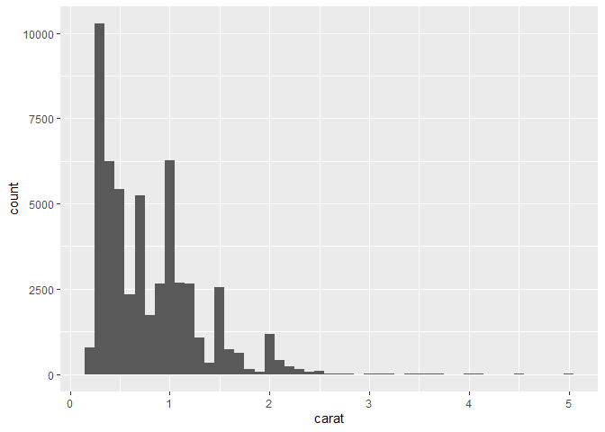

FA1_AFUNDAR_DATAMINING
================
Audrie Lex L. Afundar
2025-02-02

## Lecture 2

Call Diamonds and create a bar chart

## Bar chart

``` r
diamonds
```

    ## # A tibble: 53,940 × 10
    ##    carat cut       color clarity depth table price     x     y     z
    ##    <dbl> <ord>     <ord> <ord>   <dbl> <dbl> <int> <dbl> <dbl> <dbl>
    ##  1  0.23 Ideal     E     SI2      61.5    55   326  3.95  3.98  2.43
    ##  2  0.21 Premium   E     SI1      59.8    61   326  3.89  3.84  2.31
    ##  3  0.23 Good      E     VS1      56.9    65   327  4.05  4.07  2.31
    ##  4  0.29 Premium   I     VS2      62.4    58   334  4.2   4.23  2.63
    ##  5  0.31 Good      J     SI2      63.3    58   335  4.34  4.35  2.75
    ##  6  0.24 Very Good J     VVS2     62.8    57   336  3.94  3.96  2.48
    ##  7  0.24 Very Good I     VVS1     62.3    57   336  3.95  3.98  2.47
    ##  8  0.26 Very Good H     SI1      61.9    55   337  4.07  4.11  2.53
    ##  9  0.22 Fair      E     VS2      65.1    61   337  3.87  3.78  2.49
    ## 10  0.23 Very Good H     VS1      59.4    61   338  4     4.05  2.39
    ## # ℹ 53,930 more rows

``` r
## barchart
ggplot(data=diamonds)+
  geom_bar(mapping=aes(x=cut))
```

<!-- -->
The bar chart shows the count of each types of cut, highest being of
ideal.

## Histogram

``` r
ggplot(data=diamonds)+
  geom_histogram(mapping=aes(x=carat),binwidth=0.1)
```

<!-- -->

Histogram zoomed to 0-3 since there are little to no input in 4-5

``` r
ggplot(data = diamonds) + 
  geom_histogram(mapping = aes(x = carat),binwidth=0.01) + 
  coord_cartesian(xlim = c(0,3))
```

<!-- -->
The carat count below 1 with around 0.3 - 0.4 has the highest count
since these sizes are typically used for diamond rings such as weddings
and gifts. Moreover, 1 also have the 2nd highest count due to its
perfect sizes for rings, necklaces, etc…

## Count plots

``` r
ggplot(data = diamonds) +
  geom_count(mapping = aes(x = cut, y = clarity))
```

<!-- -->
The count plots shows the relationship between the cut and clarity. It
shows a large portion of diamonds in the ideal cut with VS2-VS1 clarity
which is a perfect cut and clarity for consumer’s sake.

## Scatter plots

``` r
ggplot(data = diamonds) +
  geom_point(mapping = aes(x = x, y = y))
```

<!-- -->
Zoom the scatter plot to see it clearer + add a line to confirm that the
points are near y=x

``` r
ggplot(data = diamonds) +
  geom_point(mapping = aes(x = x, y = y)) +
  coord_cartesian(xlim = c(3.5, 10), ylim = c(3.5,10))+
  geom_abline(slope = 1, intercept = 0, color = "red")
```

<!-- -->
The x and y are approximately equal due to the proportions of diamonds
being in most cases equal in the x and y axis.

## One to one

``` r
avg_price_by_carat <- diamonds %>%
  mutate(carat = round(carat, 1)) %>%
  group_by(carat) %>%
  summarise(avg_price = mean(price))

ggplot(data = avg_price_by_carat) +
  geom_line(mapping = aes(x = carat, y = avg_price))
```

<!-- -->
The line plot shows the average prices vs carat. In the figure, it does
makes sense as the carat gets higher (size gets bigger), the pricier it
gets. This is due to the fact of the rarity and availability of high
carat diamonds.

## Box Plot

``` r
ggplot(data = diamonds) +
  geom_boxplot(mapping = aes(x = cut, y = price))
```

<!-- -->
The box plot technically doesn’t show the full picture as different
variables does have some effect on the prices of diamonds. This include
clarity and carat. It makes sense that there are outliers as shown in
line plot, as the carats get larger the pricier it gets. So, the box
plot doesn’t show the whole picture but it is still unexpected to see
the ideal cut to have a lower median than the rest of the cut despite
being the best cut.

## Correlation Matrix

``` r
corrmat <- cor(diamonds[, sapply(diamonds, is.numeric)], use = "complete.obs")
corrmat
```

    ##            carat       depth      table      price           x           y
    ## carat 1.00000000  0.02822431  0.1816175  0.9215913  0.97509423  0.95172220
    ## depth 0.02822431  1.00000000 -0.2957785 -0.0106474 -0.02528925 -0.02934067
    ## table 0.18161755 -0.29577852  1.0000000  0.1271339  0.19534428  0.18376015
    ## price 0.92159130 -0.01064740  0.1271339  1.0000000  0.88443516  0.86542090
    ## x     0.97509423 -0.02528925  0.1953443  0.8844352  1.00000000  0.97470148
    ## y     0.95172220 -0.02934067  0.1837601  0.8654209  0.97470148  1.00000000
    ## z     0.95338738  0.09492388  0.1509287  0.8612494  0.97077180  0.95200572
    ##                z
    ## carat 0.95338738
    ## depth 0.09492388
    ## table 0.15092869
    ## price 0.86124944
    ## x     0.97077180
    ## y     0.95200572
    ## z     1.00000000

``` r
ggcorrplot(corrmat, lab = TRUE, hc.order = TRUE)
```

<!-- -->
This shows the correlation between the different aspects of diamonds,
with 1 being the highest correlation

## Facet Grid

``` r
ggplot(data = diamonds) +
  geom_point(mapping = aes(x = carat, y = price)) +
  facet_grid(clarity ~ cut)
```

<!-- -->
Exercise at the end

``` r
ggplot(data = diamonds) +
  geom_point(mapping = aes(x = carat, y = price, color = cut))
```

<!-- -->

``` r
ggplot(diamonds, aes(x = cut, y = carat, fill = cut)) +
  geom_boxplot() +
  theme_minimal() +
  labs(title = "Distribution of Carat Size by Cut Quality",
       x = "Cut",
       y = "Carat",
       fill = "Cut") +
  scale_fill_brewer(palette = "Set2")
```

<!-- -->
These graphs shows that as carat gets larger, the cut gets low (Fair &
Good). This means that higher quality cuts are seen mostly on lower
carat values. However, a positive note here is that as the carat
increases, so does the price. The reason for the paradoxical trend is
that larger diamonds are high in price due to its size and not entirely
on cut. Moreover, a low carat but high quality cut can be more expensive
than a larger carat but poor cut.

## Lecture 3

## Filtering

``` r
# Filter to price greater than or equal to 10k
filter(diamonds, price >= 10000)
```

    ## # A tibble: 5,223 × 10
    ##    carat cut       color clarity depth table price     x     y     z
    ##    <dbl> <ord>     <ord> <ord>   <dbl> <dbl> <int> <dbl> <dbl> <dbl>
    ##  1  1.51 Good      H     VS2      64      59 10000  7.25  7.19  4.62
    ##  2  1.7  Ideal     J     VS2      60.5    58 10002  7.73  7.74  4.68
    ##  3  1.03 Ideal     E     VVS2     60.6    59 10003  6.5   6.53  3.95
    ##  4  1.23 Very Good G     VVS2     60.6    55 10004  6.93  7.02  4.23
    ##  5  1.25 Ideal     F     VS2      61.6    55 10006  6.93  6.96  4.28
    ##  6  2.01 Very Good I     SI2      61.4    63 10009  8.19  7.96  4.96
    ##  7  1.21 Very Good F     VS1      62.3    58 10009  6.76  6.85  4.24
    ##  8  1.51 Premium   I     VS2      59.9    60 10010  7.42  7.36  4.43
    ##  9  1.01 Fair      D     SI2      64.6    58 10011  6.25  6.2   4.02
    ## 10  1.05 Ideal     F     VVS2     60.5    55 10011  6.67  6.58  4.01
    ## # ℹ 5,213 more rows

``` r
# filter with price of 10k or above and clarity of VVS1 and IF
filter(diamonds, price >= 10000 & clarity %in% c("VVS1", "IF"))
```

    ## # A tibble: 415 × 10
    ##    carat cut       color clarity depth table price     x     y     z
    ##    <dbl> <ord>     <ord> <ord>   <dbl> <dbl> <int> <dbl> <dbl> <dbl>
    ##  1  1.01 Very Good F     VVS1     62.9    57 10019  6.35  6.41  4.01
    ##  2  1.02 Very Good E     IF       61.7    60 10029  6.38  6.52  3.98
    ##  3  1.03 Very Good F     IF       62.8    57 10032  6.4   6.47  4.04
    ##  4  1    Very Good F     IF       63.2    63 10046  6.26  6.24  3.95
    ##  5  1.11 Ideal     G     IF       61.2    54 10053  6.71  6.73  4.11
    ##  6  1    Ideal     F     VVS1     62.3    53 10058  6.37  6.43  3.99
    ##  7  1.09 Premium   G     IF       61.3    58 10065  6.64  6.6   4.06
    ##  8  1.11 Very Good F     VVS1     62.5    59 10069  6.59  6.63  4.13
    ##  9  1.16 Ideal     G     IF       62.3    55 10082  6.79  6.73  4.21
    ## 10  1.16 Ideal     G     IF       62      57 10082  6.73  6.7   4.16
    ## # ℹ 405 more rows

``` r
filter(diamonds, price >= 10000 & cut %in% c("Ideal") & carat >=3) 
```

    ## # A tibble: 4 × 10
    ##   carat cut   color clarity depth table price     x     y     z
    ##   <dbl> <ord> <ord> <ord>   <dbl> <dbl> <int> <dbl> <dbl> <dbl>
    ## 1  3.22 Ideal I     I1       62.6    55 12545  9.49  9.42  5.92
    ## 2  3.5  Ideal H     I1       62.8    57 12587  9.65  9.59  6.03
    ## 3  3.01 Ideal J     SI2      61.7    58 16037  9.25  9.2   5.69
    ## 4  3.01 Ideal J     I1       65.4    60 16538  8.99  8.93  5.86

There are 4 diamonds with a carat of atleast 3 with the price of greater
than 10k and with an ideal cut.

## Select

``` r
select(diamonds, carat, cut, color, clarity)
```

    ## # A tibble: 53,940 × 4
    ##    carat cut       color clarity
    ##    <dbl> <ord>     <ord> <ord>  
    ##  1  0.23 Ideal     E     SI2    
    ##  2  0.21 Premium   E     SI1    
    ##  3  0.23 Good      E     VS1    
    ##  4  0.29 Premium   I     VS2    
    ##  5  0.31 Good      J     SI2    
    ##  6  0.24 Very Good J     VVS2   
    ##  7  0.24 Very Good I     VVS1   
    ##  8  0.26 Very Good H     SI1    
    ##  9  0.22 Fair      E     VS2    
    ## 10  0.23 Very Good H     VS1    
    ## # ℹ 53,930 more rows

``` r
#Select Exercise
select(diamonds, -x,-y,-z)
```

    ## # A tibble: 53,940 × 7
    ##    carat cut       color clarity depth table price
    ##    <dbl> <ord>     <ord> <ord>   <dbl> <dbl> <int>
    ##  1  0.23 Ideal     E     SI2      61.5    55   326
    ##  2  0.21 Premium   E     SI1      59.8    61   326
    ##  3  0.23 Good      E     VS1      56.9    65   327
    ##  4  0.29 Premium   I     VS2      62.4    58   334
    ##  5  0.31 Good      J     SI2      63.3    58   335
    ##  6  0.24 Very Good J     VVS2     62.8    57   336
    ##  7  0.24 Very Good I     VVS1     62.3    57   336
    ##  8  0.26 Very Good H     SI1      61.9    55   337
    ##  9  0.22 Fair      E     VS2      65.1    61   337
    ## 10  0.23 Very Good H     VS1      59.4    61   338
    ## # ℹ 53,930 more rows

## Arrange

``` r
# arrange based on carat (ascending order)
arrange(diamonds, carat)
```

    ## # A tibble: 53,940 × 10
    ##    carat cut       color clarity depth table price     x     y     z
    ##    <dbl> <ord>     <ord> <ord>   <dbl> <dbl> <int> <dbl> <dbl> <dbl>
    ##  1   0.2 Premium   E     SI2      60.2    62   345  3.79  3.75  2.27
    ##  2   0.2 Premium   E     VS2      59.8    62   367  3.79  3.77  2.26
    ##  3   0.2 Premium   E     VS2      59      60   367  3.81  3.78  2.24
    ##  4   0.2 Premium   E     VS2      61.1    59   367  3.81  3.78  2.32
    ##  5   0.2 Premium   E     VS2      59.7    62   367  3.84  3.8   2.28
    ##  6   0.2 Ideal     E     VS2      59.7    55   367  3.86  3.84  2.3 
    ##  7   0.2 Premium   F     VS2      62.6    59   367  3.73  3.71  2.33
    ##  8   0.2 Ideal     D     VS2      61.5    57   367  3.81  3.77  2.33
    ##  9   0.2 Very Good E     VS2      63.4    59   367  3.74  3.71  2.36
    ## 10   0.2 Ideal     E     VS2      62.2    57   367  3.76  3.73  2.33
    ## # ℹ 53,930 more rows

``` r
# arrange based on carat (descending order)
arrange(diamonds, desc(carat))
```

    ## # A tibble: 53,940 × 10
    ##    carat cut       color clarity depth table price     x     y     z
    ##    <dbl> <ord>     <ord> <ord>   <dbl> <dbl> <int> <dbl> <dbl> <dbl>
    ##  1  5.01 Fair      J     I1       65.5    59 18018 10.7  10.5   6.98
    ##  2  4.5  Fair      J     I1       65.8    58 18531 10.2  10.2   6.72
    ##  3  4.13 Fair      H     I1       64.8    61 17329 10     9.85  6.43
    ##  4  4.01 Premium   I     I1       61      61 15223 10.1  10.1   6.17
    ##  5  4.01 Premium   J     I1       62.5    62 15223 10.0   9.94  6.24
    ##  6  4    Very Good I     I1       63.3    58 15984 10.0   9.94  6.31
    ##  7  3.67 Premium   I     I1       62.4    56 16193  9.86  9.81  6.13
    ##  8  3.65 Fair      H     I1       67.1    53 11668  9.53  9.48  6.38
    ##  9  3.51 Premium   J     VS2      62.5    59 18701  9.66  9.63  6.03
    ## 10  3.5  Ideal     H     I1       62.8    57 12587  9.65  9.59  6.03
    ## # ℹ 53,930 more rows

``` r
# arrange exercise
arrange(diamonds, desc(depth))
```

    ## # A tibble: 53,940 × 10
    ##    carat cut   color clarity depth table price     x     y     z
    ##    <dbl> <ord> <ord> <ord>   <dbl> <dbl> <int> <dbl> <dbl> <dbl>
    ##  1  0.5  Fair  E     VS2      79      73  2579  5.21  5.18  4.09
    ##  2  0.5  Fair  E     VS2      79      73  2579  5.21  5.18  4.09
    ##  3  1.03 Fair  E     I1       78.2    54  1262  5.72  5.59  4.42
    ##  4  0.99 Fair  J     I1       73.6    60  1789  6.01  5.8   4.35
    ##  5  0.9  Fair  G     SI1      72.9    54  2691  5.74  5.67  4.16
    ##  6  0.96 Fair  G     SI2      72.2    56  2438  6.01  5.81  4.28
    ##  7  1.02 Fair  H     VS1      71.8    56  4455  6.04  5.97  4.31
    ##  8  0.99 Fair  H     VS2      71.6    57  3593  5.94  5.8   4.2 
    ##  9  0.7  Fair  D     SI2      71.6    55  1696  5.47  5.28  3.85
    ## 10  1.5  Fair  I     I1       71.3    58  4368  6.85  6.81  4.87
    ## # ℹ 53,930 more rows

The lengthiest diamond would be with the depth of 79

## Mutate

``` r
# Mutate (add another column - price per carat)
mutate(diamonds, price_per_carat = price/carat)
```

    ## # A tibble: 53,940 × 11
    ##    carat cut   color clarity depth table price     x     y     z price_per_carat
    ##    <dbl> <ord> <ord> <ord>   <dbl> <dbl> <int> <dbl> <dbl> <dbl>           <dbl>
    ##  1  0.23 Ideal E     SI2      61.5    55   326  3.95  3.98  2.43           1417.
    ##  2  0.21 Prem… E     SI1      59.8    61   326  3.89  3.84  2.31           1552.
    ##  3  0.23 Good  E     VS1      56.9    65   327  4.05  4.07  2.31           1422.
    ##  4  0.29 Prem… I     VS2      62.4    58   334  4.2   4.23  2.63           1152.
    ##  5  0.31 Good  J     SI2      63.3    58   335  4.34  4.35  2.75           1081.
    ##  6  0.24 Very… J     VVS2     62.8    57   336  3.94  3.96  2.48           1400 
    ##  7  0.24 Very… I     VVS1     62.3    57   336  3.95  3.98  2.47           1400 
    ##  8  0.26 Very… H     SI1      61.9    55   337  4.07  4.11  2.53           1296.
    ##  9  0.22 Fair  E     VS2      65.1    61   337  3.87  3.78  2.49           1532.
    ## 10  0.23 Very… H     VS1      59.4    61   338  4     4.05  2.39           1470.
    ## # ℹ 53,930 more rows

``` r
# mutate price per carat but is 10k or higher per carat
mutate(diamonds, fancy_diamond = price/carat > 10000)
```

    ## # A tibble: 53,940 × 11
    ##    carat cut     color clarity depth table price     x     y     z fancy_diamond
    ##    <dbl> <ord>   <ord> <ord>   <dbl> <dbl> <int> <dbl> <dbl> <dbl> <lgl>        
    ##  1  0.23 Ideal   E     SI2      61.5    55   326  3.95  3.98  2.43 FALSE        
    ##  2  0.21 Premium E     SI1      59.8    61   326  3.89  3.84  2.31 FALSE        
    ##  3  0.23 Good    E     VS1      56.9    65   327  4.05  4.07  2.31 FALSE        
    ##  4  0.29 Premium I     VS2      62.4    58   334  4.2   4.23  2.63 FALSE        
    ##  5  0.31 Good    J     SI2      63.3    58   335  4.34  4.35  2.75 FALSE        
    ##  6  0.24 Very G… J     VVS2     62.8    57   336  3.94  3.96  2.48 FALSE        
    ##  7  0.24 Very G… I     VVS1     62.3    57   336  3.95  3.98  2.47 FALSE        
    ##  8  0.26 Very G… H     SI1      61.9    55   337  4.07  4.11  2.53 FALSE        
    ##  9  0.22 Fair    E     VS2      65.1    61   337  3.87  3.78  2.49 FALSE        
    ## 10  0.23 Very G… H     VS1      59.4    61   338  4     4.05  2.39 FALSE        
    ## # ℹ 53,930 more rows

``` r
# mutate with 2 cases
mutate(diamonds,
       good_value =
         if_else(
           condition = carat > 2, # check whether carat > 2
           true = price < 5000, # if so, good value if cheaper than $5k
           false = price < 1000 # if not, good value if cheaper than $1k
         )
)
```

    ## # A tibble: 53,940 × 11
    ##    carat cut       color clarity depth table price     x     y     z good_value
    ##    <dbl> <ord>     <ord> <ord>   <dbl> <dbl> <int> <dbl> <dbl> <dbl> <lgl>     
    ##  1  0.23 Ideal     E     SI2      61.5    55   326  3.95  3.98  2.43 TRUE      
    ##  2  0.21 Premium   E     SI1      59.8    61   326  3.89  3.84  2.31 TRUE      
    ##  3  0.23 Good      E     VS1      56.9    65   327  4.05  4.07  2.31 TRUE      
    ##  4  0.29 Premium   I     VS2      62.4    58   334  4.2   4.23  2.63 TRUE      
    ##  5  0.31 Good      J     SI2      63.3    58   335  4.34  4.35  2.75 TRUE      
    ##  6  0.24 Very Good J     VVS2     62.8    57   336  3.94  3.96  2.48 TRUE      
    ##  7  0.24 Very Good I     VVS1     62.3    57   336  3.95  3.98  2.47 TRUE      
    ##  8  0.26 Very Good H     SI1      61.9    55   337  4.07  4.11  2.53 TRUE      
    ##  9  0.22 Fair      E     VS2      65.1    61   337  3.87  3.78  2.49 TRUE      
    ## 10  0.23 Very Good H     VS1      59.4    61   338  4     4.05  2.39 TRUE      
    ## # ℹ 53,930 more rows

Mutate Exercise

``` r
# mutate exercise
diamonds %>%
  mutate(good_color = case_when(
    color %in% c("E", "D", "F", "G") ~ "TRUE",
    TRUE ~ "FALSE"
  ))
```

    ## # A tibble: 53,940 × 11
    ##    carat cut       color clarity depth table price     x     y     z good_color
    ##    <dbl> <ord>     <ord> <ord>   <dbl> <dbl> <int> <dbl> <dbl> <dbl> <chr>     
    ##  1  0.23 Ideal     E     SI2      61.5    55   326  3.95  3.98  2.43 TRUE      
    ##  2  0.21 Premium   E     SI1      59.8    61   326  3.89  3.84  2.31 TRUE      
    ##  3  0.23 Good      E     VS1      56.9    65   327  4.05  4.07  2.31 TRUE      
    ##  4  0.29 Premium   I     VS2      62.4    58   334  4.2   4.23  2.63 FALSE     
    ##  5  0.31 Good      J     SI2      63.3    58   335  4.34  4.35  2.75 FALSE     
    ##  6  0.24 Very Good J     VVS2     62.8    57   336  3.94  3.96  2.48 FALSE     
    ##  7  0.24 Very Good I     VVS1     62.3    57   336  3.95  3.98  2.47 FALSE     
    ##  8  0.26 Very Good H     SI1      61.9    55   337  4.07  4.11  2.53 FALSE     
    ##  9  0.22 Fair      E     VS2      65.1    61   337  3.87  3.78  2.49 TRUE      
    ## 10  0.23 Very Good H     VS1      59.4    61   338  4     4.05  2.39 FALSE     
    ## # ℹ 53,930 more rows

## Summarize

``` r
summarise(diamonds, num_fancy_diamonds = sum(price/carat > 10000))
```

    ## # A tibble: 1 × 1
    ##   num_fancy_diamonds
    ##                <int>
    ## 1                617

``` r
# summarise and their mean
summarise(diamonds,
          num_fancy_diamonds = sum(price/carat > 10000),
          mean_diamond_price = mean(price))
```

    ## # A tibble: 1 × 2
    ##   num_fancy_diamonds mean_diamond_price
    ##                <int>              <dbl>
    ## 1                617              3933.

Summarise exercise

``` r
summarise(diamonds,
          num_cheap_diamonds = sum(price/carat < 1000 & carat >=1))
```

    ## # A tibble: 1 × 1
    ##   num_cheap_diamonds
    ##                <int>
    ## 1                  0

There are no diamonds with the conditions.

## Pipe

``` r
diamonds %>% 
  filter(cut == "Premium") %>% 
  mutate(price_per_carat = price/carat) %>% 
  ggplot() + 
  geom_histogram(aes(x = price_per_carat),binwidth=100)
```

<!-- -->
Pipe exercise

``` r
diamonds %>% 
  filter(carat >= 1) %>% 
  mutate(mean_price = mean(price))
```

    ## # A tibble: 19,060 × 11
    ##    carat cut       color clarity depth table price     x     y     z mean_price
    ##    <dbl> <ord>     <ord> <ord>   <dbl> <dbl> <int> <dbl> <dbl> <dbl>      <dbl>
    ##  1  1.17 Very Good J     I1       60.2    61  2774  6.83  6.9   4.13      8142.
    ##  2  1.01 Premium   F     I1       61.8    60  2781  6.39  6.36  3.94      8142.
    ##  3  1.01 Fair      E     I1       64.5    58  2788  6.29  6.21  4.03      8142.
    ##  4  1.01 Premium   H     SI2      62.7    59  2788  6.31  6.22  3.93      8142.
    ##  5  1.05 Very Good J     SI2      63.2    56  2789  6.49  6.45  4.09      8142.
    ##  6  1.05 Fair      J     SI2      65.8    59  2789  6.41  6.27  4.18      8142.
    ##  7  1    Premium   I     SI2      58.2    60  2795  6.61  6.55  3.83      8142.
    ##  8  1.01 Fair      E     SI2      67.4    60  2797  6.19  6.05  4.13      8142.
    ##  9  1.04 Premium   G     I1       62.2    58  2801  6.46  6.41  4         8142.
    ## 10  1    Premium   J     SI2      62.3    58  2801  6.45  6.34  3.98      8142.
    ## # ℹ 19,050 more rows

## Group by

``` r
diamonds %>% 
  group_by(cut, clarity) %>% 
  summarise(max_price = max(price)) %>% 
  ungroup()
```

    ## `summarise()` has grouped output by 'cut'. You can override using the `.groups`
    ## argument.

    ## # A tibble: 40 × 3
    ##    cut   clarity max_price
    ##    <ord> <ord>       <int>
    ##  1 Fair  I1          18531
    ##  2 Fair  SI2         18308
    ##  3 Fair  SI1         18574
    ##  4 Fair  VS2         18565
    ##  5 Fair  VS1         17995
    ##  6 Fair  VVS2        16364
    ##  7 Fair  VVS1        12648
    ##  8 Fair  IF           3205
    ##  9 Good  I1          11548
    ## 10 Good  SI2         18788
    ## # ℹ 30 more rows

Group by exercise

``` r
# exercise, copy count with group by and summarise
diamonds %>% 
  group_by(cut) %>% 
  summarise(count = n()) %>% 
  ungroup()
```

    ## # A tibble: 5 × 2
    ##   cut       count
    ##   <ord>     <int>
    ## 1 Fair       1610
    ## 2 Good       4906
    ## 3 Very Good 12082
    ## 4 Premium   13791
    ## 5 Ideal     21551

## Storing Transformed Data

``` r
max_prices <- diamonds %>% 
  group_by(cut) %>% 
  summarise(max_price = max(price))
max_prices
```

    ## # A tibble: 5 × 2
    ##   cut       max_price
    ##   <ord>         <int>
    ## 1 Fair          18574
    ## 2 Good          18788
    ## 3 Very Good     18818
    ## 4 Premium       18823
    ## 5 Ideal         18806

Exercise

``` r
# 1. Minimum diamond price using two different dplyr verbs
diamonds %>% summarise(min_price = min(price))
```

    ## # A tibble: 1 × 1
    ##   min_price
    ##       <int>
    ## 1       326

``` r
diamonds %>% arrange(price) %>% slice(1) %>% select(price)
```

    ## # A tibble: 1 × 1
    ##   price
    ##   <int>
    ## 1   326

``` r
# 2. Number of diamonds with length at least 1.5 times their width
diamonds %>% filter(x >= 1.5 * y) %>% tally()
```

    ## # A tibble: 1 × 1
    ##       n
    ##   <int>
    ## 1    10

``` r
# 3. Median carats for diamonds of each cut among colors D, E, F, G
diamonds %>%
  filter(color %in% c("D", "E", "F", "G")) %>%
  group_by(cut) %>%
  summarise(median_carat = median(carat), .groups = "drop")
```

    ## # A tibble: 5 × 2
    ##   cut       median_carat
    ##   <ord>            <dbl>
    ## 1 Fair              0.91
    ## 2 Good              0.72
    ## 3 Very Good         0.7 
    ## 4 Premium           0.71
    ## 5 Ideal             0.52

## Lecture 4

Use heights from tidyverse as the new dataset

``` r
library(dslabs)
data(heights)
heights
```

    ##         sex   height
    ## 1      Male 75.00000
    ## 2      Male 70.00000
    ## 3      Male 68.00000
    ## 4      Male 74.00000
    ## 5      Male 61.00000
    ## 6    Female 65.00000
    ## 7    Female 66.00000
    ## 8    Female 62.00000
    ## 9    Female 66.00000
    ## 10     Male 67.00000
    ## 11     Male 72.00000
    ## 12     Male 72.00000
    ## 13     Male 69.00000
    ## 14     Male 68.00000
    ## 15     Male 69.00000
    ## 16     Male 66.00000
    ## 17     Male 75.00000
    ## 18   Female 64.00000
    ## 19   Female 60.00000
    ## 20     Male 67.00000
    ## 21     Male 66.00000
    ## 22     Male 64.00000
    ## 23     Male 70.00000
    ## 24     Male 73.00000
    ## 25     Male 72.00000
    ## 26     Male 69.00000
    ## 27     Male 69.00000
    ## 28     Male 72.00000
    ## 29   Female 64.00000
    ## 30     Male 72.00000
    ## 31     Male 75.00000
    ## 32     Male 71.00000
    ## 33   Female 67.00000
    ## 34   Female 66.00000
    ## 35   Female 67.00000
    ## 36     Male 69.00000
    ## 37     Male 68.00000
    ## 38   Female 66.75000
    ## 39     Male 72.00000
    ## 40   Female 63.00000
    ## 41     Male 69.00000
    ## 42     Male 68.00000
    ## 43   Female 63.00000
    ## 44     Male 60.00000
    ## 45     Male 73.00000
    ## 46     Male 74.00000
    ## 47     Male 74.00000
    ## 48     Male 66.00000
    ## 49     Male 68.00000
    ## 50     Male 73.00000
    ## 51     Male 70.00000
    ## 52     Male 68.00000
    ## 53     Male 73.00000
    ## 54     Male 70.50000
    ## 55   Female 64.96063
    ## 56     Male 71.00000
    ## 57     Male 70.00000
    ## 58     Male 67.00000
    ## 59     Male 69.00000
    ## 60     Male 67.00000
    ## 61     Male 69.00000
    ## 62     Male 73.00000
    ## 63     Male 74.00000
    ## 64     Male 70.00000
    ## 65     Male 66.00000
    ## 66     Male 72.00000
    ## 67   Female 65.00000
    ## 68     Male 65.00000
    ## 69     Male 70.00000
    ## 70     Male 73.00000
    ## 71     Male 67.00000
    ## 72     Male 72.00000
    ## 73     Male 68.00000
    ## 74     Male 68.00000
    ## 75   Female 65.00000
    ## 76     Male 72.00000
    ## 77     Male 71.00000
    ## 78   Female 65.00000
    ## 79   Female 72.00000
    ## 80     Male 69.00000
    ## 81     Male 70.00000
    ## 82     Male 72.00000
    ## 83     Male 72.00000
    ## 84   Female 62.00000
    ## 85   Female 65.00000
    ## 86     Male 70.00000
    ## 87     Male 60.00000
    ## 88     Male 67.00000
    ## 89   Female 62.00000
    ## 90     Male 71.00000
    ## 91   Female 63.00000
    ## 92     Male 68.00000
    ## 93   Female 64.17320
    ## 94   Female 64.00000
    ## 95     Male 71.00000
    ## 96     Male 68.50000
    ## 97   Female 62.00000
    ## 98   Female 78.74016
    ## 99     Male 70.00000
    ## 100    Male 72.00000
    ## 101  Female 71.00000
    ## 102    Male 71.00000
    ## 103  Female 69.60000
    ## 104  Female 65.00000
    ## 105    Male 70.00000
    ## 106  Female 61.00000
    ## 107  Female 63.00000
    ## 108    Male 70.00000
    ## 109    Male 67.00000
    ## 110  Female 62.00000
    ## 111    Male 68.00000
    ## 112    Male 73.00000
    ## 113  Female 66.50000
    ## 114    Male 69.00000
    ## 115    Male 74.00000
    ## 116    Male 71.50000
    ## 117    Male 76.00000
    ## 118    Male 69.00000
    ## 119    Male 74.00000
    ## 120    Male 74.50000
    ## 121    Male 69.00000
    ## 122  Female 66.00000
    ## 123  Female 64.00000
    ## 124    Male 78.00000
    ## 125    Male 67.00000
    ## 126  Female 69.00000
    ## 127  Female 67.00000
    ## 128  Female 63.00000
    ## 129    Male 74.00000
    ## 130  Female 62.00000
    ## 131  Female 69.00000
    ## 132  Female 64.00000
    ## 133    Male 71.00000
    ## 134  Female 62.50000
    ## 135    Male 68.00000
    ## 136  Female 67.00000
    ## 137    Male 71.00000
    ## 138    Male 74.00000
    ## 139    Male 75.00000
    ## 140  Female 65.00000
    ## 141    Male 68.00000
    ## 142  Female 65.00000
    ## 143  Female 66.00000
    ## 144    Male 72.00000
    ## 145    Male 73.00000
    ## 146    Male 71.00000
    ## 147    Male 74.00000
    ## 148  Female 63.00000
    ## 149    Male 73.00000
    ## 150    Male 68.00000
    ## 151  Female 77.00000
    ## 152    Male 70.50000
    ## 153  Female 63.00000
    ## 154    Male 69.00000
    ## 155    Male 69.00000
    ## 156    Male 68.89000
    ## 157    Male 66.50000
    ## 158  Female 64.17300
    ## 159  Female 63.00000
    ## 160  Female 65.00000
    ## 161  Female 64.00000
    ## 162  Female 63.00000
    ## 163  Female 63.00000
    ## 164  Female 69.00000
    ## 165    Male 69.00000
    ## 166  Female 64.00000
    ## 167  Female 62.00000
    ## 168    Male 70.00000
    ## 169    Male 70.00000
    ## 170  Female 59.00000
    ## 171  Female 65.00000
    ## 172    Male 67.70000
    ## 173    Male 72.00000
    ## 174    Male 74.00000
    ## 175    Male 71.70000
    ## 176    Male 70.87000
    ## 177  Female 66.00000
    ## 178    Male 72.00000
    ## 179    Male 74.00000
    ## 180    Male 69.00000
    ## 181    Male 71.00000
    ## 182  Female 70.00000
    ## 183    Male 70.00000
    ## 184    Male 64.00000
    ## 185    Male 68.11000
    ## 186  Female 68.00000
    ## 187  Female 66.00000
    ## 188  Female 64.00000
    ## 189    Male 67.00000
    ## 190  Female 65.00000
    ## 191    Male 72.00000
    ## 192    Male 70.00000
    ## 193  Female 64.57000
    ## 194  Female 51.00000
    ## 195  Female 63.00000
    ## 196  Female 70.00000
    ## 197    Male 68.00000
    ## 198  Female 67.00000
    ## 199    Male 71.00000
    ## 200    Male 69.00000
    ## 201  Female 63.00000
    ## 202    Male 71.00000
    ## 203    Male 70.00000
    ## 204  Female 64.00000
    ## 205    Male 70.00000
    ## 206    Male 68.00000
    ## 207    Male 66.00000
    ## 208  Female 69.00000
    ## 209    Male 67.00000
    ## 210  Female 65.00000
    ## 211    Male 72.00000
    ## 212    Male 72.00000
    ## 213    Male 70.00000
    ## 214    Male 75.00000
    ## 215  Female 64.00000
    ## 216  Female 66.00000
    ## 217    Male 68.00000
    ## 218  Female 69.00000
    ## 219    Male 73.00000
    ## 220    Male 66.00000
    ## 221    Male 71.00000
    ## 222    Male 67.00000
    ## 223    Male 70.00000
    ## 224    Male 67.00000
    ## 225  Female 61.00000
    ## 226  Female 64.00000
    ## 227  Female 64.00000
    ## 228    Male 65.00000
    ## 229    Male 72.00000
    ## 230    Male 70.00000
    ## 231    Male 65.00000
    ## 232    Male 69.00000
    ## 233    Male 68.00000
    ## 234    Male 67.00000
    ## 235    Male 59.00000
    ## 236    Male 59.00000
    ## 237  Female 72.00000
    ## 238    Male 77.00000
    ## 239    Male 72.00000
    ## 240  Female 59.05512
    ## 241    Male 70.00000
    ## 242    Male 69.00000
    ## 243    Male 72.00000
    ## 244    Male 69.00000
    ## 245    Male 68.11000
    ## 246    Male 68.11000
    ## 247    Male 68.00000
    ## 248    Male 65.00000
    ## 249  Female 67.00000
    ## 250    Male 67.00000
    ## 251    Male 68.00000
    ## 252    Male 69.00000
    ## 253    Male 80.00000
    ## 254    Male 68.00000
    ## 255    Male 68.00000
    ## 256  Female 60.00000
    ## 257    Male 70.00000
    ## 258  Female 60.00000
    ## 259  Female 60.00000
    ## 260  Female 64.96000
    ## 261  Female 66.00000
    ## 262    Male 68.89764
    ## 263    Male 69.68504
    ## 264  Female 68.00000
    ## 265    Male 70.00000
    ## 266    Male 66.00000
    ## 267    Male 66.00000
    ## 268    Male 63.00000
    ## 269    Male 72.00000
    ## 270    Male 68.00000
    ## 271    Male 72.00000
    ## 272    Male 72.05000
    ## 273    Male 71.00000
    ## 274    Male 72.50000
    ## 275    Male 70.00000
    ## 276    Male 72.00000
    ## 277    Male 72.00000
    ## 278    Male 68.00000
    ## 279    Male 70.00000
    ## 280    Male 69.00000
    ## 281    Male 80.00000
    ## 282    Male 68.00000
    ## 283    Male 66.00000
    ## 284    Male 70.00000
    ## 285    Male 65.00000
    ## 286    Male 70.07874
    ## 287    Male 75.00000
    ## 288    Male 66.00000
    ## 289    Male 69.00000
    ## 290  Female 53.00000
    ## 291    Male 71.00000
    ## 292    Male 70.00000
    ## 293    Male 72.00000
    ## 294    Male 68.50000
    ## 295  Female 68.00000
    ## 296  Female 64.17323
    ## 297  Female 68.00000
    ## 298    Male 59.05510
    ## 299    Male 66.92000
    ## 300    Male 72.00000
    ## 301    Male 72.00000
    ## 302    Male 74.00000
    ## 303    Male 68.89764
    ## 304  Female 68.00000
    ## 305    Male 70.00000
    ## 306    Male 69.00000
    ## 307  Female 61.00000
    ## 308    Male 74.00000
    ## 309    Male 65.00000
    ## 310    Male 72.00000
    ## 311  Female 66.00000
    ## 312    Male 68.00000
    ## 313    Male 61.00000
    ## 314    Male 70.00000
    ## 315  Female 65.00000
    ## 316    Male 68.00000
    ## 317    Male 70.07874
    ## 318    Male 70.00000
    ## 319    Male 71.00000
    ## 320    Male 74.00000
    ## 321  Female 64.96063
    ## 322    Male 71.00000
    ## 323    Male 74.00000
    ## 324    Male 64.00000
    ## 325    Male 71.00000
    ## 326  Female 66.00000
    ## 327    Male 65.00000
    ## 328  Female 64.96063
    ## 329    Male 74.00000
    ## 330    Male 75.00000
    ## 331    Male 70.86614
    ## 332    Male 68.00000
    ## 333  Female 62.00000
    ## 334    Male 74.80000
    ## 335    Male 69.00000
    ## 336    Male 68.40000
    ## 337    Male 67.00000
    ## 338    Male 65.00000
    ## 339    Male 68.00000
    ## 340  Female 67.00000
    ## 341    Male 69.30000
    ## 342    Male 66.53543
    ## 343    Male 67.00000
    ## 344    Male 67.00000
    ## 345    Male 73.00000
    ## 346    Male 75.00000
    ## 347    Male 70.00000
    ## 348    Male 71.00000
    ## 349  Female 64.00000
    ## 350    Male 72.00000
    ## 351    Male 70.00000
    ## 352    Male 72.00000
    ## 353    Male 71.50000
    ## 354    Male 72.00000
    ## 355    Male 68.89760
    ## 356    Male 68.00000
    ## 357    Male 64.00000
    ## 358    Male 69.00000
    ## 359    Male 70.00000
    ## 360  Female 75.00000
    ## 361    Male 67.00000
    ## 362    Male 61.81102
    ## 363    Male 73.00000
    ## 364    Male 66.53543
    ## 365  Female 63.00000
    ## 366    Male 66.00000
    ## 367    Male 72.04724
    ## 368    Male 67.72000
    ## 369  Female 65.00000
    ## 370    Male 69.00000
    ## 371    Male 71.00000
    ## 372    Male 66.00000
    ## 373    Male 72.00000
    ## 374    Male 72.40000
    ## 375    Male 69.00000
    ## 376    Male 72.00000
    ## 377    Male 79.05000
    ## 378    Male 63.77953
    ## 379    Male 70.07874
    ## 380    Male 70.86614
    ## 381    Male 66.40000
    ## 382    Male 72.00000
    ## 383    Male 70.00000
    ## 384    Male 66.00000
    ## 385    Male 69.29000
    ## 386    Male 66.92913
    ## 387  Female 63.00000
    ## 388  Female 66.14160
    ## 389    Male 78.00000
    ## 390    Male 75.00000
    ## 391    Male 70.07874
    ## 392    Male 70.00000
    ## 393    Male 66.00000
    ## 394  Female 65.00000
    ## 395    Male 71.00000
    ## 396    Male 68.50000
    ## 397    Male 65.00000
    ## 398    Male 69.00000
    ## 399    Male 74.80315
    ## 400    Male 70.00000
    ## 401    Male 66.00000
    ## 402    Male 66.00000
    ## 403  Female 63.00000
    ## 404    Male 71.00000
    ## 405    Male 64.00000
    ## 406    Male 70.00000
    ## 407    Male 72.00000
    ## 408    Male 72.44094
    ## 409    Male 67.00000
    ## 410    Male 68.50000
    ## 411  Female 68.00000
    ## 412    Male 69.00000
    ## 413    Male 70.00000
    ## 414    Male 68.50000
    ## 415    Male 53.77000
    ## 416    Male 66.92000
    ## 417    Male 73.00000
    ## 418    Male 68.00000
    ## 419    Male 72.00000
    ## 420    Male 70.00000
    ## 421    Male 66.00000
    ## 422    Male 71.50000
    ## 423  Female 66.00000
    ## 424    Male 72.44094
    ## 425    Male 72.00000
    ## 426    Male 67.00000
    ## 427    Male 72.00000
    ## 428    Male 65.74803
    ## 429    Male 72.00000
    ## 430    Male 74.00000
    ## 431    Male 72.00000
    ## 432    Male 72.00000
    ## 433    Male 67.71650
    ## 434    Male 71.00000
    ## 435    Male 65.00000
    ## 436    Male 72.00000
    ## 437    Male 68.00000
    ## 438    Male 71.00000
    ## 439    Male 69.00000
    ## 440  Female 63.00000
    ## 441    Male 71.00000
    ## 442    Male 65.00000
    ## 443  Female 62.00000
    ## 444    Male 67.00000
    ## 445    Male 70.86614
    ## 446    Male 54.00000
    ## 447    Male 65.00000
    ## 448    Male 65.00000
    ## 449    Male 77.00000
    ## 450    Male 67.00000
    ## 451    Male 68.11020
    ## 452    Male 69.00000
    ## 453    Male 68.00000
    ## 454  Female 62.00000
    ## 455    Male 72.00000
    ## 456    Male 70.00000
    ## 457    Male 71.00000
    ## 458    Male 64.96100
    ## 459  Female 64.00000
    ## 460    Male 67.00000
    ## 461    Male 70.86614
    ## 462    Male 66.00000
    ## 463    Male 72.04724
    ## 464    Male 66.92913
    ## 465    Male 66.00000
    ## 466    Male 66.00000
    ## 467    Male 70.00000
    ## 468    Male 66.00000
    ## 469  Female 64.00000
    ## 470    Male 72.00000
    ## 471    Male 70.00000
    ## 472    Male 67.71654
    ## 473    Male 75.00000
    ## 474    Male 72.00000
    ## 475    Male 72.00000
    ## 476    Male 68.50000
    ## 477  Female 66.00000
    ## 478    Male 71.00000
    ## 479    Male 71.00000
    ## 480    Male 66.14173
    ## 481    Male 72.00000
    ## 482  Female 64.00000
    ## 483  Female 70.00000
    ## 484    Male 67.00000
    ## 485    Male 70.00000
    ## 486    Male 70.00000
    ## 487    Male 72.00000
    ## 488    Male 63.00000
    ## 489    Male 65.00000
    ## 490    Male 63.00000
    ## 491    Male 66.92913
    ## 492    Male 70.00000
    ## 493    Male 70.80000
    ## 494    Male 67.71654
    ## 495    Male 68.00000
    ## 496  Female 66.00000
    ## 497    Male 77.16540
    ## 498    Male 65.00000
    ## 499    Male 69.29134
    ## 500    Male 67.50000
    ## 501    Male 67.50000
    ## 502    Male 68.00000
    ## 503    Male 66.00000
    ## 504    Male 74.00000
    ## 505    Male 72.00000
    ## 506    Male 72.83000
    ## 507    Male 77.00000
    ## 508    Male 67.00000
    ## 509    Male 70.00000
    ## 510    Male 64.00000
    ## 511    Male 65.00000
    ## 512    Male 73.00000
    ## 513  Female 62.00000
    ## 514    Male 66.70000
    ## 515  Female 69.00000
    ## 516    Male 67.00000
    ## 517    Male 68.11024
    ## 518    Male 69.00000
    ## 519    Male 68.50394
    ## 520    Male 69.29134
    ## 521    Male 68.89764
    ## 522    Male 71.00000
    ## 523    Male 64.00000
    ## 524    Male 67.00000
    ## 525    Male 70.00000
    ## 526    Male 68.00000
    ## 527  Female 67.78000
    ## 528    Male 68.50000
    ## 529    Male 68.00000
    ## 530  Female 67.71000
    ## 531    Male 66.50000
    ## 532    Male 69.00000
    ## 533    Male 79.00000
    ## 534  Female 64.00000
    ## 535    Male 60.00000
    ## 536    Male 72.00000
    ## 537  Female 61.00000
    ## 538    Male 74.00000
    ## 539  Female 66.00000
    ## 540  Female 65.00000
    ## 541    Male 67.00000
    ## 542    Male 68.80000
    ## 543    Male 69.00000
    ## 544    Male 78.00000
    ## 545    Male 70.00000
    ## 546    Male 66.00000
    ## 547    Male 66.00000
    ## 548    Male 74.00000
    ## 549    Male 71.00000
    ## 550    Male 73.00000
    ## 551    Male 67.00000
    ## 552    Male 72.00000
    ## 553    Male 70.00000
    ## 554    Male 70.10000
    ## 555    Male 62.00000
    ## 556    Male 69.00000
    ## 557  Female 65.00000
    ## 558  Female 68.00000
    ## 559    Male 72.00000
    ## 560    Male 72.00000
    ## 561    Male 72.00000
    ## 562  Female 63.00000
    ## 563    Male 66.00000
    ## 564    Male 67.00000
    ## 565    Male 73.20000
    ## 566  Female 64.00000
    ## 567    Male 74.00000
    ## 568    Male 73.62000
    ## 569    Male 72.00000
    ## 570  Female 68.40000
    ## 571    Male 69.00000
    ## 572  Female 61.00000
    ## 573    Male 67.00000
    ## 574    Male 69.00000
    ## 575    Male 66.00000
    ## 576    Male 68.00000
    ## 577    Male 65.00000
    ## 578    Male 68.90000
    ## 579    Male 67.71000
    ## 580    Male 67.00000
    ## 581    Male 67.00000
    ## 582  Female 59.00000
    ## 583  Female 59.00000
    ## 584  Female 67.00000
    ## 585    Male 72.04724
    ## 586    Male 71.00000
    ## 587    Male 67.71654
    ## 588    Male 68.00000
    ## 589    Male 66.90000
    ## 590    Male 68.50000
    ## 591    Male 74.00000
    ## 592    Male 76.00000
    ## 593    Male 60.00000
    ## 594    Male 69.00000
    ## 595    Male 72.00000
    ## 596    Male 69.00000
    ## 597    Male 67.00000
    ## 598    Male 70.00000
    ## 599    Male 68.50000
    ## 600    Male 70.00000
    ## 601    Male 67.00000
    ## 602    Male 70.00000
    ## 603    Male 69.00000
    ## 604  Female 65.00000
    ## 605    Male 68.90000
    ## 606    Male 69.00000
    ## 607    Male 66.14173
    ## 608  Female 66.92910
    ## 609    Male 70.00000
    ## 610    Male 77.00000
    ## 611    Male 70.85000
    ## 612    Male 66.92913
    ## 613    Male 68.89764
    ## 614  Female 64.00000
    ## 615    Male 69.00000
    ## 616    Male 67.00000
    ## 617    Male 72.00000
    ## 618    Male 72.00000
    ## 619    Male 67.00000
    ## 620    Male 72.00000
    ## 621    Male 72.00000
    ## 622    Male 72.83000
    ## 623    Male 70.00000
    ## 624  Female 63.00000
    ## 625    Male 71.00000
    ## 626    Male 72.00000
    ## 627    Male 72.00000
    ## 628    Male 72.44000
    ## 629    Male 70.00000
    ## 630    Male 68.00000
    ## 631  Female 59.00000
    ## 632    Male 71.00000
    ## 633    Male 61.32000
    ## 634    Male 72.00000
    ## 635    Male 68.00000
    ## 636    Male 73.00000
    ## 637    Male 71.00000
    ## 638    Male 69.00000
    ## 639    Male 71.00000
    ## 640    Male 66.93000
    ## 641    Male 58.00000
    ## 642  Female 55.00000
    ## 643    Male 70.00000
    ## 644    Male 66.00000
    ## 645    Male 65.00000
    ## 646    Male 72.00000
    ## 647  Female 74.00000
    ## 648    Male 71.00000
    ## 649    Male 69.00000
    ## 650    Male 63.77953
    ## 651    Male 71.00000
    ## 652    Male 72.00000
    ## 653    Male 68.00000
    ## 654    Male 69.00000
    ## 655    Male 70.00000
    ## 656    Male 73.00000
    ## 657    Male 64.96063
    ## 658    Male 72.44094
    ## 659    Male 73.22000
    ## 660  Female 64.00000
    ## 661    Male 70.00000
    ## 662    Male 75.00000
    ## 663    Male 63.00000
    ## 664    Male 72.05000
    ## 665    Male 72.00000
    ## 666    Male 68.00000
    ## 667    Male 75.00000
    ## 668    Male 68.00000
    ## 669    Male 68.11024
    ## 670    Male 70.00000
    ## 671  Female 66.14170
    ## 672    Male 74.00000
    ## 673    Male 62.99213
    ## 674    Male 68.00000
    ## 675    Male 68.00000
    ## 676    Male 70.00000
    ## 677    Male 71.00000
    ## 678    Male 67.71654
    ## 679    Male 66.92913
    ## 680    Male 70.00000
    ## 681    Male 70.08000
    ## 682    Male 67.20000
    ## 683    Male 69.00000
    ## 684    Male 70.00000
    ## 685    Male 69.00000
    ## 686    Male 72.44000
    ## 687    Male 69.00000
    ## 688    Male 72.45000
    ## 689    Male 69.00000
    ## 690    Male 67.00000
    ## 691    Male 75.98000
    ## 692    Male 71.00000
    ## 693    Male 67.00000
    ## 694    Male 71.00000
    ## 695    Male 67.00000
    ## 696    Male 65.00000
    ## 697    Male 62.00000
    ## 698    Male 71.00000
    ## 699    Male 74.00000
    ## 700    Male 69.00000
    ## 701    Male 72.00000
    ## 702    Male 68.50394
    ## 703    Male 66.92913
    ## 704    Male 68.00000
    ## 705    Male 66.92910
    ## 706    Male 63.00000
    ## 707  Female 62.99213
    ## 708    Male 70.00000
    ## 709    Male 75.59055
    ## 710    Male 68.00000
    ## 711    Male 69.00000
    ## 712    Male 71.00000
    ## 713    Male 71.00000
    ## 714    Male 69.30000
    ## 715    Male 65.74803
    ## 716    Male 70.86600
    ## 717    Male 67.00000
    ## 718    Male 67.72000
    ## 719    Male 70.00000
    ## 720    Male 67.00000
    ## 721    Male 65.00000
    ## 722    Male 67.00000
    ## 723  Female 62.40000
    ## 724    Male 71.00000
    ## 725    Male 59.05512
    ## 726    Male 72.00000
    ## 727    Male 68.00000
    ## 728    Male 75.00000
    ## 729    Male 72.00000
    ## 730    Male 66.00000
    ## 731    Male 71.00000
    ## 732    Male 76.00000
    ## 733    Male 69.00000
    ## 734    Male 69.00000
    ## 735    Male 66.92913
    ## 736    Male 66.00000
    ## 737    Male 68.50394
    ## 738    Male 69.29000
    ## 739    Male 72.00000
    ## 740    Male 68.00000
    ## 741  Female 64.00000
    ## 742    Male 66.00000
    ## 743    Male 70.00000
    ## 744    Male 67.00000
    ## 745    Male 75.60000
    ## 746    Male 71.50000
    ## 747    Male 72.00000
    ## 748  Female 63.00000
    ## 749  Female 62.00000
    ## 750    Male 69.00000
    ## 751  Female 68.00000
    ## 752    Male 71.65000
    ## 753    Male 75.00000
    ## 754    Male 68.89760
    ## 755    Male 74.00000
    ## 756  Female 65.00000
    ## 757  Female 64.00000
    ## 758  Female 68.00000
    ## 759  Female 65.00000
    ## 760  Female 64.00000
    ## 761  Female 67.00000
    ## 762    Male 69.00000
    ## 763    Male 68.00000
    ## 764  Female 67.00000
    ## 765  Female 68.89760
    ## 766  Female 62.60000
    ## 767    Male 70.00000
    ## 768  Female 69.00000
    ## 769  Female 65.00000
    ## 770  Female 63.00000
    ## 771    Male 67.30000
    ## 772  Female 64.20000
    ## 773  Female 63.00000
    ## 774    Male 61.00000
    ## 775    Male 67.00000
    ## 776    Male 71.00000
    ## 777  Female 61.00000
    ## 778  Female 61.00000
    ## 779  Female 68.11000
    ## 780  Female 66.14000
    ## 781  Female 67.50000
    ## 782  Female 60.00000
    ## 783  Female 67.00000
    ## 784  Female 67.72000
    ## 785  Female 66.00000
    ## 786    Male 67.00000
    ## 787  Female 70.00000
    ## 788  Female 66.00000
    ## 789  Female 64.50000
    ## 790  Female 68.00000
    ## 791    Male 69.00000
    ## 792    Male 68.00000
    ## 793    Male 71.00000
    ## 794    Male 76.00000
    ## 795    Male 70.86610
    ## 796    Male 66.00000
    ## 797  Female 67.00000
    ## 798    Male 71.00000
    ## 799  Female 62.50000
    ## 800    Male 67.00000
    ## 801    Male 67.00000
    ## 802    Male 67.71654
    ## 803  Female 60.00000
    ## 804    Male 67.00000
    ## 805  Female 68.00000
    ## 806    Male 75.00000
    ## 807    Male 65.00000
    ## 808    Male 65.00000
    ## 809  Female 64.00000
    ## 810  Female 62.00000
    ## 811    Male 70.86614
    ## 812    Male 75.00000
    ## 813    Male 71.00000
    ## 814  Female 67.00000
    ## 815    Male 72.00000
    ## 816  Female 60.00000
    ## 817    Male 68.00000
    ## 818  Female 64.00000
    ## 819    Male 70.86614
    ## 820    Male 70.86614
    ## 821    Male 73.00000
    ## 822    Male 75.40000
    ## 823  Female 68.00000
    ## 824    Male 70.00000
    ## 825    Male 69.00000
    ## 826  Female 63.00000
    ## 827  Female 62.00000
    ## 828    Male 73.00000
    ## 829    Male 72.00000
    ## 830  Female 68.00000
    ## 831  Female 61.00000
    ## 832  Female 60.00000
    ## 833    Male 65.00000
    ## 834  Female 63.00000
    ## 835    Male 67.00000
    ## 836  Female 69.00000
    ## 837    Male 74.00000
    ## 838  Female 68.00000
    ## 839    Male 70.00000
    ## 840    Male 73.00000
    ## 841    Male 70.00000
    ## 842  Female 60.00000
    ## 843  Female 66.00000
    ## 844  Female 68.00000
    ## 845    Male 67.00000
    ## 846    Male 65.00000
    ## 847    Male 71.00000
    ## 848  Female 70.00000
    ## 849    Male 65.00000
    ## 850    Male 72.83460
    ## 851    Male 70.00000
    ## 852    Male 70.00000
    ## 853  Female 65.00000
    ## 854    Male 70.00000
    ## 855    Male 70.00000
    ## 856  Female 67.70000
    ## 857  Female 62.00000
    ## 858    Male 69.00000
    ## 859    Male 69.00000
    ## 860  Female 62.00000
    ## 861    Male 74.00000
    ## 862    Male 71.00000
    ## 863  Female 70.00000
    ## 864    Male 64.00000
    ## 865    Male 73.00000
    ## 866    Male 70.00000
    ## 867    Male 66.00000
    ## 868    Male 66.00000
    ## 869    Male 68.00000
    ## 870  Female 62.00000
    ## 871  Female 66.00000
    ## 872  Female 64.00000
    ## 873    Male 67.00000
    ## 874    Male 71.00000
    ## 875    Male 78.00000
    ## 876    Male 69.00000
    ## 877  Female 67.00000
    ## 878    Male 70.00000
    ## 879  Female 65.00000
    ## 880    Male 70.00000
    ## 881    Male 65.74803
    ## 882    Male 71.00000
    ## 883    Male 68.00000
    ## 884  Female 67.00000
    ## 885    Male 66.14173
    ## 886  Female 64.00000
    ## 887    Male 68.00000
    ## 888  Female 60.00000
    ## 889  Female 64.00000
    ## 890    Male 73.20000
    ## 891    Male 72.00000
    ## 892    Male 73.00000
    ## 893    Male 71.00000
    ## 894    Male 72.44000
    ## 895  Female 67.00000
    ## 896    Male 71.00000
    ## 897    Male 71.00000
    ## 898    Male 68.89000
    ## 899    Male 68.89000
    ## 900    Male 70.07874
    ## 901    Male 71.65354
    ## 902  Female 69.00000
    ## 903  Female 64.56693
    ## 904  Female 66.00000
    ## 905    Male 68.00000
    ## 906    Male 70.00000
    ## 907    Male 70.00000
    ## 908    Male 68.00000
    ## 909    Male 70.10000
    ## 910  Female 72.83465
    ## 911    Male 72.00000
    ## 912    Male 72.00000
    ## 913    Male 66.00000
    ## 914    Male 66.00000
    ## 915    Male 69.00000
    ## 916    Male 66.00000
    ## 917    Male 78.74000
    ## 918    Male 67.00000
    ## 919    Male 70.00000
    ## 920    Male 67.00000
    ## 921    Male 66.00000
    ## 922    Male 70.00000
    ## 923    Male 72.83460
    ## 924    Male 67.70000
    ## 925    Male 72.00000
    ## 926  Female 69.00000
    ## 927    Male 65.00000
    ## 928    Male 66.00000
    ## 929    Male 70.00000
    ## 930    Male 67.71654
    ## 931    Male 67.00000
    ## 932    Male 72.00000
    ## 933  Female 68.00000
    ## 934  Female 69.00000
    ## 935    Male 64.90000
    ## 936    Male 62.99213
    ## 937    Male 75.00000
    ## 938    Male 69.00000
    ## 939  Female 64.96000
    ## 940    Male 64.50000
    ## 941    Male 64.00000
    ## 942    Male 65.00000
    ## 943    Male 70.00000
    ## 944    Male 61.00000
    ## 945    Male 67.00000
    ## 946    Male 59.84252
    ## 947    Male 67.50000
    ## 948    Male 70.86614
    ## 949    Male 70.86000
    ## 950    Male 68.89764
    ## 951    Male 70.00000
    ## 952    Male 62.20472
    ## 953    Male 68.11024
    ## 954    Male 64.56693
    ## 955    Male 76.00000
    ## 956    Male 66.53543
    ## 957    Male 70.00000
    ## 958    Male 72.83465
    ## 959    Male 66.14173
    ## 960    Male 69.00000
    ## 961    Male 66.53543
    ## 962    Male 65.00000
    ## 963    Male 68.00000
    ## 964    Male 68.50394
    ## 965    Male 68.00000
    ## 966    Male 68.11024
    ## 967    Male 75.00000
    ## 968    Male 69.00000
    ## 969    Male 70.47244
    ## 970    Male 66.00000
    ## 971    Male 69.00000
    ## 972    Male 67.00000
    ## 973    Male 68.89000
    ## 974    Male 73.22000
    ## 975    Male 66.00000
    ## 976    Male 65.00000
    ## 977    Male 72.00000
    ## 978    Male 75.00000
    ## 979    Male 72.00000
    ## 980    Male 66.92913
    ## 981  Female 52.00000
    ## 982  Female 52.00000
    ## 983  Female 79.00000
    ## 984    Male 70.00000
    ## 985    Male 72.00000
    ## 986    Male 67.71654
    ## 987  Female 64.00000
    ## 988    Male 68.11000
    ## 989    Male 67.00000
    ## 990    Male 62.20472
    ## 991    Male 75.00000
    ## 992    Male 75.00000
    ## 993    Male 81.00000
    ## 994    Male 69.00000
    ## 995    Male 68.89764
    ## 996    Male 62.59843
    ## 997    Male 76.00000
    ## 998  Female 74.80315
    ## 999    Male 69.60000
    ## 1000   Male 67.00000
    ## 1001 Female 63.00000
    ## 1002   Male 70.00000
    ## 1003   Male 72.44000
    ## 1004 Female 66.00000
    ## 1005   Male 66.92913
    ## 1006   Male 62.20472
    ## 1007   Male 73.00000
    ## 1008   Male 72.00000
    ## 1009 Female 60.00000
    ## 1010   Male 76.00000
    ## 1011   Male 65.00000
    ## 1012   Male 66.00000
    ## 1013   Male 70.86614
    ## 1014   Male 68.90000
    ## 1015   Male 71.00000
    ## 1016 Female 64.00000
    ## 1017   Male 82.67717
    ## 1018   Male 72.00000
    ## 1019   Male 68.00000
    ## 1020   Male 67.00000
    ## 1021   Male 69.00000
    ## 1022 Female 64.20000
    ## 1023   Male 72.00000
    ## 1024   Male 63.00000
    ## 1025 Female 63.77953
    ## 1026   Male 66.00000
    ## 1027   Male 66.92913
    ## 1028   Male 74.00000
    ## 1029   Male 72.00000
    ## 1030   Male 67.00000
    ## 1031   Male 71.00000
    ## 1032   Male 50.00000
    ## 1033   Male 66.92913
    ## 1034   Male 61.81102
    ## 1035   Male 73.22835
    ## 1036   Male 65.00000
    ## 1037   Male 66.92913
    ## 1038   Male 63.00000
    ## 1039   Male 74.00000
    ## 1040   Male 67.71650
    ## 1041   Male 60.00000
    ## 1042   Male 60.00000
    ## 1043   Male 69.00000
    ## 1044   Male 69.00000
    ## 1045   Male 50.00000
    ## 1046 Female 69.00000
    ## 1047   Male 69.00000
    ## 1048   Male 63.38583
    ## 1049   Male 66.00000
    ## 1050   Male 66.00000

``` r
table1
```

    ## # A tibble: 6 × 4
    ##   country      year  cases population
    ##   <chr>       <dbl>  <dbl>      <dbl>
    ## 1 Afghanistan  1999    745   19987071
    ## 2 Afghanistan  2000   2666   20595360
    ## 3 Brazil       1999  37737  172006362
    ## 4 Brazil       2000  80488  174504898
    ## 5 China        1999 212258 1272915272
    ## 6 China        2000 213766 1280428583

``` r
table2
```

    ## # A tibble: 12 × 4
    ##    country      year type            count
    ##    <chr>       <dbl> <chr>           <dbl>
    ##  1 Afghanistan  1999 cases             745
    ##  2 Afghanistan  1999 population   19987071
    ##  3 Afghanistan  2000 cases            2666
    ##  4 Afghanistan  2000 population   20595360
    ##  5 Brazil       1999 cases           37737
    ##  6 Brazil       1999 population  172006362
    ##  7 Brazil       2000 cases           80488
    ##  8 Brazil       2000 population  174504898
    ##  9 China        1999 cases          212258
    ## 10 China        1999 population 1272915272
    ## 11 China        2000 cases          213766
    ## 12 China        2000 population 1280428583

``` r
table3
```

    ## # A tibble: 6 × 3
    ##   country      year rate             
    ##   <chr>       <dbl> <chr>            
    ## 1 Afghanistan  1999 745/19987071     
    ## 2 Afghanistan  2000 2666/20595360    
    ## 3 Brazil       1999 37737/172006362  
    ## 4 Brazil       2000 80488/174504898  
    ## 5 China        1999 212258/1272915272
    ## 6 China        2000 213766/1280428583

``` r
table4a
```

    ## # A tibble: 3 × 3
    ##   country     `1999` `2000`
    ##   <chr>        <dbl>  <dbl>
    ## 1 Afghanistan    745   2666
    ## 2 Brazil       37737  80488
    ## 3 China       212258 213766

``` r
table4b
```

    ## # A tibble: 3 × 3
    ##   country         `1999`     `2000`
    ##   <chr>            <dbl>      <dbl>
    ## 1 Afghanistan   19987071   20595360
    ## 2 Brazil       172006362  174504898
    ## 3 China       1272915272 1280428583

## Visualization

``` r
ggplot(data = heights) +
  geom_count(mapping = aes(x = sex, y = height))
```

<!-- -->

## Pivot Longer

``` r
table4a %>%
  pivot_longer(cols = c(`1999`, `2000`), names_to = "year", values_to = "cases")
```

    ## # A tibble: 6 × 3
    ##   country     year   cases
    ##   <chr>       <chr>  <dbl>
    ## 1 Afghanistan 1999     745
    ## 2 Afghanistan 2000    2666
    ## 3 Brazil      1999   37737
    ## 4 Brazil      2000   80488
    ## 5 China       1999  212258
    ## 6 China       2000  213766

## Pivot Wide

``` r
table2 %>%
  pivot_wider(names_from = type, values_from = count)
```

    ## # A tibble: 6 × 4
    ##   country      year  cases population
    ##   <chr>       <dbl>  <dbl>      <dbl>
    ## 1 Afghanistan  1999    745   19987071
    ## 2 Afghanistan  2000   2666   20595360
    ## 3 Brazil       1999  37737  172006362
    ## 4 Brazil       2000  80488  174504898
    ## 5 China        1999 212258 1272915272
    ## 6 China        2000 213766 1280428583

Note that Pivot Longer is the opposite of Pivot Wide, therefore the uses
of each pivot are different depending on the scenario.

Exercise

``` r
df<-tribble(
  ~pregnant, ~male, ~female,
  "yes", NA, 10,
  "no", 20, 12
)

df %>%
  pivot_longer(cols = c(male, female), names_to = "gender", values_to = "count")
```

    ## # A tibble: 4 × 3
    ##   pregnant gender count
    ##   <chr>    <chr>  <dbl>
    ## 1 yes      male      NA
    ## 2 yes      female    10
    ## 3 no       male      20
    ## 4 no       female    12

## Join

``` r
tidy4a <- table4a %>%
  pivot_longer(c(`1999`, `2000`), names_to = "year", values_to = "cases")
tidy4b <- table4b %>%
  pivot_longer(c(`1999`, `2000`), names_to = "year", values_to = "population")
tidy4a
```

    ## # A tibble: 6 × 3
    ##   country     year   cases
    ##   <chr>       <chr>  <dbl>
    ## 1 Afghanistan 1999     745
    ## 2 Afghanistan 2000    2666
    ## 3 Brazil      1999   37737
    ## 4 Brazil      2000   80488
    ## 5 China       1999  212258
    ## 6 China       2000  213766

``` r
tidy4b
```

    ## # A tibble: 6 × 3
    ##   country     year  population
    ##   <chr>       <chr>      <dbl>
    ## 1 Afghanistan 1999    19987071
    ## 2 Afghanistan 2000    20595360
    ## 3 Brazil      1999   172006362
    ## 4 Brazil      2000   174504898
    ## 5 China       1999  1272915272
    ## 6 China       2000  1280428583

``` r
left_join(x = tidy4a, y = tidy4b, by = c("country", "year"))
```

    ## # A tibble: 6 × 4
    ##   country     year   cases population
    ##   <chr>       <chr>  <dbl>      <dbl>
    ## 1 Afghanistan 1999     745   19987071
    ## 2 Afghanistan 2000    2666   20595360
    ## 3 Brazil      1999   37737  172006362
    ## 4 Brazil      2000   80488  174504898
    ## 5 China       1999  212258 1272915272
    ## 6 China       2000  213766 1280428583

Exercise

``` r
x <- tribble(
  ~state, ~population,
  "PA", 12.8,
  "TX", 28.6,
  "NY", 19.5
)
y <- tribble(
  ~state, ~capital,
  "TX", "Austin",
  "CA", "Sacramento",
  "NY", "New York City",
  "MI", "Lansing"
)

left_join(x,y)
```

    ## Joining with `by = join_by(state)`

    ## # A tibble: 3 × 3
    ##   state population capital      
    ##   <chr>      <dbl> <chr>        
    ## 1 PA          12.8 <NA>         
    ## 2 TX          28.6 Austin       
    ## 3 NY          19.5 New York City

``` r
left_join(y,x)
```

    ## Joining with `by = join_by(state)`

    ## # A tibble: 4 × 3
    ##   state capital       population
    ##   <chr> <chr>              <dbl>
    ## 1 TX    Austin              28.6
    ## 2 CA    Sacramento          NA  
    ## 3 NY    New York City       19.5
    ## 4 MI    Lansing             NA

The number of rows differ depending on what table goes first. However
with this situation, the columns did not change.

## Separate

``` r
table3
```

    ## # A tibble: 6 × 3
    ##   country      year rate             
    ##   <chr>       <dbl> <chr>            
    ## 1 Afghanistan  1999 745/19987071     
    ## 2 Afghanistan  2000 2666/20595360    
    ## 3 Brazil       1999 37737/172006362  
    ## 4 Brazil       2000 80488/174504898  
    ## 5 China        1999 212258/1272915272
    ## 6 China        2000 213766/1280428583

``` r
table3 %>%
  separate(rate, into = c("cases", "population"),convert=TRUE)
```

    ## # A tibble: 6 × 4
    ##   country      year  cases population
    ##   <chr>       <dbl>  <int>      <int>
    ## 1 Afghanistan  1999    745   19987071
    ## 2 Afghanistan  2000   2666   20595360
    ## 3 Brazil       1999  37737  172006362
    ## 4 Brazil       2000  80488  174504898
    ## 5 China        1999 212258 1272915272
    ## 6 China        2000 213766 1280428583

``` r
table3 %>%
  separate(year, into = c("century", "year"), sep = 2)
```

    ## # A tibble: 6 × 4
    ##   country     century year  rate             
    ##   <chr>       <chr>   <chr> <chr>            
    ## 1 Afghanistan 19      99    745/19987071     
    ## 2 Afghanistan 20      00    2666/20595360    
    ## 3 Brazil      19      99    37737/172006362  
    ## 4 Brazil      20      00    80488/174504898  
    ## 5 China       19      99    212258/1272915272
    ## 6 China       20      00    213766/1280428583

## Missing values

``` r
stocks <- tibble(
  year = c(2015, 2015, 2015, 2015, 2016, 2016, 2016),
  qtr = c( 1, 2, 3, 4, 2, 3, 4),
  return = c(1.88, 0.59, 0.35, NA, 0.92, 0.17, 2.66)
)
stocks
```

    ## # A tibble: 7 × 3
    ##    year   qtr return
    ##   <dbl> <dbl>  <dbl>
    ## 1  2015     1   1.88
    ## 2  2015     2   0.59
    ## 3  2015     3   0.35
    ## 4  2015     4  NA   
    ## 5  2016     2   0.92
    ## 6  2016     3   0.17
    ## 7  2016     4   2.66

Use Pivot Wide to explicitly show hidden NA.

``` r
stocks %>%
  pivot_wider(names_from = year, values_from = return)
```

    ## # A tibble: 4 × 3
    ##     qtr `2015` `2016`
    ##   <dbl>  <dbl>  <dbl>
    ## 1     1   1.88  NA   
    ## 2     2   0.59   0.92
    ## 3     3   0.35   0.17
    ## 4     4  NA      2.66

Most common way to handle NA are to omit them from the table.

``` r
stocks %>%
  na.omit()
```

    ## # A tibble: 6 × 3
    ##    year   qtr return
    ##   <dbl> <dbl>  <dbl>
    ## 1  2015     1   1.88
    ## 2  2015     2   0.59
    ## 3  2015     3   0.35
    ## 4  2016     2   0.92
    ## 5  2016     3   0.17
    ## 6  2016     4   2.66
