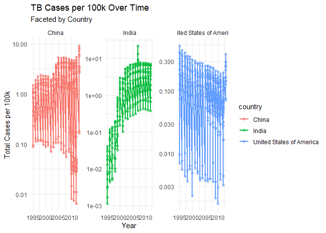
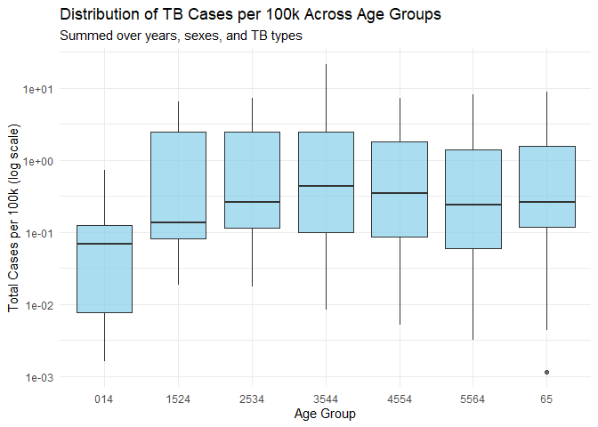
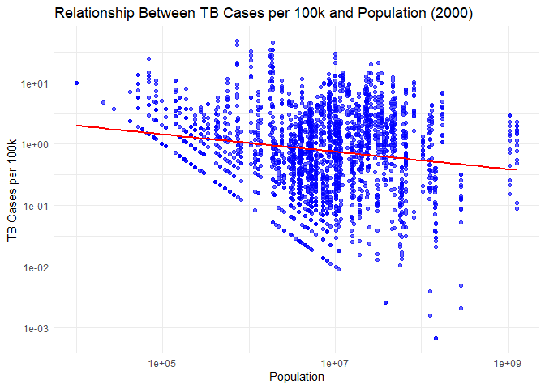

FA2_AFUNDAR_DATAMINING
================
Audrie Lex L. Afundar
2025-02-16

## Import

Import the data into tibbles named who and population

``` r
data(population)

population
```

    ## # A tibble: 4,060 × 3
    ##    country      year population
    ##    <chr>       <dbl>      <dbl>
    ##  1 Afghanistan  1995   17586073
    ##  2 Afghanistan  1996   18415307
    ##  3 Afghanistan  1997   19021226
    ##  4 Afghanistan  1998   19496836
    ##  5 Afghanistan  1999   19987071
    ##  6 Afghanistan  2000   20595360
    ##  7 Afghanistan  2001   21347782
    ##  8 Afghanistan  2002   22202806
    ##  9 Afghanistan  2003   23116142
    ## 10 Afghanistan  2004   24018682
    ## # ℹ 4,050 more rows

``` r
data(who)

who
```

    ## # A tibble: 7,240 × 60
    ##    country  iso2  iso3   year new_sp_m014 new_sp_m1524 new_sp_m2534 new_sp_m3544
    ##    <chr>    <chr> <chr> <dbl>       <dbl>        <dbl>        <dbl>        <dbl>
    ##  1 Afghani… AF    AFG    1980          NA           NA           NA           NA
    ##  2 Afghani… AF    AFG    1981          NA           NA           NA           NA
    ##  3 Afghani… AF    AFG    1982          NA           NA           NA           NA
    ##  4 Afghani… AF    AFG    1983          NA           NA           NA           NA
    ##  5 Afghani… AF    AFG    1984          NA           NA           NA           NA
    ##  6 Afghani… AF    AFG    1985          NA           NA           NA           NA
    ##  7 Afghani… AF    AFG    1986          NA           NA           NA           NA
    ##  8 Afghani… AF    AFG    1987          NA           NA           NA           NA
    ##  9 Afghani… AF    AFG    1988          NA           NA           NA           NA
    ## 10 Afghani… AF    AFG    1989          NA           NA           NA           NA
    ## # ℹ 7,230 more rows
    ## # ℹ 52 more variables: new_sp_m4554 <dbl>, new_sp_m5564 <dbl>,
    ## #   new_sp_m65 <dbl>, new_sp_f014 <dbl>, new_sp_f1524 <dbl>,
    ## #   new_sp_f2534 <dbl>, new_sp_f3544 <dbl>, new_sp_f4554 <dbl>,
    ## #   new_sp_f5564 <dbl>, new_sp_f65 <dbl>, new_sn_m014 <dbl>,
    ## #   new_sn_m1524 <dbl>, new_sn_m2534 <dbl>, new_sn_m3544 <dbl>,
    ## #   new_sn_m4554 <dbl>, new_sn_m5564 <dbl>, new_sn_m65 <dbl>, …

The population dataset having 4,060 rows and 3 columns while who dataset
having 7,240 rows and 60 columns.

Fix any anomalies and store the corrected data in population2:

``` r
population2 <- population %>% distinct()
population2 <- population %>%
  filter(population > 0)
population2 <- population %>% drop_na(population)
population2
```

    ## # A tibble: 4,060 × 3
    ##    country      year population
    ##    <chr>       <dbl>      <dbl>
    ##  1 Afghanistan  1995   17586073
    ##  2 Afghanistan  1996   18415307
    ##  3 Afghanistan  1997   19021226
    ##  4 Afghanistan  1998   19496836
    ##  5 Afghanistan  1999   19987071
    ##  6 Afghanistan  2000   20595360
    ##  7 Afghanistan  2001   21347782
    ##  8 Afghanistan  2002   22202806
    ##  9 Afghanistan  2003   23116142
    ## 10 Afghanistan  2004   24018682
    ## # ℹ 4,050 more rows

``` r
summary(population2) 
```

    ##    country               year        population       
    ##  Length:4060        Min.   :1995   Min.   :1.129e+03  
    ##  Class :character   1st Qu.:1999   1st Qu.:6.029e+05  
    ##  Mode  :character   Median :2004   Median :5.319e+06  
    ##                     Mean   :2004   Mean   :3.003e+07  
    ##                     3rd Qu.:2009   3rd Qu.:1.855e+07  
    ##                     Max.   :2013   Max.   :1.386e+09

``` r
glimpse(population2) 
```

    ## Rows: 4,060
    ## Columns: 3
    ## $ country    <chr> "Afghanistan", "Afghanistan", "Afghanistan", "Afghanistan",…
    ## $ year       <dbl> 1995, 1996, 1997, 1998, 1999, 2000, 2001, 2002, 2003, 2004,…
    ## $ population <dbl> 17586073, 18415307, 19021226, 19496836, 19987071, 20595360,…

``` r
population2 %>% count(country, year) %>% nrow()
```

    ## [1] 4060

``` r
tail(population2)
```

    ## # A tibble: 6 × 3
    ##   country   year population
    ##   <chr>    <dbl>      <dbl>
    ## 1 Zimbabwe  2008   12784041
    ## 2 Zimbabwe  2009   12888918
    ## 3 Zimbabwe  2010   13076978
    ## 4 Zimbabwe  2011   13358738
    ## 5 Zimbabwe  2012   13724317
    ## 6 Zimbabwe  2013   14149648

## Tidy Data

Perform a pivot operation to make the data tidy, storing the result in
who2

Separate values like new_ep_f014 into components (e.g., new, ep, f014)

``` r
who2 <- who %>%
  pivot_longer(
    cols = -c(country, iso2, iso3, year),
    names_to = c("new", "TB_Type", "gender"),
    names_pattern = "^(newrel|new)_(sn|sp|ep|rel)?_?(m\\d+|f\\d+)?$",
    values_to = "count"
  )
who2 <- who2 %>%
  mutate(TB_Type = ifelse(TB_Type == "", "rel", TB_Type))
tail(who2,20)
```

    ## # A tibble: 20 × 8
    ##    country  iso2  iso3   year new    TB_Type gender count
    ##    <chr>    <chr> <chr> <dbl> <chr>  <chr>   <chr>  <dbl>
    ##  1 Zimbabwe ZW    ZWE    2013 new    ep      f1524     NA
    ##  2 Zimbabwe ZW    ZWE    2013 new    ep      f2534     NA
    ##  3 Zimbabwe ZW    ZWE    2013 new    ep      f3544     NA
    ##  4 Zimbabwe ZW    ZWE    2013 new    ep      f4554     NA
    ##  5 Zimbabwe ZW    ZWE    2013 new    ep      f5564     NA
    ##  6 Zimbabwe ZW    ZWE    2013 new    ep      f65       NA
    ##  7 Zimbabwe ZW    ZWE    2013 newrel rel     m014    1315
    ##  8 Zimbabwe ZW    ZWE    2013 newrel rel     m1524   1642
    ##  9 Zimbabwe ZW    ZWE    2013 newrel rel     m2534   5331
    ## 10 Zimbabwe ZW    ZWE    2013 newrel rel     m3544   5363
    ## 11 Zimbabwe ZW    ZWE    2013 newrel rel     m4554   2349
    ## 12 Zimbabwe ZW    ZWE    2013 newrel rel     m5564   1206
    ## 13 Zimbabwe ZW    ZWE    2013 newrel rel     m65     1208
    ## 14 Zimbabwe ZW    ZWE    2013 newrel rel     f014    1252
    ## 15 Zimbabwe ZW    ZWE    2013 newrel rel     f1524   2069
    ## 16 Zimbabwe ZW    ZWE    2013 newrel rel     f2534   4649
    ## 17 Zimbabwe ZW    ZWE    2013 newrel rel     f3544   3526
    ## 18 Zimbabwe ZW    ZWE    2013 newrel rel     f4554   1453
    ## 19 Zimbabwe ZW    ZWE    2013 newrel rel     f5564    811
    ## 20 Zimbabwe ZW    ZWE    2013 newrel rel     f65      725

``` r
who2
```

    ## # A tibble: 405,440 × 8
    ##    country     iso2  iso3   year new   TB_Type gender count
    ##    <chr>       <chr> <chr> <dbl> <chr> <chr>   <chr>  <dbl>
    ##  1 Afghanistan AF    AFG    1980 new   sp      m014      NA
    ##  2 Afghanistan AF    AFG    1980 new   sp      m1524     NA
    ##  3 Afghanistan AF    AFG    1980 new   sp      m2534     NA
    ##  4 Afghanistan AF    AFG    1980 new   sp      m3544     NA
    ##  5 Afghanistan AF    AFG    1980 new   sp      m4554     NA
    ##  6 Afghanistan AF    AFG    1980 new   sp      m5564     NA
    ##  7 Afghanistan AF    AFG    1980 new   sp      m65       NA
    ##  8 Afghanistan AF    AFG    1980 new   sp      f014      NA
    ##  9 Afghanistan AF    AFG    1980 new   sp      f1524     NA
    ## 10 Afghanistan AF    AFG    1980 new   sp      f2534     NA
    ## # ℹ 405,430 more rows

Remove the column containing new, and further separate values like f014
into f and 014, storing the result in who_tidy

``` r
who_tidy <- who2 %>%
  separate(col = gender, into = c("gender", "age_range"), sep = "(?<=^[mf])") %>%
  select(-new)

who_tidy
```

    ## # A tibble: 405,440 × 8
    ##    country     iso2  iso3   year TB_Type gender age_range count
    ##    <chr>       <chr> <chr> <dbl> <chr>   <chr>  <chr>     <dbl>
    ##  1 Afghanistan AF    AFG    1980 sp      m      014          NA
    ##  2 Afghanistan AF    AFG    1980 sp      m      1524         NA
    ##  3 Afghanistan AF    AFG    1980 sp      m      2534         NA
    ##  4 Afghanistan AF    AFG    1980 sp      m      3544         NA
    ##  5 Afghanistan AF    AFG    1980 sp      m      4554         NA
    ##  6 Afghanistan AF    AFG    1980 sp      m      5564         NA
    ##  7 Afghanistan AF    AFG    1980 sp      m      65           NA
    ##  8 Afghanistan AF    AFG    1980 sp      f      014          NA
    ##  9 Afghanistan AF    AFG    1980 sp      f      1524         NA
    ## 10 Afghanistan AF    AFG    1980 sp      f      2534         NA
    ## # ℹ 405,430 more rows

``` r
tail(who_tidy)
```

    ## # A tibble: 6 × 8
    ##   country  iso2  iso3   year TB_Type gender age_range count
    ##   <chr>    <chr> <chr> <dbl> <chr>   <chr>  <chr>     <dbl>
    ## 1 Zimbabwe ZW    ZWE    2013 rel     f      1524       2069
    ## 2 Zimbabwe ZW    ZWE    2013 rel     f      2534       4649
    ## 3 Zimbabwe ZW    ZWE    2013 rel     f      3544       3526
    ## 4 Zimbabwe ZW    ZWE    2013 rel     f      4554       1453
    ## 5 Zimbabwe ZW    ZWE    2013 rel     f      5564        811
    ## 6 Zimbabwe ZW    ZWE    2013 rel     f      65          725

Cast the population variable to an appropriate data type, storing the
result in population_tidy

``` r
population_tidy<-population2 %>% 
  mutate(population= as.integer(population))

population_tidy
```

    ## # A tibble: 4,060 × 3
    ##    country      year population
    ##    <chr>       <dbl>      <int>
    ##  1 Afghanistan  1995   17586073
    ##  2 Afghanistan  1996   18415307
    ##  3 Afghanistan  1997   19021226
    ##  4 Afghanistan  1998   19496836
    ##  5 Afghanistan  1999   19987071
    ##  6 Afghanistan  2000   20595360
    ##  7 Afghanistan  2001   21347782
    ##  8 Afghanistan  2002   22202806
    ##  9 Afghanistan  2003   23116142
    ## 10 Afghanistan  2004   24018682
    ## # ℹ 4,050 more rows

## Join Datasets

Join the datasets into a tibble called tuberculosis.

``` r
tuberculosis<-population_tidy %>% 
  left_join(who_tidy, by=c("country", "year"))
tuberculosis<-tuberculosis %>%
  mutate(count=as.integer(count))

tuberculosis
```

    ## # A tibble: 226,095 × 9
    ##    country      year population iso2  iso3  TB_Type gender age_range count
    ##    <chr>       <dbl>      <int> <chr> <chr> <chr>   <chr>  <chr>     <int>
    ##  1 Afghanistan  1995   17586073 AF    AFG   sp      m      014          NA
    ##  2 Afghanistan  1995   17586073 AF    AFG   sp      m      1524         NA
    ##  3 Afghanistan  1995   17586073 AF    AFG   sp      m      2534         NA
    ##  4 Afghanistan  1995   17586073 AF    AFG   sp      m      3544         NA
    ##  5 Afghanistan  1995   17586073 AF    AFG   sp      m      4554         NA
    ##  6 Afghanistan  1995   17586073 AF    AFG   sp      m      5564         NA
    ##  7 Afghanistan  1995   17586073 AF    AFG   sp      m      65           NA
    ##  8 Afghanistan  1995   17586073 AF    AFG   sp      f      014          NA
    ##  9 Afghanistan  1995   17586073 AF    AFG   sp      f      1524         NA
    ## 10 Afghanistan  1995   17586073 AF    AFG   sp      f      2534         NA
    ## # ℹ 226,085 more rows

## Data Manipulation

Determine the total TB cases among men and women in the 21st century in
the United States. Identify which sex had more cases.

``` r
tuberculosis %>% 
  filter(iso3 == "USA") %>% 
  filter(year >= 2000) %>% 
  summarize(total_male_count = sum(count[gender=="m"], na.rm = TRUE),
            total_female_count = sum(count[gender=="f"], na.rm = TRUE),
            total_count = sum(count, na.rm = TRUE)
            )
```

    ## # A tibble: 1 × 3
    ##   total_male_count total_female_count total_count
    ##              <int>              <int>       <int>
    ## 1            77867              45768      123635

Then, on the 21st century, USA has a total of 123635 cases with male
having the highest with 77867 (62.981%) of the TB population.

Create a new variable, cases_per_100k, representing TB cases per 100,000
people by year, sex, age group, and TB type.

The country and year with the highest cases per 100k.

The country and year with the lowest cases per 100k.

``` r
tuberculosis <- tuberculosis %>%
  mutate(cases_per_100k = (count / population) * 100000) %>%
  group_by(country,year, gender, age_range, TB_Type, population) %>%
  summarize(cases_per_100k = sum(cases_per_100k, na.rm = TRUE), .groups = "drop")
tuberculosis
```

    ## # A tibble: 226,095 × 7
    ##    country      year gender age_range TB_Type population cases_per_100k
    ##    <chr>       <dbl> <chr>  <chr>     <chr>        <int>          <dbl>
    ##  1 Afghanistan  1995 f      014       ep        17586073              0
    ##  2 Afghanistan  1995 f      014       rel       17586073              0
    ##  3 Afghanistan  1995 f      014       sn        17586073              0
    ##  4 Afghanistan  1995 f      014       sp        17586073              0
    ##  5 Afghanistan  1995 f      1524      ep        17586073              0
    ##  6 Afghanistan  1995 f      1524      rel       17586073              0
    ##  7 Afghanistan  1995 f      1524      sn        17586073              0
    ##  8 Afghanistan  1995 f      1524      sp        17586073              0
    ##  9 Afghanistan  1995 f      2534      ep        17586073              0
    ## 10 Afghanistan  1995 f      2534      rel       17586073              0
    ## # ℹ 226,085 more rows

``` r
tuberculosis %>%
  filter(cases_per_100k == max(cases_per_100k, na.rm = TRUE)) %>%
  select(country, year, cases_per_100k)
```

    ## # A tibble: 1 × 3
    ##   country  year cases_per_100k
    ##   <chr>   <dbl>          <dbl>
    ## 1 Samoa    2009           602.

``` r
tuberculosis %>%
  filter(cases_per_100k == min(cases_per_100k[cases_per_100k > 0], na.rm = TRUE)) %>%
  select(country, year, cases_per_100k)
```

    ## # A tibble: 2 × 3
    ##   country             year cases_per_100k
    ##   <chr>              <dbl>          <dbl>
    ## 1 Russian Federation  2000       0.000681
    ## 2 Russian Federation  2000       0.000681

Samoa having the highest cases per 100k in the year 2009 with 601.5029
while Russian Federation in the 2000 having 0.00068

## Data Visualization

Plot the total cases per 100k as a function of year for China, India,
and the United States:

Use a log scale on the y-axis (scale_y_log10()).

Describe emerging patterns.

``` r
tb_subset <- tuberculosis %>%
  filter(country %in% c("India", "China", "United States of America")) %>%
  filter(cases_per_100k > 0)


ggplot(tb_subset, aes(x = year, y = cases_per_100k)) +
  geom_line(aes(color = country), size = 1) +
  geom_point(aes(color = country), alpha = 0.5) +
  scale_y_log10() +
  facet_wrap(~ country, scales = "free_y") + 
  labs(
    title = "TB Cases per 100k Over Time",
    subtitle = "Faceted by Country",
    x = "Year",
    y = "Total Cases per 100k"
  ) +
  theme_minimal()
```

    ## Warning: Using `size` aesthetic for lines was deprecated in ggplot2 3.4.0.
    ## ℹ Please use `linewidth` instead.
    ## This warning is displayed once every 8 hours.
    ## Call `lifecycle::last_lifecycle_warnings()` to see where this warning was
    ## generated.

<!-- -->
Seen in the figure above, USA have the lowest TB cases among the 3 with
0.3 being the highest. Whilst India, progressively increased in number
from 1995-2000 and became stable. On the other hand, China had also
become stable with a few dips in the figure. However, the highest among
these 3 countries based on their TB cases would go to India. Another
thing to note here is that the dips across the figures might indicate
that there are age range amongst these countries that have very low TB
cases creating the spikes.

Compare distributions of total cases per 100k (summed over years, sexes,
and TB types) across age groups:

Use a log scale on the y-axis.

Highlight observed patterns.

``` r
ggplot(tb_subset, aes(x = age_range, y = cases_per_100k)) +
  geom_boxplot(fill = "skyblue", alpha = 0.7) +
  scale_y_log10() +  
  labs(
    title = "Distribution of TB Cases per 100k Across Age Groups",
    subtitle = "Summed over years, sexes, and TB types",
    x = "Age Group",
    y = "Total Cases per 100k (log scale)"
  ) +
  theme_minimal()
```

<!-- -->
In the box plot, 0-14 years old have the lowest count across all the age
ranges. While in 1524-4554 have their mean steadily increase. This can
indicate variables such as work among other things that might influence
an infection on TB cases.

Create a plot to evaluate whether the number of cases per 100k in 2000
was related to a country’s population:

Conclude based on the visualization.

``` r
tb_2000 <- tuberculosis %>%
  filter(year == 2000) %>%
  filter(population > 0, cases_per_100k > 0) 

ggplot(tb_2000, aes(x = population, y = cases_per_100k)) +
  geom_point(alpha = 0.6, color = "blue") +  
  geom_smooth(method = "lm", color = "red", se = FALSE) + 
  scale_x_log10() +  
  scale_y_log10() + 
  labs(
    title = "Relationship Between TB Cases per 100k and Population (2000)",
    x = "Population",
    y = "TB Cases per 100k"
  ) +
  theme_minimal()
```

    ## `geom_smooth()` using formula = 'y ~ x'

<!-- -->
The line indicates that as population increase, TB cases decreases. This
can be due to higher accessibility amongst healthcare, urbanization,
etc… Moreover, low populated countries have a higher variability,
therefore, there are low populated countries that have higher cases,
vice versa.
