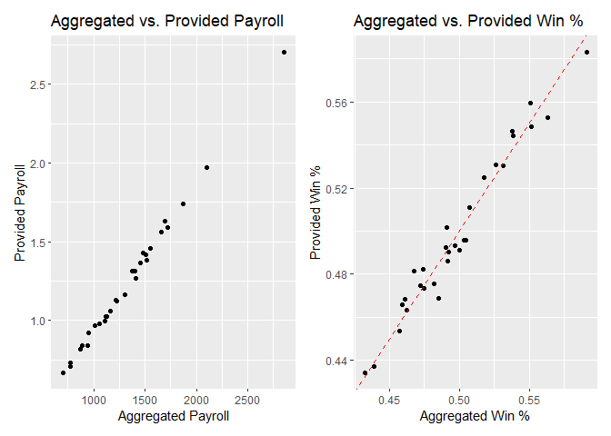
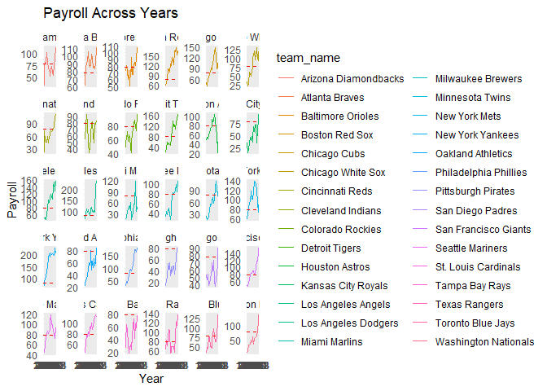
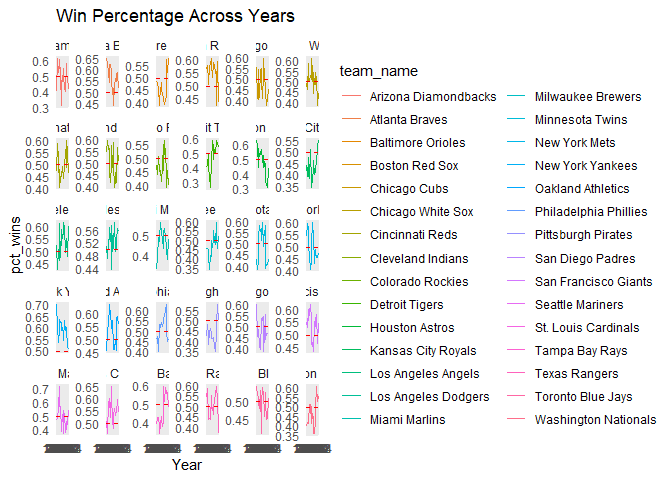
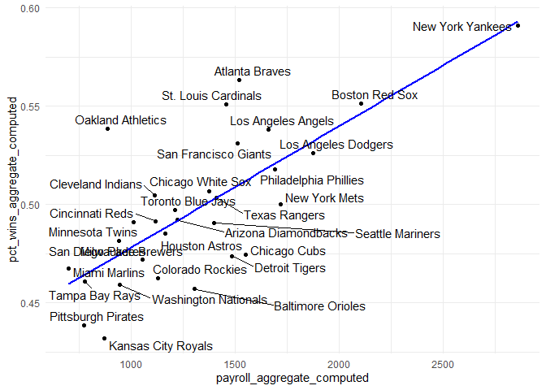
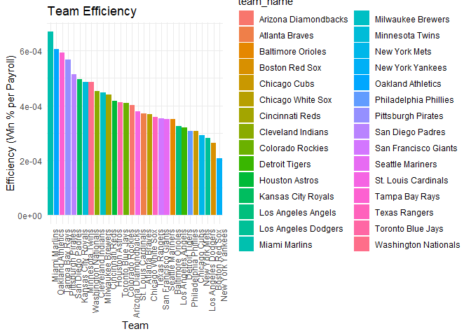

FA3_AFUNDAR_DATAMINING
================
Audrie Lex L. Afundar
2025-02-21

## Major League Baseball

The dataset used in this analysis is the Major League Baseball
consisting of the following variables:

• payroll: total team payroll (in billions of dollars) over the 17-year
period • avgwin: the aggregated win percentage over the 17-year period •
Team.name.2014: the name of the team • p1998, . . . , p2014: payroll for
each year (in millions of dollars) • X1998, . . . , X2014: number of
wins for each year • X1998.pct, . . . , X2014.pct: win percentage for
each year

## Tidy

Using pivot longer for payroll per year, wins per year and percentage
per year.

``` r
payroll_long <- ml_pay %>%
  pivot_longer(
    cols = matches("^p\\d{4}$"), 
    names_to = "Year",
    names_prefix="p",
    values_to = "Payroll_p_year"
  )

wins_long <- ml_pay %>%
  pivot_longer(
    cols = matches("^X\\d{4}$"),  
    names_to = "Year",
    names_prefix="X",
    values_to = "num_wins"
  )

win_pct_long <- ml_pay %>%
  pivot_longer(
    cols = matches("^X\\d{4}\\.pct$"),  
    names_to = "Year",
    names_prefix = "X",
    values_to = "pct_wins"
  ) %>%
  mutate(Year = str_remove(Year, "\\.pct$"))  

df_list <- list(payroll_long, wins_long, win_pct_long)

tidy_data <- reduce(df_list, left_join, by = c("Team.name.2014", "Year"))

tidy_data <- tidy_data %>%
  select(-matches("^p\\d{4}$"), -matches("^X\\d{4}$"), -matches("^X\\d{4}\\.pct$"))

tidy_data <- tidy_data %>%
  select(-matches("\\.x$")) %>%
  select(-matches("\\.y$"))

tidy_data <- tidy_data %>%
  mutate(Payroll_p_year = as.numeric(Payroll_p_year))


tidy_data <- tidy_data %>%
  rename(team_name = Team.name.2014)

tidy_data
```

    ## # A tibble: 510 × 7
    ##    team_name            Year  Payroll_p_year num_wins payroll avgwin pct_wins
    ##    <fct>                <chr>          <dbl>    <int>   <dbl>  <dbl>    <dbl>
    ##  1 Arizona Diamondbacks 1998            31.6       65    1.12  0.490    0.399
    ##  2 Arizona Diamondbacks 1999            70.5      100    1.12  0.490    0.613
    ##  3 Arizona Diamondbacks 2000            81.0       85    1.12  0.490    0.525
    ##  4 Arizona Diamondbacks 2001            81.2       92    1.12  0.490    0.568
    ##  5 Arizona Diamondbacks 2002           103.        98    1.12  0.490    0.605
    ##  6 Arizona Diamondbacks 2003            80.6       84    1.12  0.490    0.519
    ##  7 Arizona Diamondbacks 2004            70.2       51    1.12  0.490    0.315
    ##  8 Arizona Diamondbacks 2005            63.0       77    1.12  0.490    0.475
    ##  9 Arizona Diamondbacks 2006            59.7       76    1.12  0.490    0.469
    ## 10 Arizona Diamondbacks 2007            52.1       90    1.12  0.490    0.552
    ## # ℹ 500 more rows

Creating two more tibbles: mlb_aggregate and mlb_yearly.

Using the tidy_data, we can then easily extract mlb_yearly. For
mlb_aggregate, use the original dataset to extract the team, payroll and
avgwin.

``` r
mlb_aggregate <- ml_pay %>%
  select(Team.name.2014, payroll, avgwin) %>%
  rename(team_name = Team.name.2014)
mlb_aggregate
```

    ##                team_name   payroll    avgwin
    ## 1   Arizona Diamondbacks 1.1208736 0.4902585
    ## 2         Atlanta Braves 1.3817118 0.5527605
    ## 3      Baltimore Orioles 1.1612117 0.4538250
    ## 4         Boston Red Sox 1.9723587 0.5487172
    ## 5           Chicago Cubs 1.4597668 0.4736557
    ## 6      Chicago White Sox 1.3153909 0.5111170
    ## 7        Cincinnati Reds 1.0247816 0.4861602
    ## 8      Cleveland Indians 0.9991810 0.4959225
    ## 9       Colorado Rockies 1.0261536 0.4633760
    ## 10        Detroit Tigers 1.4297408 0.4822029
    ## 11        Houston Astros 1.0601501 0.4687202
    ## 12    Kansas City Royals 0.8177417 0.4342288
    ## 13    Los Angeles Angels 1.5626224 0.5463819
    ## 14   Los Angeles Dodgers 1.7402719 0.5308482
    ## 15         Miami Marlins 0.6678019 0.4813631
    ## 16     Milwaukee Brewers 0.9790940 0.4746570
    ## 17       Minnesota Twins 0.9698272 0.5019047
    ## 18         New York Mets 1.5884288 0.4911388
    ## 19      New York Yankees 2.7032482 0.5830719
    ## 20     Oakland Athletics 0.8409340 0.5445067
    ## 21 Philadelphia Phillies 1.6301209 0.5247021
    ## 22    Pittsburgh Pirates 0.7339057 0.4371254
    ## 23      San Diego Padres 0.8406668 0.4754884
    ## 24  San Francisco Giants 1.4168770 0.5304369
    ## 25      Seattle Mariners 1.3111203 0.4925819
    ## 26   St. Louis Cardinals 1.3681117 0.5595414
    ## 27        Tampa Bay Rays 0.7107894 0.4685176
    ## 28         Texas Rangers 1.2693201 0.4956494
    ## 29     Toronto Blue Jays 1.1290219 0.4930823
    ## 30  Washington Nationals 0.9219641 0.4660195

``` r
mlb_yearly <- tidy_data %>%
  select(-payroll, -avgwin)
mlb_yearly
```

    ## # A tibble: 510 × 5
    ##    team_name            Year  Payroll_p_year num_wins pct_wins
    ##    <fct>                <chr>          <dbl>    <int>    <dbl>
    ##  1 Arizona Diamondbacks 1998            31.6       65    0.399
    ##  2 Arizona Diamondbacks 1999            70.5      100    0.613
    ##  3 Arizona Diamondbacks 2000            81.0       85    0.525
    ##  4 Arizona Diamondbacks 2001            81.2       92    0.568
    ##  5 Arizona Diamondbacks 2002           103.        98    0.605
    ##  6 Arizona Diamondbacks 2003            80.6       84    0.519
    ##  7 Arizona Diamondbacks 2004            70.2       51    0.315
    ##  8 Arizona Diamondbacks 2005            63.0       77    0.475
    ##  9 Arizona Diamondbacks 2006            59.7       76    0.469
    ## 10 Arizona Diamondbacks 2007            52.1       90    0.552
    ## # ℹ 500 more rows

Comparing the rows from both the mlb_aggregate and mlb_yearly,
mlb_yearly definitely has more rows with 510 vs 30. This is due to the
fact that mlb_yearly records the year by year wins, percentage and
payroll per year. On the contrast, mlb_aggregate only records the total
payroll and average win.

## Quality Control

Create a new tibble mlb_aggregate_computed based on the data from
mlb_yearly, then join the newly created tibble to mlb_aggregate to
compare and visualize later on.

``` r
mlb_aggregate_computed <- mlb_yearly %>%
  group_by(team_name) %>%
  summarise(
    payroll_aggregate_computed = sum(Payroll_p_year, na.rm = TRUE), 
    pct_wins_aggregate_computed = mean(pct_wins, na.rm = TRUE) 
  )
mlb_aggregate_computed
```

    ## # A tibble: 30 × 3
    ##    team_name            payroll_aggregate_computed pct_wins_aggregate_computed
    ##    <fct>                                     <dbl>                       <dbl>
    ##  1 Arizona Diamondbacks                      1223.                       0.492
    ##  2 Atlanta Braves                            1518.                       0.563
    ##  3 Baltimore Orioles                         1305.                       0.457
    ##  4 Boston Red Sox                            2104.                       0.551
    ##  5 Chicago Cubs                              1552.                       0.475
    ##  6 Chicago White Sox                         1375.                       0.507
    ##  7 Cincinnati Reds                           1119.                       0.491
    ##  8 Cleveland Indians                         1113.                       0.505
    ##  9 Colorado Rockies                          1129.                       0.463
    ## 10 Detroit Tigers                            1484.                       0.474
    ## # ℹ 20 more rows

``` r
mlb_aggregate_joined <- mlb_aggregate %>%
  left_join(mlb_aggregate_computed, by = "team_name")

mlb_aggregate_joined
```

    ##                team_name   payroll    avgwin payroll_aggregate_computed
    ## 1   Arizona Diamondbacks 1.1208736 0.4902585                  1222.9841
    ## 2         Atlanta Braves 1.3817118 0.5527605                  1518.3098
    ## 3      Baltimore Orioles 1.1612117 0.4538250                  1305.2710
    ## 4         Boston Red Sox 1.9723587 0.5487172                  2103.5807
    ## 5           Chicago Cubs 1.4597668 0.4736557                  1551.7256
    ## 6      Chicago White Sox 1.3153909 0.5111170                  1375.1059
    ## 7        Cincinnati Reds 1.0247816 0.4861602                  1118.7674
    ## 8      Cleveland Indians 0.9991810 0.4959225                  1113.1666
    ## 9       Colorado Rockies 1.0261536 0.4633760                  1129.3117
    ## 10        Detroit Tigers 1.4297408 0.4822029                  1483.9380
    ## 11        Houston Astros 1.0601501 0.4687202                  1162.7931
    ## 12    Kansas City Royals 0.8177417 0.4342288                   869.9087
    ## 13    Los Angeles Angels 1.5626224 0.5463819                  1660.8796
    ## 14   Los Angeles Dodgers 1.7402719 0.5308482                  1874.1943
    ## 15         Miami Marlins 0.6678019 0.4813631                   698.0929
    ## 16     Milwaukee Brewers 0.9790940 0.4746570                  1053.9193
    ## 17       Minnesota Twins 0.9698272 0.5019047                  1010.6997
    ## 18         New York Mets 1.5884288 0.4911388                  1718.5959
    ## 19      New York Yankees 2.7032482 0.5830719                  2857.0926
    ## 20     Oakland Athletics 0.8409340 0.5445067                   887.5729
    ## 21 Philadelphia Phillies 1.6301209 0.5247021                  1689.3115
    ## 22    Pittsburgh Pirates 0.7339057 0.4371254                   771.7683
    ## 23      San Diego Padres 0.8406668 0.4754884                   939.5651
    ## 24  San Francisco Giants 1.4168770 0.5304369                  1511.3513
    ## 25      Seattle Mariners 1.3111203 0.4925819                  1399.2147
    ## 26   St. Louis Cardinals 1.3681117 0.5595414                  1458.3757
    ## 27        Tampa Bay Rays 0.7107894 0.4685176                   776.1869
    ## 28         Texas Rangers 1.2693201 0.4956494                  1411.4163
    ## 29     Toronto Blue Jays 1.1290219 0.4930823                  1211.6357
    ## 30  Washington Nationals 0.9219641 0.4660195                   946.6941
    ##    pct_wins_aggregate_computed
    ## 1                    0.4921264
    ## 2                    0.5631539
    ## 3                    0.4570920
    ## 4                    0.5512860
    ## 5                    0.4745898
    ## 6                    0.5069221
    ## 7                    0.4913973
    ## 8                    0.5047025
    ## 9                    0.4626324
    ## 10                   0.4738311
    ## 11                   0.4853919
    ## 12                   0.4322229
    ## 13                   0.5380382
    ## 14                   0.5261364
    ## 15                   0.4673161
    ## 16                   0.4722253
    ## 17                   0.4908542
    ## 18                   0.5001207
    ## 19                   0.5909819
    ## 20                   0.5385489
    ## 21                   0.5178263
    ## 22                   0.4387483
    ## 23                   0.4816201
    ## 24                   0.5311866
    ## 25                   0.4905675
    ## 26                   0.5507321
    ## 27                   0.4610341
    ## 28                   0.5033788
    ## 29                   0.4971440
    ## 30                   0.4591908

Visualize mlb_aggregate_joined using scatterplots comparing
payroll_aggregate_computed vs payroll_aggregate and
pct_wins_aggreggate_computed vs pct_wins_aggregate.

``` r
payroll_plot <- ggplot(mlb_aggregate_joined, aes(x = payroll_aggregate_computed, y = payroll)) +
  geom_point() +
  geom_abline(slope = 1, intercept = 0, linetype = "dashed", color = "red") + 
  labs(title = "Aggregated vs. Provided Payroll", x = "Aggregated Payroll", y = "Provided Payroll")

win_pct_plot <- ggplot(mlb_aggregate_joined, aes(x = pct_wins_aggregate_computed, y = avgwin)) +
  geom_point() +
  geom_abline(slope = 1, intercept = 0, linetype = "dashed", color = "red") + 
  labs(title = "Aggregated vs. Provided Win %", x = "Aggregated Win %", y = "Provided Win %") 

payroll_plot + win_pct_plot
```

<!-- -->
This means that the computed payroll and win percentage is highly
similar with the provided ones indicating that there were no significant
errors in the computed payroll and win percentage.

## Visualization

## Payroll across years

``` r
ggplot(tidy_data, aes(x = Year, y = Payroll_p_year, group = team_name, color = team_name)) +
  geom_line() +
  geom_hline(aes(yintercept = mean(Payroll_p_year)), linetype = "dashed", color = "red") +  
  facet_wrap(~ team_name, scales = "free_y") +
  labs(title = "Payroll Across Years", x = "Year", y = "Payroll")+
  theme_minimal()
```

<!-- -->
(a) Using dplyr, identify the three teams with the greatest
payroll_aggregate_computed, and print a table of these teams and their
payroll_aggregate_computed.

2)  Using dplyr, identify the three teams with the greatest percentage
    increase in payroll from 1998 to 2014 (call it pct_increase), and
    print a table of these teams along with pct_increase as well as
    their payroll figures from 1998 and 2014.

3)  How are the metrics payroll_aggregate_computed and pct_increase
    reflected in the plot above, and how can we see that the two sets of
    teams identified above are the top three in terms of these metrics?

## (a)

``` r
top_payroll_teams <- mlb_aggregate_computed %>%
  arrange(desc(payroll_aggregate_computed)) %>%
  slice_head(n = 3)

top_payroll_teams
```

    ## # A tibble: 3 × 3
    ##   team_name           payroll_aggregate_computed pct_wins_aggregate_computed
    ##   <fct>                                    <dbl>                       <dbl>
    ## 1 New York Yankees                         2857.                       0.591
    ## 2 Boston Red Sox                           2104.                       0.551
    ## 3 Los Angeles Dodgers                      1874.                       0.526

## (b)

``` r
payroll_growth <- mlb_yearly %>%
  filter(Year %in% c(1998, 2014)) %>%
  select(team_name, Year, Payroll_p_year) %>%
  pivot_wider(names_from = Year, values_from = Payroll_p_year, names_prefix = "Payroll_") %>%
  mutate(pct_increase = (Payroll_2014 - Payroll_1998) / Payroll_1998 * 100) %>%
  arrange(desc(pct_increase)) %>%
  slice_head(n = 3)

payroll_growth
```

    ## # A tibble: 3 × 4
    ##   team_name             Payroll_1998 Payroll_2014 pct_increase
    ##   <fct>                        <dbl>        <dbl>        <dbl>
    ## 1 Washington Nationals          8.32         135.        1520.
    ## 2 Detroit Tigers               19.2          162.         743.
    ## 3 Philadelphia Phillies        28.6          180.         529.

## (c)

Based on the 3 top payroll teams, they have been having consistent high
payroll per year. This can also be seen in the plot. It can also be seen
that they are all relatively above the mean of the payrolls.

On the growth of the payroll, the 3 teams have a more steeper increase
on the payroll of 1998 to 2014 as also seen in the plot above.

## Win percentage across years

``` r
ggplot(tidy_data, aes(x = Year, y = pct_wins, group = team_name, color = team_name)) +
  geom_line() +
  geom_hline(aes(yintercept = mean(pct_wins)), linetype = "dashed", color = "red") +
  facet_wrap(~ team_name, scales = "free_y")+
  labs(title = "Win Percentage Across Years", x = "Year", y = "pct_wins")+
  theme_minimal() 
```

<!-- -->
(a) Using dplyr, identify the three teams with the greatest
pct_wins_aggregate_computed and print a table of these teams along with
pct_wins_aggregate_computed.

2)  Using dplyr, identify the three teams with the most erratic pct_wins
    across years (as measured by the standard deviation, call it
    pct_wins_sd) and print a table of these teams along with
    pct_wins_sd.

3)  How are the metrics pct_wins_aggregate_computed and pct_wins_sd
    reflected in the plot above, and how can we see that the two sets of
    teams identified above are the top three in terms of these metrics?

## (a)

``` r
top_pct_teams <- mlb_aggregate_computed %>%
  arrange(desc(pct_wins_aggregate_computed)) %>%
  slice_head(n = 3)

top_pct_teams
```

    ## # A tibble: 3 × 3
    ##   team_name        payroll_aggregate_computed pct_wins_aggregate_computed
    ##   <fct>                                 <dbl>                       <dbl>
    ## 1 New York Yankees                      2857.                       0.591
    ## 2 Atlanta Braves                        1518.                       0.563
    ## 3 Boston Red Sox                        2104.                       0.551

## (b)

``` r
sd_teams <- mlb_yearly %>%
  group_by(team_name) %>%
  summarize(pct_wins_sd = sd(pct_wins, na.rm = TRUE)) %>%
  arrange(desc(pct_wins_sd)) %>%
  slice_head(n = 3)

sd_teams
```

    ## # A tibble: 3 × 2
    ##   team_name        pct_wins_sd
    ##   <fct>                  <dbl>
    ## 1 Houston Astros        0.0914
    ## 2 Detroit Tigers        0.0898
    ## 3 Seattle Mariners      0.0892

## (c)

Based on the top 3 win percentage, it can be seen in the plot that this
is true. While the New York Yankees had 70% winrate in their early years
but dropped into 59%.

On the other hand, it can also be seen that the top 3 highest sd have
the most erratic plot with Houston Astros having the highest. This can
be seen in the plot where it had a 60+% winrate going down as low as
30%.

## Win percentage versus payroll

``` r
ggplot(mlb_aggregate_joined, aes(x = payroll_aggregate_computed, y = pct_wins_aggregate_computed, label = team_name)) +
  geom_point() +
  geom_smooth(method = "lm", se = FALSE, color = "blue") +
  geom_text_repel() + 
  theme_minimal()
```

    ## `geom_smooth()` using formula = 'y ~ x'

    ## Warning: The following aesthetics were dropped during statistical transformation: label.
    ## ℹ This can happen when ggplot fails to infer the correct grouping structure in
    ##   the data.
    ## ℹ Did you forget to specify a `group` aesthetic or to convert a numerical
    ##   variable into a factor?

<!-- -->

As seen in the plot above, the relationship between the payroll and
percentage wins is positive. This indicates that as payroll increases,
win percentage tends to increase also. This can be easily seen by the
line.

## Team Efficiency

``` r
mlb_aggregate_joined <- mlb_aggregate_joined%>% 
  mutate(Efficiency = pct_wins_aggregate_computed / payroll_aggregate_computed)

ggplot(mlb_aggregate_joined, aes(x = reorder(team_name, -Efficiency), y = Efficiency, fill = team_name)) +
  geom_col() +
  theme_minimal() +
  labs(title = "Team Efficiency", x = "Team", y = "Efficiency (Win % per Payroll)") +
  theme(axis.text.x = element_text(angle = 90, hjust = 1))
```

<!-- -->

``` r
top_effic_teams <- mlb_aggregate_joined %>%
  arrange(desc(Efficiency)) %>%
  slice_head(n = 3)

top_effic_teams
```

    ##           team_name   payroll    avgwin payroll_aggregate_computed
    ## 1     Miami Marlins 0.6678019 0.4813631                   698.0929
    ## 2 Oakland Athletics 0.8409340 0.5445067                   887.5729
    ## 3    Tampa Bay Rays 0.7107894 0.4685176                   776.1869
    ##   pct_wins_aggregate_computed   Efficiency
    ## 1                   0.4673161 0.0006694182
    ## 2                   0.5385489 0.0006067658
    ## 3                   0.4610341 0.0005939731

As seen in the plot and table, the 3 efficient teams are Miami Marlins,
Oakland Athletics and Tampa Bay Rays. These 3 are efficient in relation
to their winrate based on payroll. Despite having a below mean payroll,
they still manage to hang above or below the 50% mark. This considers
them as efficient, by further increasing the payroll: this can result to
a higher winrate with the possibility of being one of the highest
winrate amongst the baseball league.
