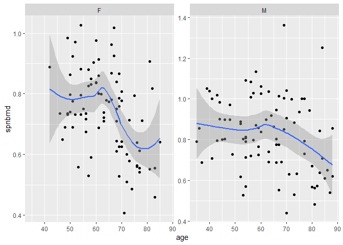
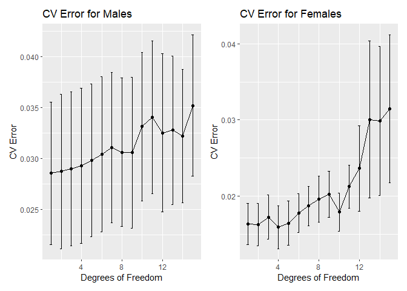
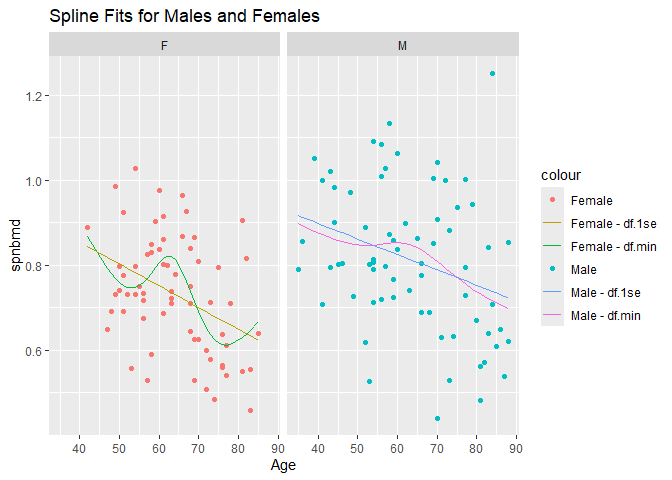
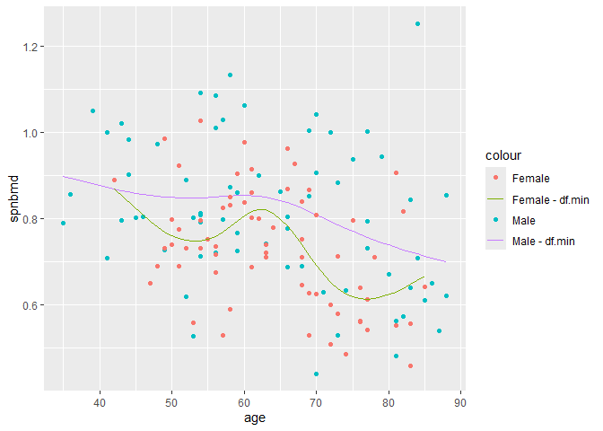
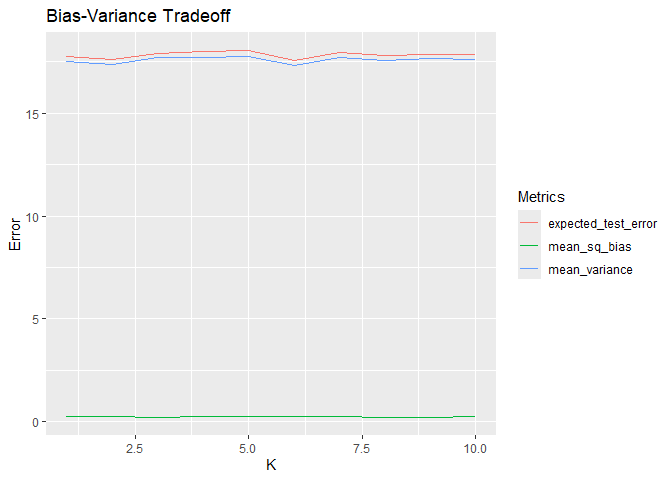
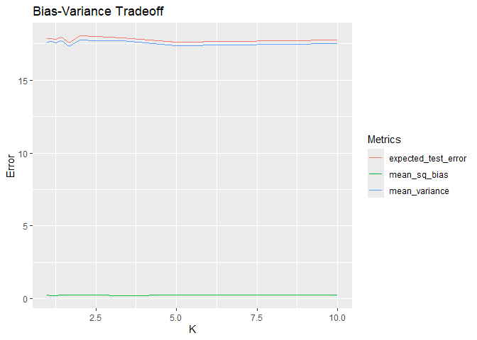
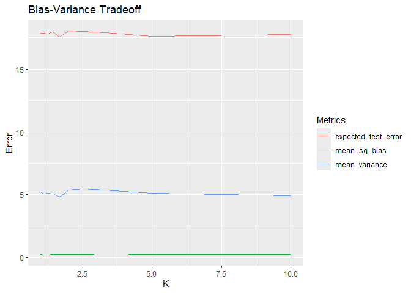

FA4_AFUNDAR_DATAMINING
================
Audrie Lex L. Afundar
2025-03-06

## 1.1 Import

``` r
bmd_data<-read_excel("D:/Download folder/bmd-data.xlsx")
bmd_data
```

    ## # A tibble: 169 × 9
    ##    idnum   age sex   fracture weight_kg height_cm medication waiting_time spnbmd
    ##    <dbl> <dbl> <chr> <chr>        <dbl>     <dbl> <chr>             <dbl>  <dbl>
    ##  1   469  57.1 F     no frac…        64      156. Anticonvu…           18  0.879
    ##  2  8724  75.7 F     no frac…        78      162  No medica…           56  0.795
    ##  3  6736  70.8 M     no frac…        73      170. No medica…           10  0.907
    ##  4 24180  78.2 F     no frac…        60      148  No medica…           14  0.711
    ##  5 17072  54.2 M     no frac…        55      161  No medica…           20  0.791
    ##  6  3806  77.2 M     no frac…        65      168  No medica…            7  0.730
    ##  7 17106  56.2 M     no frac…        77      159  No medica…           26  1.01 
    ##  8 23834  49.9 F     no frac…        59      150  No medica…            9  0.731
    ##  9  2454  68.4 M     no frac…        64      167  Glucocort…            6  0.689
    ## 10  2088  66.3 M     no frac…        72      160. No medica…           10  0.947
    ## # ℹ 159 more rows

## Tidy

I don’t see any problem in the current tibble for bmd_data except for
age in a decimal format. Although there a few notes to take care of such
as fracture and medication, if we need this to be graphed, this still
doesn’t cause any troubles since there are only a few unique words that
corresponds to these fractures and medication. Moreover, we can also use
the count function to quantify each unique words on each column.

``` r
bmd_data$age<-as.integer(bmd_data$age)

bmd<-bmd_data

bmd
```

    ## # A tibble: 169 × 9
    ##    idnum   age sex   fracture weight_kg height_cm medication waiting_time spnbmd
    ##    <dbl> <int> <chr> <chr>        <dbl>     <dbl> <chr>             <dbl>  <dbl>
    ##  1   469    57 F     no frac…        64      156. Anticonvu…           18  0.879
    ##  2  8724    75 F     no frac…        78      162  No medica…           56  0.795
    ##  3  6736    70 M     no frac…        73      170. No medica…           10  0.907
    ##  4 24180    78 F     no frac…        60      148  No medica…           14  0.711
    ##  5 17072    54 M     no frac…        55      161  No medica…           20  0.791
    ##  6  3806    77 M     no frac…        65      168  No medica…            7  0.730
    ##  7 17106    56 M     no frac…        77      159  No medica…           26  1.01 
    ##  8 23834    49 F     no frac…        59      150  No medica…            9  0.731
    ##  9  2454    68 M     no frac…        64      167  Glucocort…            6  0.689
    ## 10  2088    66 M     no frac…        72      160. No medica…           10  0.947
    ## # ℹ 159 more rows

## 1.3 Explore

``` r
sum(bmd$age <= 12.5)
```

    ## [1] 0

There are no children in the dataset thus have no median.

``` r
ggplot(bmd, aes(x = age, y = spnbmd)) +
  geom_point()+
  facet_wrap(~ sex, scales = "free_y")+
  geom_smooth(method="loess", se=TRUE)
```

    ## `geom_smooth()` using formula = 'y ~ x'

<!-- -->

The trend loess is giving is that as the age goes higher the bmd gets
lower. To add, on the dataset, the male has a higher bmd with a steady
decline compared to the female.

## 1.4.1 Split

``` r
set.seed(5)
n <- nrow(bmd)

train_samples <- sample(1:n, round(0.8*n))

bmd_train <- bmd[train_samples,]
bmd_test <- bmd[-train_samples,]

bmd_train_male <- filter(bmd_train, sex=="M")
bmd_train_female <- filter(bmd_train, sex=="F")

bmd_test_male<- filter(bmd_test, sex=="M")
bmd_test_female<- filter(bmd_test, sex=="F")
```

## 1.4.2 Tune

``` r
K <- 10
n_male <- nrow(bmd_train_male) 
n_fmale <- nrow(bmd_train_female)
folds_fmale <- sample(rep(1:K, length.out = n_fmale))
folds <- sample(rep(1:K, length.out = n_male))  
bmd_train_female <- bmd_train_female %>% mutate(fold_fmale = folds_fmale)
bmd_train_male <- bmd_train_male %>% mutate(fold = folds)

results_table_male <- data.frame(df = integer(), cv_mean = numeric(), cv_se = numeric())
results_table_female <- data.frame(df = integer(), cv_mean = numeric(), cv_se = numeric())

for (df_value in 1:15) {
  out_of_fold_predictions_fmale <- numeric(n_fmale)
  out_of_fold_predictions <- numeric(n_male)
  
  for (current_fold in 1:K) {
    out_of_fold_data <- bmd_train_male %>% filter(fold != current_fold)
    out_of_fold_data_fmale <- bmd_train_female %>% filter(fold_fmale != current_fold)
    in_fold_data_fmale <- bmd_train_female %>% filter(fold_fmale == current_fold)
    in_fold_data <- bmd_train_male %>% filter(fold == current_fold)
    
    spline_fit_fmale <- lm(spnbmd ~ ns(age, df = df_value), data = out_of_fold_data_fmale)
    spline_fit <- lm(spnbmd ~ ns(age, df = df_value), data = out_of_fold_data)
    
    out_of_fold_predictions_fmale[folds_fmale == current_fold] <- predict(spline_fit_fmale, newdata = in_fold_data_fmale)
    out_of_fold_predictions[folds == current_fold] <- predict(spline_fit, newdata = in_fold_data)
  }
  
  results <- bmd_train_male %>% mutate(yhat = out_of_fold_predictions)
  results_fmale <- bmd_train_female %>% mutate(yhat = out_of_fold_predictions_fmale)
  
  cv_results <- results %>%
    group_by(fold) %>%
    summarise(cv_fold = mean((yhat - spnbmd)^2), .groups = "drop")
  
  cv_results_fmale <- results_fmale %>%
    group_by(fold_fmale) %>%
    summarise(cv_fold = mean((yhat - spnbmd)^2), .groups = "drop")
  
  results_table_male <- rbind(results_table_male, data.frame(
    df = df_value,
    cv_mean = mean(cv_results$cv_fold),
    cv_se = sd(cv_results$cv_fold) / sqrt(K)
  ))
  
  results_table_female <- rbind(results_table_female, data.frame(
    df = df_value,
    cv_mean = mean(cv_results_fmale$cv_fold),
    cv_se = sd(cv_results_fmale$cv_fold) / sqrt(K)
  ))
}

print(results_table_male)
```

    ##    df    cv_mean       cv_se
    ## 1   1 0.02855251 0.006997279
    ## 2   2 0.02873081 0.007583060
    ## 3   3 0.02896794 0.007537461
    ## 4   4 0.02930086 0.007617324
    ## 5   5 0.02981706 0.007486396
    ## 6   6 0.03043619 0.007605250
    ## 7   7 0.03105718 0.007351030
    ## 8   8 0.03061830 0.007275814
    ## 9   9 0.03056516 0.007415553
    ## 10 10 0.03312293 0.007272481
    ## 11 11 0.03404963 0.007468473
    ## 12 12 0.03250241 0.007760273
    ## 13 13 0.03276690 0.007255803
    ## 14 14 0.03220582 0.006535714
    ## 15 15 0.03518652 0.006925553

``` r
print(results_table_female)
```

    ##    df    cv_mean       cv_se
    ## 1   1 0.01632720 0.002703791
    ## 2   2 0.01621147 0.002800254
    ## 3   3 0.01721957 0.002889499
    ## 4   4 0.01588787 0.002838855
    ## 5   5 0.01642603 0.002893640
    ## 6   6 0.01773964 0.002560019
    ## 7   7 0.01867348 0.002569144
    ## 8   8 0.01959175 0.003023508
    ## 9   9 0.02019358 0.003029576
    ## 10 10 0.01789797 0.002514277
    ## 11 11 0.02123473 0.002803223
    ## 12 12 0.02362304 0.005597202
    ## 13 13 0.03005237 0.010316911
    ## 14 14 0.02985185 0.009804361
    ## 15 15 0.03146607 0.009729083

``` r
library(patchwork)
```

    ## 
    ## Attaching package: 'patchwork'

    ## The following object is masked from 'package:cowplot':
    ## 
    ##     align_plots

``` r
plot_male <- ggplot(results_table_male, aes(x = df, y = cv_mean)) +
  geom_line() +
  geom_point() +
  geom_errorbar(aes(ymin = cv_mean - cv_se, ymax = cv_mean + cv_se), width = 0.2) +
  labs(title = "CV Error for Males", x = "Degrees of Freedom", y = "CV Error")

plot_female <- ggplot(results_table_female, aes(x = df, y = cv_mean)) +
  geom_line() +
  geom_point() +
  geom_errorbar(aes(ymin = cv_mean - cv_se, ymax = cv_mean + cv_se), width = 0.2) +
  labs(title = "CV Error for Females", x = "Degrees of Freedom", y = "CV Error")

plot_male + plot_female
```

<!-- -->

Finding the degrees of freedom values by minimizing the CV curves and
the values from the one standard rule

``` r
min_df_male <- results_table_male$df[which.min(results_table_male$cv_mean)]
min_df_female <- results_table_female$df[which.min(results_table_female$cv_mean)]

one_se_male <- min(results_table_male$df[results_table_male$cv_mean <= min(results_table_male$cv_mean) + results_table_male$cv_se[which.min(results_table_male$cv_mean)]])
one_se_female <- min(results_table_female$df[results_table_female$cv_mean <= min(results_table_female$cv_mean) + results_table_female$cv_se[which.min(results_table_female$cv_mean)]])


min_df_male
```

    ## [1] 1

``` r
min_df_female
```

    ## [1] 4

``` r
one_se_male 
```

    ## [1] 1

``` r
one_se_female 
```

    ## [1] 1

``` r
df_min <- max(min_df_male, min_df_female)
df_1se <- max(one_se_male, one_se_female)

spline_fit_combined_male <- lm(spnbmd ~ ns(age, df = df_min), data = bmd_train_male)
spline_fit_combined_female <- lm(spnbmd ~ ns(age, df = df_min), data = bmd_train_female)

bmd_train_male <- bmd_train_male %>% mutate(fitted_min = predict(spline_fit_combined_male), fitted_1se = predict(lm(spnbmd ~ ns(age, df = df_1se), data = bmd_train_male)))
bmd_train_female <- bmd_train_female %>% mutate(fitted_min = predict(spline_fit_combined_female), fitted_1se = predict(lm(spnbmd ~ ns(age, df = df_1se), data = bmd_train_female)))

ggplot() +
  geom_point(data = bmd_train_male, aes(x = age, y = spnbmd, color = "Male")) +
  geom_line(data = bmd_train_male, aes(x = age, y = fitted_min, color = "Male - df.min")) +
  geom_line(data = bmd_train_male, aes(x = age, y = fitted_1se, color = "Male - df.1se")) +
  geom_point(data = bmd_train_female, aes(x = age, y = spnbmd, color = "Female")) +
  geom_line(data = bmd_train_female, aes(x = age, y = fitted_min, color = "Female - df.min")) +
  geom_line(data = bmd_train_female, aes(x = age, y = fitted_1se, color = "Female - df.1se")) +
  facet_wrap(~ sex) +
  labs(title = "Spline Fits for Males and Females", x = "Age", y = "spnbmd")
```

<!-- -->

Picking the degrees of freedom of the min over 1se due to 1se being too
linear.

## 1.5 Evaluate

``` r
bmd_train_male <- bmd_train_male %>% mutate(fitted_min = predict(spline_fit_combined_male))
bmd_train_female <- bmd_train_female %>% mutate(fitted_min = predict(spline_fit_combined_female))

spline_fit_combined_male <- lm(spnbmd ~ ns(age, df = df_min), data = bmd_train_male)
spline_fit_combined_female <- lm(spnbmd ~ ns(age, df = df_min), data = bmd_train_female)

test_rmse_male <- sqrt(mean((bmd_test_male$spnbmd - predict(spline_fit_combined_male, newdata = bmd_test_male))^2))
test_rmse_female <- sqrt(mean((bmd_test_female$spnbmd - predict(spline_fit_combined_female, newdata = bmd_test_female))^2))

train_rmse_male <- sqrt(mean((bmd_train_male$spnbmd - predict(spline_fit_combined_male))^2))
train_rmse_female <- sqrt(mean((bmd_train_female$spnbmd - predict(spline_fit_combined_female))^2))

rmse_table <- data.frame(
  Gender = c("Male", "Female"),
  Train_RMSE = c(train_rmse_male, train_rmse_female),
  Test_RMSE = c(test_rmse_male, test_rmse_female)
)

print(rmse_table)
```

    ##   Gender Train_RMSE Test_RMSE
    ## 1   Male  0.1604151 0.2107039
    ## 2 Female  0.1151606 0.1256592

Considering the table, the spline fits of the male have a 31% increase
over test and train suggesting an overfitting thus having too high of
degrees of freedom. On the other hand, the female has minimal
overfitting suggesting a more balanced out RMSE.

## 1.6 Interpret

``` r
ggplot() +
  geom_point(data = bmd_train_male, aes(x = age, y = spnbmd, color = "Male")) +
  geom_line(data = bmd_train_male, aes(x = age, y = fitted_min, color = "Male - df.min")) +
  geom_point(data = bmd_train_female, aes(x = age, y = spnbmd, color = "Female")) +
  geom_line(data = bmd_train_female, aes(x = age, y = fitted_min, color = "Female - df.min")) 
```

<!-- -->

Considering the figure, it seems reasonable for the men since they have
a gradual decline on the bmd. While on the women, they have a massive
dip at around 65 suggesting a decline due to factors such as menopause.

## 2.1 A simple rule to predict this season’s yield

1.  The training error of such rule is the mean squared error (MSE)
    which is $$
    \sigma^2 = \frac{1}{n} \sum_{i=1}^{n} (Y_i - \hat{Y}_i)^2
    $$

where: - $Y_i$ is the actual response, - $\hat{Y}_i$ is the predicted
response, - $n$ is the total number of observations.

2.  Mean squared bias = 0 since the predicted yield of this year’s yield
    depends on the last year’s yield that not necessarily over or under
    estimate this year’s yield.

Mean variance = Since we know that σ=4, and Var(Y_hat)=Var(Y_i) = σ^2

Then the mean variance is 16

Expected test error = Mean sqr bias + Mean var + Irreducible error = 0 +
16 + 16 = 32

3.  This might not be the best rule since it doesn’t take account of the
    weather, soil, placement, etc… which affects the tree’s yield.
    Moreover, due to it predicting using last year’s yield it has high
    variance due to the fluctuation of yields due to other factors.

## 2.2 K nearest neighbors regression (conceptual)

1.  As K increases, the number of observations also increases providing
    smaller regions of constant prediction that also results in a much
    smoother fit compared to rough fit on low K.

2.  When K is large, each points are clustered in groups causing each
    group to behave as a unit instead of unique individual unit. Thus,
    having n/K captures the degrees of freedom more accurately by making
    predictions smoother.

3.  Increasing the K tend to improve the prediction rule due to having
    Kth more observation resulting in better prediction. However, the
    downside here is that there is a high bias causing underfitting and
    masking of patterns in the data.

4.  Increasing K tend to worsen the prediction rule due to it having a
    high bias, making the data to simple and cause underfitting.
    However, if the K is too low, this also might cause a problem due to
    having high variance. To counteract this, having a good K that will
    balance bias and variance together will be the best for the data.

## 2.3 K nearest neighbors regression

``` r
data_tree
```

    ## # A tibble: 6,174 × 5
    ##        K    X1    X2    bias variance
    ##    <dbl> <dbl> <dbl>   <dbl>    <dbl>
    ##  1     1     0     0 -0.25       16.2
    ##  2     1     0    10  0.14       12.2
    ##  3     1     0    20 -0.523      20.4
    ##  4     1     0    30  0.109      15.6
    ##  5     1     0    40 -0.566      21.4
    ##  6     1     0    50 -0.336      15.9
    ##  7     1     0    60 -1.04       12.4
    ##  8     1     0    70 -0.0213     12.4
    ##  9     1     0    80  0.045      18.3
    ## 10     1     0    90 -0.312      14.7
    ## # ℹ 6,164 more rows

Create a new tibble called overall_results the contains the mean squared
bias, mean variance, and expected test error for each value of K. This
tibble should have four columns: K, mean_sq_bias, mean_variance, and
expected_test_error.

``` r
overall_results <- data_tree %>%
  group_by(K) %>%
  summarise(
    mean_sq_bias = mean(bias^2), 
    mean_variance = mean(variance),  
    expected_test_error = mean(bias^2 + variance) 
  )

overall_results
```

    ## # A tibble: 10 × 4
    ##        K mean_sq_bias mean_variance expected_test_error
    ##    <dbl>        <dbl>         <dbl>               <dbl>
    ##  1     1        0.280          17.5                17.8
    ##  2     2        0.256          17.4                17.6
    ##  3     3        0.227          17.7                17.9
    ##  4     4        0.264          17.7                18.0
    ##  5     5        0.255          17.8                18.0
    ##  6     6        0.252          17.3                17.6
    ##  7     7        0.244          17.7                18.0
    ##  8     8        0.232          17.6                17.8
    ##  9     9        0.232          17.6                17.9
    ## 10    10        0.240          17.6                17.9

Using overall_results, plot the mean squared bias, mean variance, and
expected test error on the same axes as a function of K. Based on this
plot, what is the optimal value of K?

``` r
ggplot(data=overall_results, aes(x=K)) +
  geom_line(data=overall_results, aes(x=K, y=mean_variance, color = "mean_variance")) +
  geom_line(data=overall_results, aes(x=K, y=mean_sq_bias, color = "mean_sq_bias")) +
  geom_line(data=overall_results, aes(x=K, y=expected_test_error, color="expected_test_error")) +
  labs(x = "K", y = "Error", color = "Metrics", title = "Bias-Variance Tradeoff")
```

<!-- -->

``` r
optimal_k <- overall_results$K[which.min(overall_results$expected_test_error)]
optimal_k
```

    ## [1] 6

We are used to the bias decreasing and the variance increasing when
going from left to right in the plot.Here, the trend seems to be
reversed. Why is this the case?

As seen in the plot, despite the K getting larger, the bias does not
decrease and variance does not increase. Instead they appear to be
stable, this can be due to the data having a non standard structure
where it affects the results and plots.

The mean squared bias has a strange bump between K = 1 and K = 5,
increasing from K = 1 to K = 2 but then decreasing from K = 2 to K = 5.
Why does this bump occur? \[Hint: Think about the rectangular grid
configuration of the trees. So for a given tree, the closest tree is
itself, and then the next closest four trees are the ones that are one
tree up, down, left, and right from it.\]

In the plot creat4ed, there was no strange bump seen between K =1 and
K=5.

Based on the information in training_results_summary, which tree and
which value of K gives the overall highest absolute bias? Does the sign
of the bias make sense? Why do this particular tree and this particular
value of K give us the largest absolute bias?

``` r
max_bias_row <- overall_results %>% filter(abs(mean_sq_bias) == max(abs(mean_sq_bias)))
max_bias_row
```

    ## # A tibble: 1 × 4
    ##       K mean_sq_bias mean_variance expected_test_error
    ##   <dbl>        <dbl>         <dbl>               <dbl>
    ## 1     1        0.280          17.5                17.8

``` r
max_bias_row_or <- data_tree %>% filter(abs(bias) == max(abs(bias)))
max_bias_row_or
```

    ## # A tibble: 1 × 5
    ##       K    X1    X2  bias variance
    ##   <dbl> <dbl> <dbl> <dbl>    <dbl>
    ## 1     1     0    70 -2.06     13.9

Redo the bias-variance plot from part 2, this time putting df = n/K on
the x-axis. What do we notice about the variance as a function of df?

``` r
n<-nrow(overall_results)
overall_results <- overall_results %>%
  mutate(df = n / K)
ggplot(data=overall_results, aes(x=df)) +
  geom_line(data=overall_results, aes(x=df, y=mean_variance, color = "mean_variance")) +
  geom_line(data=overall_results, aes(x=df, y=mean_sq_bias, color = "mean_sq_bias")) +
  geom_line(data=overall_results, aes(x=df, y=expected_test_error, color="expected_test_error")) +
  labs(x = "K", y = "Error", color = "Metrics", title = "Bias-Variance Tradeoff")
```

<!-- -->

Derive a formula for the KNN mean variance. \[Hint: First, write down an
expression for the KNN prediction for a given tree. Then, compute the
variance of this quantity using the fact that the variance of the
average of N independent random variables each with variance s2 is s2/N
. Finally, compute the mean variance by averaging over trees.\]

$$
\mathbb{E} \left[ \text{Var} (\hat{f}_k(x)) \right] = \frac{\sigma^2}{k}
$$

``` r
n<-nrow(overall_results)
overall_results <- overall_results %>%
  mutate(df = n / K) 

data_tree<-data_tree %>%
  mutate(df1=variance/overall_results$K)
```

    ## Warning: There was 1 warning in `mutate()`.
    ## ℹ In argument: `df1 = variance/overall_results$K`.
    ## Caused by warning in `variance / overall_results$K`:
    ## ! longer object length is not a multiple of shorter object length

``` r
data_tree2 <- data_tree %>%
  group_by(K) %>%     
  summarise(
    mean_variance = mean(variance, na.rm = TRUE),  
    mean_bias = mean(bias, na.rm = TRUE),
    df1= mean(df1)
  )
data_tree2 <- data_tree2 %>%
  mutate(df=n / K)
ggplot(data=overall_results, aes(x=df)) +
  geom_line(data=data_tree2, aes(x=df, y=df1, color = "mean_variance")) +
  geom_line(data=overall_results, aes(x=df, y=mean_sq_bias, color = "mean_sq_bias")) +
  geom_line(data=overall_results, aes(x=df, y=expected_test_error, color="expected_test_error")) +
  labs(x = "K", y = "Error", color = "Metrics", title = "Bias-Variance Tradeoff")
```

<!-- -->
The curve looks the same as the previous one but hovers around 5 instead
of 15+.
