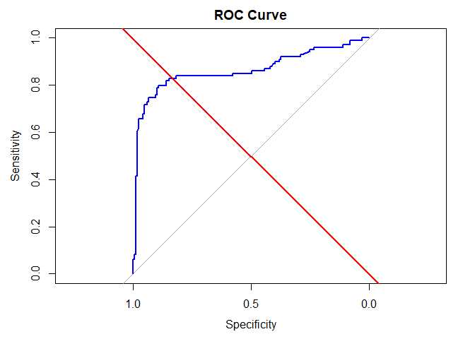
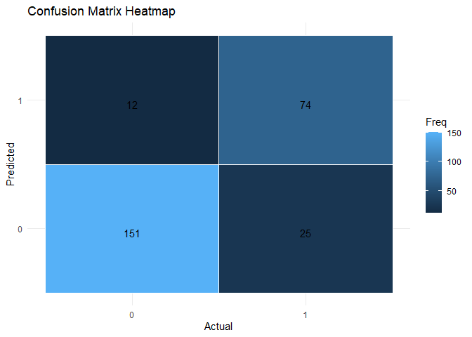

FA5_DATAMINING_AFUNDAR
================
Audrie Lex L. Afundar
2025-04-28

The Titanic dataset is widely known and commonly used for machine
learning. It contains information about the passengers that was in the
Titanic.

The dataset provides demographic and travel details which encompasses
these following key features:

Pclass: Passenger class (1st, 2nd, 3rd)

Sex: Gender of the passenger

Age: Age of the passenger

SibSp: Number of siblings/spouses aboard

Parch: Number of parents/children aboard

Fare: Ticket fare

Embarked: Port of embarkation

Survived: Target variable (0 = No, 1 = Yes)

With this, the goal of this research is to train and predict whether a
passenger will survive based on the attributes and features.

## Data Preprocessing:

``` r
train_titanic=read.csv("D:/Download folder/titanic/train.csv")
test_titanic=read.csv("D:/Download folder/titanic/test.csv")
gender_titanic=read.csv("D:/Download folder/titanic/gender_submission.csv")


head(train_titanic)
```

    ##   PassengerId Survived Pclass
    ## 1           1        0      3
    ## 2           2        1      1
    ## 3           3        1      3
    ## 4           4        1      1
    ## 5           5        0      3
    ## 6           6        0      3
    ##                                                  Name    Sex Age SibSp Parch
    ## 1                             Braund, Mr. Owen Harris   male  22     1     0
    ## 2 Cumings, Mrs. John Bradley (Florence Briggs Thayer) female  38     1     0
    ## 3                              Heikkinen, Miss. Laina female  26     0     0
    ## 4        Futrelle, Mrs. Jacques Heath (Lily May Peel) female  35     1     0
    ## 5                            Allen, Mr. William Henry   male  35     0     0
    ## 6                                    Moran, Mr. James   male  NA     0     0
    ##             Ticket    Fare Cabin Embarked
    ## 1        A/5 21171  7.2500              S
    ## 2         PC 17599 71.2833   C85        C
    ## 3 STON/O2. 3101282  7.9250              S
    ## 4           113803 53.1000  C123        S
    ## 5           373450  8.0500              S
    ## 6           330877  8.4583              Q

``` r
head(test_titanic)
```

    ##   PassengerId Pclass                                         Name    Sex  Age
    ## 1         892      3                             Kelly, Mr. James   male 34.5
    ## 2         893      3             Wilkes, Mrs. James (Ellen Needs) female 47.0
    ## 3         894      2                    Myles, Mr. Thomas Francis   male 62.0
    ## 4         895      3                             Wirz, Mr. Albert   male 27.0
    ## 5         896      3 Hirvonen, Mrs. Alexander (Helga E Lindqvist) female 22.0
    ## 6         897      3                   Svensson, Mr. Johan Cervin   male 14.0
    ##   SibSp Parch  Ticket    Fare Cabin Embarked
    ## 1     0     0  330911  7.8292              Q
    ## 2     1     0  363272  7.0000              S
    ## 3     0     0  240276  9.6875              Q
    ## 4     0     0  315154  8.6625              S
    ## 5     1     1 3101298 12.2875              S
    ## 6     0     0    7538  9.2250              S

``` r
head(gender_titanic)
```

    ##   PassengerId Survived
    ## 1         892        0
    ## 2         893        1
    ## 3         894        0
    ## 4         895        0
    ## 5         896        1
    ## 6         897        0

``` r
test_full <- merge(test_titanic, gender_titanic, by = "PassengerId")

train_titanic <- train_titanic[, colnames(test_full)]

full_titanic <- rbind(train_titanic, test_full)

head(full_titanic)
```

    ##   PassengerId Pclass                                                Name    Sex
    ## 1           1      3                             Braund, Mr. Owen Harris   male
    ## 2           2      1 Cumings, Mrs. John Bradley (Florence Briggs Thayer) female
    ## 3           3      3                              Heikkinen, Miss. Laina female
    ## 4           4      1        Futrelle, Mrs. Jacques Heath (Lily May Peel) female
    ## 5           5      3                            Allen, Mr. William Henry   male
    ## 6           6      3                                    Moran, Mr. James   male
    ##   Age SibSp Parch           Ticket    Fare Cabin Embarked Survived
    ## 1  22     1     0        A/5 21171  7.2500              S        0
    ## 2  38     1     0         PC 17599 71.2833   C85        C        1
    ## 3  26     0     0 STON/O2. 3101282  7.9250              S        1
    ## 4  35     1     0           113803 53.1000  C123        S        1
    ## 5  35     0     0           373450  8.0500              S        0
    ## 6  NA     0     0           330877  8.4583              Q        0

``` r
colSums(is.na(full_titanic))
```

    ## PassengerId      Pclass        Name         Sex         Age       SibSp 
    ##           0           0           0           0         263           0 
    ##       Parch      Ticket        Fare       Cabin    Embarked    Survived 
    ##           0           0           1           0           0           0

There are 263 NAs in Age and 1 NA in Fare. Since there are a lot of NAs
in for Age, fill this in with the median of the entire dataset.
Moreover, for the Fare, since there is only 1 NA in the whole dataset,
this can be removed.

``` r
full_titanic$Age[is.na(full_titanic$Age)] <- median(full_titanic$Age, na.rm = TRUE)

full_titanic <- full_titanic[!is.na(full_titanic$Fare), ]

colSums(is.na(full_titanic))
```

    ## PassengerId      Pclass        Name         Sex         Age       SibSp 
    ##           0           0           0           0           0           0 
    ##       Parch      Ticket        Fare       Cabin    Embarked    Survived 
    ##           0           0           0           0           0           0

There are no longer NAs in the entire column.

Although it is not seen in colSums, Cabin also have blank cabin for
passengers. Thus using U as Unknown for missing values. Moreover,
removing the number and only keeping the letter since the letter
indicates the deck level.

``` r
full_titanic$Cabin[is.na(full_titanic$Cabin)] <- "U"

full_titanic$Deck <- substr(full_titanic$Cabin, 1, 1)
```

``` r
str(full_titanic)
```

    ## 'data.frame':    1308 obs. of  13 variables:
    ##  $ PassengerId: int  1 2 3 4 5 6 7 8 9 10 ...
    ##  $ Pclass     : int  3 1 3 1 3 3 1 3 3 2 ...
    ##  $ Name       : chr  "Braund, Mr. Owen Harris" "Cumings, Mrs. John Bradley (Florence Briggs Thayer)" "Heikkinen, Miss. Laina" "Futrelle, Mrs. Jacques Heath (Lily May Peel)" ...
    ##  $ Sex        : chr  "male" "female" "female" "female" ...
    ##  $ Age        : num  22 38 26 35 35 28 54 2 27 14 ...
    ##  $ SibSp      : int  1 1 0 1 0 0 0 3 0 1 ...
    ##  $ Parch      : int  0 0 0 0 0 0 0 1 2 0 ...
    ##  $ Ticket     : chr  "A/5 21171" "PC 17599" "STON/O2. 3101282" "113803" ...
    ##  $ Fare       : num  7.25 71.28 7.92 53.1 8.05 ...
    ##  $ Cabin      : chr  "" "C85" "" "C123" ...
    ##  $ Embarked   : chr  "S" "C" "S" "S" ...
    ##  $ Survived   : int  0 1 1 1 0 0 0 0 1 1 ...
    ##  $ Deck       : chr  "" "C" "" "C" ...

Change the Sex to numerical feature

``` r
full_titanic$Sex <- as.character(full_titanic$Sex)


full_titanic$Sex <- ifelse(full_titanic$Sex == "male", 1, 0)

str(full_titanic)
```

    ## 'data.frame':    1308 obs. of  13 variables:
    ##  $ PassengerId: int  1 2 3 4 5 6 7 8 9 10 ...
    ##  $ Pclass     : int  3 1 3 1 3 3 1 3 3 2 ...
    ##  $ Name       : chr  "Braund, Mr. Owen Harris" "Cumings, Mrs. John Bradley (Florence Briggs Thayer)" "Heikkinen, Miss. Laina" "Futrelle, Mrs. Jacques Heath (Lily May Peel)" ...
    ##  $ Sex        : num  1 0 0 0 1 1 1 1 0 0 ...
    ##  $ Age        : num  22 38 26 35 35 28 54 2 27 14 ...
    ##  $ SibSp      : int  1 1 0 1 0 0 0 3 0 1 ...
    ##  $ Parch      : int  0 0 0 0 0 0 0 1 2 0 ...
    ##  $ Ticket     : chr  "A/5 21171" "PC 17599" "STON/O2. 3101282" "113803" ...
    ##  $ Fare       : num  7.25 71.28 7.92 53.1 8.05 ...
    ##  $ Cabin      : chr  "" "C85" "" "C123" ...
    ##  $ Embarked   : chr  "S" "C" "S" "S" ...
    ##  $ Survived   : int  0 1 1 1 0 0 0 0 1 1 ...
    ##  $ Deck       : chr  "" "C" "" "C" ...

Standardizing numerical features so that big numbers does not dominate
the model.

``` r
full_titanic$Age <- scale(full_titanic$Age)
full_titanic$Fare <- scale(full_titanic$Fare)
full_titanic$SibSp <- scale(full_titanic$SibSp)
full_titanic$Parch <- scale(full_titanic$Parch)


str(full_titanic)
```

    ## 'data.frame':    1308 obs. of  13 variables:
    ##  $ PassengerId: int  1 2 3 4 5 6 7 8 9 10 ...
    ##  $ Pclass     : int  3 1 3 1 3 3 1 3 3 2 ...
    ##  $ Name       : chr  "Braund, Mr. Owen Harris" "Cumings, Mrs. John Bradley (Florence Briggs Thayer)" "Heikkinen, Miss. Laina" "Futrelle, Mrs. Jacques Heath (Lily May Peel)" ...
    ##  $ Sex        : num  1 0 0 0 1 1 1 1 0 0 ...
    ##  $ Age        : num [1:1308, 1] -0.581 0.661 -0.27 0.429 0.429 ...
    ##   ..- attr(*, "scaled:center")= num 29.5
    ##   ..- attr(*, "scaled:scale")= num 12.9
    ##  $ SibSp      : num [1:1308, 1] 0.481 0.481 -0.479 0.481 -0.479 ...
    ##   ..- attr(*, "scaled:center")= num 0.499
    ##   ..- attr(*, "scaled:scale")= num 1.04
    ##  $ Parch      : num [1:1308, 1] -0.445 -0.445 -0.445 -0.445 -0.445 ...
    ##   ..- attr(*, "scaled:center")= num 0.385
    ##   ..- attr(*, "scaled:scale")= num 0.866
    ##  $ Ticket     : chr  "A/5 21171" "PC 17599" "STON/O2. 3101282" "113803" ...
    ##  $ Fare       : num [1:1308, 1] -0.503 0.734 -0.49 0.383 -0.488 ...
    ##   ..- attr(*, "scaled:center")= num 33.3
    ##   ..- attr(*, "scaled:scale")= num 51.8
    ##  $ Cabin      : chr  "" "C85" "" "C123" ...
    ##  $ Embarked   : chr  "S" "C" "S" "S" ...
    ##  $ Survived   : int  0 1 1 1 0 0 0 0 1 1 ...
    ##  $ Deck       : chr  "" "C" "" "C" ...

Turning categorical variables to factors

``` r
full_titanic$Survived <- as.factor(full_titanic$Survived)
full_titanic$Pclass <- as.factor(full_titanic$Pclass)
full_titanic$Embarked <- as.factor(full_titanic$Embarked)
full_titanic$Sex <- as.factor(full_titanic$Sex)
full_titanic$Cabin<- as.factor(full_titanic$Deck)
```

Splitting the dataset into training and testing set again.

``` r
set.seed(421)

split <- initial_split(full_titanic, prop = 0.8, strata = "Survived")

titanic_train <- training(split)
titanic_test <- testing(split)
```

## Model Implementation:

Implementing logistic regression as Survived column as the dependent
variable and the rest as the independent variable.

``` r
log_model_titanic<- glm(Survived ~ Pclass+Sex+Age+SibSp+Parch+Fare+Deck+Embarked, data=titanic_train, family=binomial)

summary(log_model_titanic)
```

    ## 
    ## Call:
    ## glm(formula = Survived ~ Pclass + Sex + Age + SibSp + Parch + 
    ##     Fare + Deck + Embarked, family = binomial, data = titanic_train)
    ## 
    ## Coefficients:
    ##              Estimate Std. Error z value Pr(>|z|)    
    ## (Intercept)  13.79170  618.02947   0.022 0.982196    
    ## Pclass2      -0.23590    0.42918  -0.550 0.582558    
    ## Pclass3      -1.36190    0.43469  -3.133 0.001730 ** 
    ## Sex1         -3.91853    0.22691 -17.269  < 2e-16 ***
    ## Age          -0.36240    0.10545  -3.437 0.000589 ***
    ## SibSp        -0.31862    0.10663  -2.988 0.002806 ** 
    ## Parch        -0.14201    0.09296  -1.528 0.126593    
    ## Fare          0.17319    0.12630   1.371 0.170288    
    ## DeckA         1.35794    0.64568   2.103 0.035455 *  
    ## DeckB         1.01562    0.56546   1.796 0.072480 .  
    ## DeckC         0.60260    0.50591   1.191 0.233605    
    ## DeckD         0.96926    0.54197   1.788 0.073709 .  
    ## DeckE         2.07875    0.56692   3.667 0.000246 ***
    ## DeckF         0.94104    0.74127   1.269 0.204264    
    ## DeckG        -1.92951    1.27127  -1.518 0.129070    
    ## DeckT       -12.68764  882.74346  -0.014 0.988532    
    ## EmbarkedC   -11.55396  618.02940  -0.019 0.985085    
    ## EmbarkedQ   -11.11072  618.02946  -0.018 0.985657    
    ## EmbarkedS   -11.53820  618.02939  -0.019 0.985105    
    ## ---
    ## Signif. codes:  0 '***' 0.001 '**' 0.01 '*' 0.05 '.' 0.1 ' ' 1
    ## 
    ## (Dispersion parameter for binomial family taken to be 1)
    ## 
    ##     Null deviance: 1386.77  on 1045  degrees of freedom
    ## Residual deviance:  738.46  on 1027  degrees of freedom
    ## AIC: 776.46
    ## 
    ## Number of Fisher Scoring iterations: 13

With the summary above, we can say that sex is significant, meaning the
gender of the person is important in surviving. Moreover, Age and Sibsp
are also significant, meaning younger people have mroe chance to
survive. Deck E and A are also significant. With this, the rest are
insignificant or less likely to affect whether the passengers survived
or not

Predicting the test set

``` r
test_pred_prob <- predict(log_model_titanic, newdata = titanic_test, type = "response")
test_pred_class <- ifelse(test_pred_prob > 0.5, 1, 0)

test_pred_class
```

    ##   1   2   3   4   5   6   7   8   9  10  11  12  13  14  15  16  17  18  19  20 
    ##   1   1   0   0   0   0   0   1   1   0   0   0   0   0   1   0   1   0   0   0 
    ##  21  22  23  24  25  26  27  28  29  30  31  32  33  34  35  36  37  38  39  40 
    ##   0   0   0   0   0   0   0   0   0   0   0   0   1   0   1   0   0   1   0   0 
    ##  41  42  43  44  45  46  47  48  49  50  51  52  53  54  55  56  57  58  59  60 
    ##   0   0   0   0   1   0   0   0   0   0   0   0   0   1   0   0   1   1   1   1 
    ##  61  62  63  64  65  66  67  68  69  70  71  72  73  74  75  76  77  78  79  80 
    ##   0   0   0   0   0   0   0   1   1   0   0   0   1   1   1   1   0   0   1   1 
    ##  81  82  83  84  85  86  87  88  89  90  91  92  93  94  95  96  97  98  99 100 
    ##   0   0   1   0   1   1   1   0   0   1   1   1   0   0   0   0   0   0   0   1 
    ## 101 102 103 104 105 106 107 108 109 110 111 112 113 114 115 116 117 118 119 120 
    ##   1   1   0   1   0   1   1   0   1   0   1   0   0   0   0   0   0   0   0   0 
    ## 121 122 123 124 125 126 127 128 129 130 131 132 133 134 135 136 137 138 139 140 
    ##   1   0   0   0   1   0   1   0   0   1   0   0   1   0   0   1   1   0   0   0 
    ## 141 142 143 144 145 146 147 148 149 150 151 152 153 154 155 156 157 158 159 160 
    ##   0   0   0   0   0   0   0   0   0   0   1   0   0   0   0   0   1   0   0   0 
    ## 161 162 163 164 165 166 167 168 169 170 171 172 173 174 175 176 177 178 179 180 
    ##   0   0   0   0   0   0   1   0   1   0   0   1   0   1   1   0   0   0   0   0 
    ## 181 182 183 184 185 186 187 188 189 190 191 192 193 194 195 196 197 198 199 200 
    ##   0   0   1   0   1   0   0   1   0   0   1   1   1   0   0   1   1   0   1   0 
    ## 201 202 203 204 205 206 207 208 209 210 211 212 213 214 215 216 217 218 219 220 
    ##   0   0   1   1   0   0   0   0   1   1   0   1   0   1   0   0   1   0   0   0 
    ## 221 222 223 224 225 226 227 228 229 230 231 232 233 234 235 236 237 238 239 240 
    ##   0   0   0   0   0   1   1   1   0   1   0   1   1   0   0   1   0   1   1   0 
    ## 241 242 243 244 245 246 247 248 249 250 251 252 253 254 255 256 257 258 259 260 
    ##   1   0   1   0   1   0   1   0   1   0   0   0   1   1   0   1   0   0   0   0 
    ## 261 262 
    ##   1   0

Counting the passengers who survived:

``` r
count_survived<-(sum(test_pred_class)/262)*100

count_survived
```

    ## [1] 32.82443

32.82% of the passengers predicted in the test set survived while the
rest perished.

## Model Evaluation:

Using performance metrics such as confusion matrix, roc curve and auc
score, accuracy, etc… We can check how the model performed and find ways
to have better evaluation.

``` r
log_perf<-confusionMatrix(factor(test_pred_class), factor(titanic_test$Survived))

log_perf
```

    ## Confusion Matrix and Statistics
    ## 
    ##           Reference
    ## Prediction   0   1
    ##          0 151  25
    ##          1  12  74
    ##                                           
    ##                Accuracy : 0.8588          
    ##                  95% CI : (0.8106, 0.8986)
    ##     No Information Rate : 0.6221          
    ##     P-Value [Acc > NIR] : < 2e-16         
    ##                                           
    ##                   Kappa : 0.6917          
    ##                                           
    ##  Mcnemar's Test P-Value : 0.04852         
    ##                                           
    ##             Sensitivity : 0.9264          
    ##             Specificity : 0.7475          
    ##          Pos Pred Value : 0.8580          
    ##          Neg Pred Value : 0.8605          
    ##              Prevalence : 0.6221          
    ##          Detection Rate : 0.5763          
    ##    Detection Prevalence : 0.6718          
    ##       Balanced Accuracy : 0.8369          
    ##                                           
    ##        'Positive' Class : 0               
    ## 

``` r
accuracy <- log_perf$overall["Accuracy"]

precision <- log_perf$byClass["Pos Pred Value"]

recall <- log_perf$byClass["Sensitivity"]

f1_score <- 2 * (precision * recall) / (precision + recall)

roc_curve <- roc(titanic_test$Survived, test_pred_prob)
```

    ## Setting levels: control = 0, case = 1

    ## Setting direction: controls < cases

``` r
auc_value <- auc(roc_curve)

cat("Model Performance Metrics:\n")
```

    ## Model Performance Metrics:

``` r
cat("Accuracy: ", round(accuracy, 4), "\n")
```

    ## Accuracy:  0.8588

``` r
cat("Precision: ", round(precision, 4), "\n")
```

    ## Precision:  0.858

``` r
cat("Recall: ", round(recall, 4), "\n")
```

    ## Recall:  0.9264

``` r
cat("F1-Score: ", round(f1_score, 4), "\n")
```

    ## F1-Score:  0.8909

``` r
cat("AUC Score:", round(auc_value, 4), "\n")
```

    ## AUC Score: 0.8619

With this, we can plot the ROC curve and Confusion matrix heatmap

``` r
plot(roc_curve, col = "blue", main = "ROC Curve")
abline(a = 0, b = 1, col = "red", lwd=2)  
```

<!-- -->

``` r
cm_df <- as.data.frame(log_perf$table)
colnames(cm_df) <- c("Predicted", "Actual", "Freq")

ggplot(data = cm_df, aes(x = Actual, y = Predicted, fill = Freq)) +
  geom_tile(color = "white") +
  geom_text(aes(label = Freq), vjust = 1) +
  labs(title = "Confusion Matrix Heatmap", x = "Actual", y = "Predicted") +
  theme_minimal()
```

<!-- -->
Firstly, the accuracy of the model, meaning it correctly classified 86%
of the passengers. With this, 85.8% of the predicted “survived”
passengers were also correctly classified as seen at the precision.

Recall also had a high percentage with 92.64%, meaning the model catched
92.64% of the actual survivors. Moreover, 89.09% of F1-Score is also
recorded.

With the AUC score (86.19%) and ROC Curve seen, the plot is curving
upwards whilst staying on the lower end of specificity and higher
sensitivity. This means that the model predicts true positive rate more
rather than false positive rate.

Lastly, the confusion matrix shows the True negatives, false negatives,
true positives and false positives. As seen in the heat map, the model
predicted 151 true negatives and 74 true positives. Moreover, the model
also predicted 12 false positives and 25 false negatives.

Overall, the model correctly predicted averaging around 80-90% having a
good performance all around.

## Results Interpretation & Discussion:

Summary of Model Findings:

Model Performance Metrics:

Accuracy: 0.8588

Precision: 0.858

Recall: 0.9264

F1-Score: 0.8909

AUC Score: 0.8619

Confusion Matrix:

            Reference

Prediction 0 1 0 151 25 1 12 74

Overall, the model performed well, with an overall high percentage on
all performance matrics. This means that using logistic regression on
the dataset was the correct choice.

We can say that sex is significant, meaning the gender of the person is
important in surviving. Specifically, female sex had higher probability
in surviving than male who had a large negative coefficient of -3.91.

Moreover, younger people have mroe chance to survive as seen on the
significance of Age.

Pclass also was significant meaning having a higher class means better
survival rate than compared to a 3rd class passenger. This also means
that higher fare affects the pclass as higher class means wealthier
people.

Deck E and A are also significant, meaning it was a mixture of positive
and negative connotations whether the passenger survived or not.

With this, the real world implication of this is it helps if you ever
gotten yourself into a situation similar to titanic.

Being female and young whilst being wealthy can greatly affect whether
you survive or not.

In a real life context, socioeconomic status and gender greatly
influence whether you get in a life boat or not.

With the end of the study, for further improvements, feature engineering
helps, specifically in combining Sibsp and Parch into one. Moreover,
better imputation on age since this study only used median as the basis
for NAs.

Trying different models can also help compare the models like a random
forest classifier.
