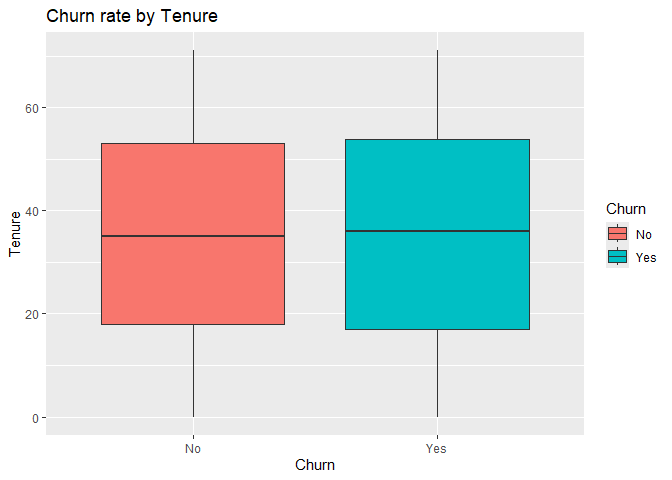
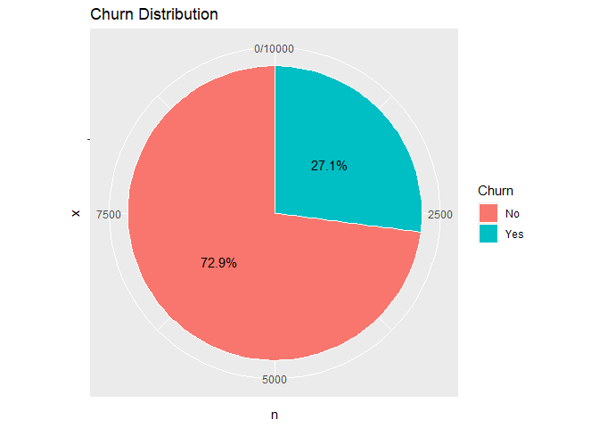
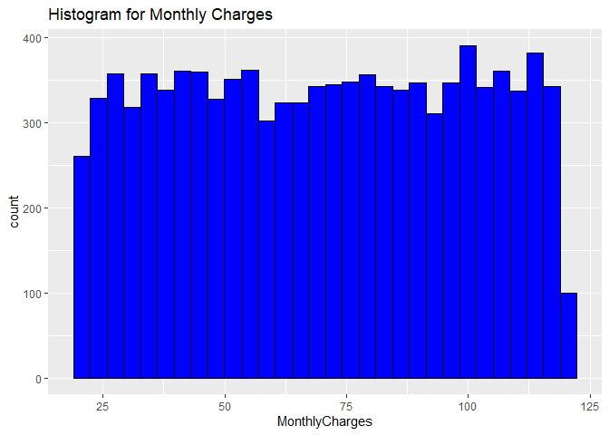
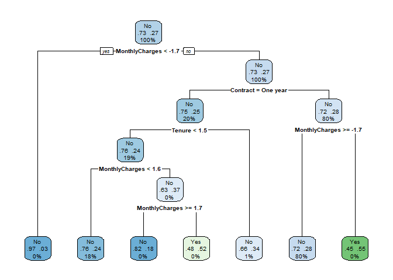

SA1_AFUNDAR_DATAMINING
================
Audrie Lex L. Afundar
2025-03-17

## Unit 1: R for Data Mining

Intro to Modern Data Mining

``` r
churn_data<-read.csv("D:/Download folder/customer_churn.csv")
head(churn_data)
```

    ##   CustomerID Gender SeniorCitizen Partner Dependents Tenure PhoneService
    ## 1  CUST00001   Male             0      No         No     65          Yes
    ## 2  CUST00002   Male             0      No         No     26          Yes
    ## 3  CUST00003   Male             0     Yes         No     54          Yes
    ## 4  CUST00004 Female             0     Yes        Yes     70          Yes
    ## 5  CUST00005   Male             0      No         No     53          Yes
    ## 6  CUST00006 Female             0      No        Yes     45          Yes
    ##   InternetService       Contract MonthlyCharges TotalCharges Churn
    ## 1     Fiber optic Month-to-month          20.04      1302.60    No
    ## 2     Fiber optic Month-to-month          65.14      1693.64    No
    ## 3     Fiber optic Month-to-month          49.38      2666.52    No
    ## 4             DSL       One year          31.19      2183.30    No
    ## 5             DSL Month-to-month         103.86      5504.58   Yes
    ## 6     Fiber optic Month-to-month          87.34      3930.30   Yes

``` r
summary(churn_data)
```

    ##   CustomerID           Gender          SeniorCitizen      Partner         
    ##  Length:10000       Length:10000       Min.   :0.0000   Length:10000      
    ##  Class :character   Class :character   1st Qu.:0.0000   Class :character  
    ##  Mode  :character   Mode  :character   Median :0.0000   Mode  :character  
    ##                                        Mean   :0.1502                     
    ##                                        3rd Qu.:0.0000                     
    ##                                        Max.   :1.0000                     
    ##   Dependents            Tenure      PhoneService       InternetService   
    ##  Length:10000       Min.   : 0.00   Length:10000       Length:10000      
    ##  Class :character   1st Qu.:17.00   Class :character   Class :character  
    ##  Mode  :character   Median :35.00   Mode  :character   Mode  :character  
    ##                     Mean   :35.22                                        
    ##                     3rd Qu.:53.00                                        
    ##                     Max.   :71.00                                        
    ##    Contract         MonthlyCharges    TotalCharges       Churn          
    ##  Length:10000       Min.   : 20.02   Min.   :   0.0   Length:10000      
    ##  Class :character   1st Qu.: 44.88   1st Qu.: 961.2   Class :character  
    ##  Mode  :character   Median : 70.56   Median :2025.6   Mode  :character  
    ##                     Mean   : 70.18   Mean   :2455.8                     
    ##                     3rd Qu.: 95.77   3rd Qu.:3611.0                     
    ##                     Max.   :119.99   Max.   :8425.6

``` r
str(churn_data)
```

    ## 'data.frame':    10000 obs. of  12 variables:
    ##  $ CustomerID     : chr  "CUST00001" "CUST00002" "CUST00003" "CUST00004" ...
    ##  $ Gender         : chr  "Male" "Male" "Male" "Female" ...
    ##  $ SeniorCitizen  : int  0 0 0 0 0 0 0 0 0 0 ...
    ##  $ Partner        : chr  "No" "No" "Yes" "Yes" ...
    ##  $ Dependents     : chr  "No" "No" "No" "Yes" ...
    ##  $ Tenure         : int  65 26 54 70 53 45 35 20 48 33 ...
    ##  $ PhoneService   : chr  "Yes" "Yes" "Yes" "Yes" ...
    ##  $ InternetService: chr  "Fiber optic" "Fiber optic" "Fiber optic" "DSL" ...
    ##  $ Contract       : chr  "Month-to-month" "Month-to-month" "Month-to-month" "One year" ...
    ##  $ MonthlyCharges : num  20 65.1 49.4 31.2 103.9 ...
    ##  $ TotalCharges   : num  1303 1694 2667 2183 5505 ...
    ##  $ Churn          : chr  "No" "No" "No" "No" ...

``` r
dim(churn_data)
```

    ## [1] 10000    12

There are 10000 rows and 12 columns on the dataset

``` r
colSums(is.na(churn_data))
```

    ##      CustomerID          Gender   SeniorCitizen         Partner      Dependents 
    ##               0               0               0               0               0 
    ##          Tenure    PhoneService InternetService        Contract  MonthlyCharges 
    ##               0               0               0               0               0 
    ##    TotalCharges           Churn 
    ##               0               0

There are no NA values on all columns

Data mining helps in uncovering patterns and trends in the dataset that
will result in insights and solutions. This can be used to predict churn
and other behaviours related to the dataset itself.

Data Visualization

Churn rate by tenure

``` r
ggplot(churn_data, aes(x = Churn, y = Tenure, fill = Churn)) + 
  geom_boxplot()+
  labs(title="Churn rate by Tenure")
```

<!-- -->
Based on the box plot, the mean of people who churned and have not
churned is around 30-35.

Pie Chart for Churn

``` r
churn_counts <- churn_data %>%
  count(Churn) %>%
  mutate(percentage = n / sum(n) * 100)

ggplot(churn_counts, aes(x="", y=n, fill=Churn)) +
  geom_bar(stat="identity", width=1, color="white") +
  coord_polar("y", start=0) +
  geom_text(aes(label=paste0(round(percentage, 1), "%")), 
            position=position_stack(vjust=0.5)) + 
  labs(title="Churn Distribution") 
```

<!-- -->
With this 72.9% of customers have not Churned yet while only 27.1% have.

``` r
ggplot(churn_data, aes(x=MonthlyCharges)) + 
  geom_histogram(color="black", fill="blue")+
  labs(title="Histogram for Monthly Charges")
```

    ## `stat_bin()` using `bins = 30`. Pick better value with `binwidth`.

<!-- -->
Based on the histogram, the count per Monthly Charges are relatively the
same across the plot except for one with 100 customers with 120-125
monthly charges.

Data Transformation

Missing values were checked and there were no missing values.

Convert categorical variables into factor variables.

``` r
churn_data$Gender <- as.factor(churn_data$Gender)
churn_data$Partner <- as.factor(churn_data$Partner)
churn_data$Dependents <- as.factor(churn_data$Dependents)
churn_data$PhoneService <- as.factor(churn_data$PhoneService)
churn_data$InternetService <- as.factor(churn_data$InternetService)
churn_data$Contract <- as.factor(churn_data$Contract)
churn_data$Churn <- as.factor(churn_data$Churn)
```

Normalize or standardize numerical features where necessary.

``` r
churn_data$MonthlyCharges<- scale(churn_data$MonthlyCharges)
churn_data$TotalCharges<- scale(churn_data$TotalCharges)
churn_data$Tenure<- scale(churn_data$Tenure)
```

Data Wrangling

``` r
Q1 <- quantile(churn_data$MonthlyCharges, 0.25)
Q3 <- quantile(churn_data$MonthlyCharges, 0.75)
IQR_value <- Q3 - Q1

churn_data <- churn_data %>% 
  filter(MonthlyCharges > (Q1 - 1.5 * IQR_value) & MonthlyCharges < (Q3 + 1.5 * IQR_value))
```

    ## Warning: Using one column matrices in `filter()` was deprecated in dplyr 1.1.0.
    ## ℹ Please use one dimensional logical vectors instead.
    ## This warning is displayed once every 8 hours.
    ## Call `lifecycle::last_lifecycle_warnings()` to see where this warning was
    ## generated.

``` r
Q1_final <- quantile(churn_data$TotalCharges, 0.25)
Q3_final <- quantile(churn_data$TotalCharges, 0.75)
IQR_value_final <- Q3_final - Q1_final

churn_data <- churn_data %>% 
  filter(TotalCharges > (Q1_final - 1.5 * IQR_value_final) & TotalCharges < (Q3_final + 1.5 * IQR_value_final))
```

Create new derived variables that may help in predictive modeling.

``` r
churn_summary <- churn_data %>%
  group_by(Churn)%>%
  summarize(mean_MonthlyCharges = mean(MonthlyCharges), 
         mean_TotalCharges=mean(TotalCharges),
         var_MonthlyCharges=var(MonthlyCharges),
         var_TotalCharges=var(TotalCharges)
         )
tail(churn_summary)
```

    ## # A tibble: 2 × 5
    ##   Churn mean_MonthlyCharges mean_TotalCharges var_MonthlyCharges[,1]
    ##   <fct>               <dbl>             <dbl>                  <dbl>
    ## 1 No               -0.00841           -0.0218                  0.993
    ## 2 Yes              -0.0195            -0.0203                  0.979
    ## # ℹ 1 more variable: var_TotalCharges <dbl[,1]>

The point of the EDA process such as data wrangling, transformation, and
visualization is to see and adjust the dataset where necessary. This can
be useful for tuning, predictive models and regression models where the
dataset is supposed to be factored, standardized or even cleaned.
Moreover, by the EDA process, this helps in the accuracy of the models
itself.

## Unit 2: Tuning Predictive Models

Model Complexity

Fit a decision tree and logistic regression model.

``` r
set.seed(421)

split <- initial_split(churn_data, prop = 0.8, strata = "Churn")

churn_train <- training(split)
churn_test <- testing(split)

churn_train$Gender <- as.factor(churn_train$Gender)
churn_train$Partner <- as.factor(churn_train$Partner)
churn_train$Dependents <- as.factor(churn_train$Dependents)
churn_train$PhoneService <- as.factor(churn_train$PhoneService)
churn_train$InternetService <- as.factor(churn_train$InternetService)
churn_train$Contract <- as.factor(churn_train$Contract)
churn_train$Churn <- as.factor(churn_train$Churn)
```

``` r
log_model_churn<-glm(Churn ~ Tenure + MonthlyCharges+TotalCharges+ Gender+Partner+Dependents+PhoneService+InternetService+Contract, data=churn_train, family=binomial)

summary(log_model_churn)
```

    ## 
    ## Call:
    ## glm(formula = Churn ~ Tenure + MonthlyCharges + TotalCharges + 
    ##     Gender + Partner + Dependents + PhoneService + InternetService + 
    ##     Contract, family = binomial, data = churn_train)
    ## 
    ## Coefficients:
    ##                             Estimate Std. Error z value Pr(>|z|)    
    ## (Intercept)                -0.847410   0.097372  -8.703  < 2e-16 ***
    ## Tenure                      0.021539   0.065995   0.326  0.74414    
    ## MonthlyCharges             -0.021664   0.050320  -0.431  0.66682    
    ## TotalCharges               -0.009824   0.079458  -0.124  0.90160    
    ## GenderMale                 -0.069568   0.050596  -1.375  0.16914    
    ## PartnerYes                 -0.045282   0.050591  -0.895  0.37076    
    ## DependentsYes              -0.051047   0.055266  -0.924  0.35567    
    ## PhoneServiceYes            -0.041533   0.084854  -0.489  0.62452    
    ## InternetServiceFiber optic  0.028781   0.056255   0.512  0.60892    
    ## InternetServiceNo          -0.050614   0.070371  -0.719  0.47199    
    ## ContractOne year           -0.177597   0.066946  -2.653  0.00798 ** 
    ## ContractTwo year           -0.003070   0.064739  -0.047  0.96217    
    ## ---
    ## Signif. codes:  0 '***' 0.001 '**' 0.01 '*' 0.05 '.' 0.1 ' ' 1
    ## 
    ## (Dispersion parameter for binomial family taken to be 1)
    ## 
    ##     Null deviance: 9279.1  on 7940  degrees of freedom
    ## Residual deviance: 9265.2  on 7929  degrees of freedom
    ## AIC: 9289.2
    ## 
    ## Number of Fisher Scoring iterations: 4

``` r
churn_train$TotalCharges[is.na(churn_train$TotalCharges)] <- median(churn_train$TotalCharges, na.rm=TRUE)

decision_tree_churn<-rpart(Churn ~ Tenure + MonthlyCharges + TotalCharges + Gender + Partner + Dependents + PhoneService + InternetService + Contract, data = churn_train, method = "class",   control = rpart.control(cp = 0, maxdepth = 5))


summary(decision_tree_churn)
```

    ## Call:
    ## rpart(formula = Churn ~ Tenure + MonthlyCharges + TotalCharges + 
    ##     Gender + Partner + Dependents + PhoneService + InternetService + 
    ##     Contract, data = churn_train, method = "class", control = rpart.control(cp = 0, 
    ##     maxdepth = 5))
    ##   n= 7941 
    ## 
    ##             CP nsplit rel error   xerror       xstd
    ## 1 0.0001548947      0 1.0000000 1.000000 0.01840531
    ## 2 0.0000000000      6 0.9990706 1.011152 0.01846925
    ## 
    ## Variable importance
    ##  MonthlyCharges        Contract          Tenure    TotalCharges    PhoneService 
    ##              56              18              15               5               3 
    ## InternetService          Gender 
    ##               2               1 
    ## 
    ## Node number 1: 7941 observations,    complexity param=0.0001548947
    ##   predicted class=No   expected loss=0.2709986  P(node) =1
    ##     class counts:  5789  2152
    ##    probabilities: 0.729 0.271 
    ##   left son=2 (30 obs) right son=3 (7911 obs)
    ##   Primary splits:
    ##       MonthlyCharges < -1.719032   to the left,  improve=3.4019390, (0 missing)
    ##       Contract       splits as  RLR, improve=2.8111940, (0 missing)
    ##       TotalCharges   < -1.309278   to the left,  improve=1.9724260, (0 missing)
    ##       Tenure         < 1.456636    to the left,  improve=1.4391490, (0 missing)
    ##       Gender         splits as  RL, improve=0.6911929, (0 missing)
    ## 
    ## Node number 2: 30 observations
    ##   predicted class=No   expected loss=0.03333333  P(node) =0.003777862
    ##     class counts:    29     1
    ##    probabilities: 0.967 0.033 
    ## 
    ## Node number 3: 7911 observations,    complexity param=0.0001548947
    ##   predicted class=No   expected loss=0.2718999  P(node) =0.9962221
    ##     class counts:  5760  2151
    ##    probabilities: 0.728 0.272 
    ##   left son=6 (1573 obs) right son=7 (6338 obs)
    ##   Primary splits:
    ##       Contract       splits as  RLR, improve=2.7594450, (0 missing)
    ##       MonthlyCharges < -1.713348   to the right, improve=2.5165420, (0 missing)
    ##       TotalCharges   < -1.309278   to the left,  improve=1.9331900, (0 missing)
    ##       Tenure         < 1.456636    to the left,  improve=1.5307790, (0 missing)
    ##       Gender         splits as  RL, improve=0.6108095, (0 missing)
    ##   Surrogate splits:
    ##       TotalCharges < 2.740751    to the right, agree=0.802, adj=0.003, (0 split)
    ## 
    ## Node number 6: 1573 observations,    complexity param=0.0001548947
    ##   predicted class=No   expected loss=0.245391  P(node) =0.1980859
    ##     class counts:  1187   386
    ##    probabilities: 0.755 0.245 
    ##   left son=12 (1484 obs) right son=13 (89 obs)
    ##   Primary splits:
    ##       Tenure          < 1.504742    to the left,  improve=1.5861230, (0 missing)
    ##       TotalCharges    < 0.7094614   to the left,  improve=1.3657550, (0 missing)
    ##       MonthlyCharges  < 1.601595    to the left,  improve=1.1788450, (0 missing)
    ##       InternetService splits as  LRL, improve=1.1400170, (0 missing)
    ##       Gender          splits as  RL, improve=0.2514031, (0 missing)
    ##   Surrogate splits:
    ##       TotalCharges < 2.461331    to the left,  agree=0.947, adj=0.056, (0 split)
    ## 
    ## Node number 7: 6338 observations,    complexity param=0.0001548947
    ##   predicted class=No   expected loss=0.278479  P(node) =0.7981363
    ##     class counts:  4573  1765
    ##    probabilities: 0.722 0.278 
    ##   left son=14 (6327 obs) right son=15 (11 obs)
    ##   Primary splits:
    ##       MonthlyCharges  < -1.713348   to the right, improve=1.5707970, (0 missing)
    ##       TotalCharges    < -1.301902   to the left,  improve=1.0779440, (0 missing)
    ##       Tenure          < -1.670286   to the left,  improve=0.7669212, (0 missing)
    ##       Partner         splits as  RL, improve=0.4805992, (0 missing)
    ##       InternetService splits as  RRL, improve=0.4332095, (0 missing)
    ## 
    ## Node number 12: 1484 observations,    complexity param=0.0001548947
    ##   predicted class=No   expected loss=0.2398922  P(node) =0.1868782
    ##     class counts:  1128   356
    ##    probabilities: 0.760 0.240 
    ##   left son=24 (1446 obs) right son=25 (38 obs)
    ##   Primary splits:
    ##       MonthlyCharges  < 1.601595    to the left,  improve=1.2884890, (0 missing)
    ##       InternetService splits as  LRL, improve=1.2825720, (0 missing)
    ##       TotalCharges    < -1.309513   to the left,  improve=1.0058310, (0 missing)
    ##       Tenure          < -1.670286   to the left,  improve=0.7310218, (0 missing)
    ##       PhoneService    splits as  RL, improve=0.1580696, (0 missing)
    ## 
    ## Node number 13: 89 observations
    ##   predicted class=No   expected loss=0.3370787  P(node) =0.01120766
    ##     class counts:    59    30
    ##    probabilities: 0.663 0.337 
    ## 
    ## Node number 14: 6327 observations
    ##   predicted class=No   expected loss=0.2780149  P(node) =0.796751
    ##     class counts:  4568  1759
    ##    probabilities: 0.722 0.278 
    ## 
    ## Node number 15: 11 observations
    ##   predicted class=Yes  expected loss=0.4545455  P(node) =0.001385216
    ##     class counts:     5     6
    ##    probabilities: 0.455 0.545 
    ## 
    ## Node number 24: 1446 observations
    ##   predicted class=No   expected loss=0.2365145  P(node) =0.1820929
    ##     class counts:  1104   342
    ##    probabilities: 0.763 0.237 
    ## 
    ## Node number 25: 38 observations,    complexity param=0.0001548947
    ##   predicted class=No   expected loss=0.3684211  P(node) =0.004785292
    ##     class counts:    24    14
    ##    probabilities: 0.632 0.368 
    ##   left son=50 (17 obs) right son=51 (21 obs)
    ##   Primary splits:
    ##       MonthlyCharges  < 1.671357    to the right, improve=2.266844, (0 missing)
    ##       InternetService splits as  RLR, improve=1.809211, (0 missing)
    ##       Partner         splits as  LR, improve=1.347979, (0 missing)
    ##       Tenure          < -1.044902   to the right, improve=0.825973, (0 missing)
    ##       TotalCharges    < -0.4626007  to the right, improve=0.825973, (0 missing)
    ##   Surrogate splits:
    ##       Tenure          < -0.7081564  to the left,  agree=0.684, adj=0.294, (0 split)
    ##       TotalCharges    < -0.01381696 to the left,  agree=0.684, adj=0.294, (0 split)
    ##       PhoneService    splits as  LR, agree=0.632, adj=0.176, (0 split)
    ##       InternetService splits as  RLR, agree=0.605, adj=0.118, (0 split)
    ##       Gender          splits as  LR, agree=0.579, adj=0.059, (0 split)
    ## 
    ## Node number 50: 17 observations
    ##   predicted class=No   expected loss=0.1764706  P(node) =0.002140788
    ##     class counts:    14     3
    ##    probabilities: 0.824 0.176 
    ## 
    ## Node number 51: 21 observations
    ##   predicted class=Yes  expected loss=0.4761905  P(node) =0.002644503
    ##     class counts:    10    11
    ##    probabilities: 0.476 0.524

``` r
rpart.plot(decision_tree_churn, type = 2, extra = 104, fallen.leaves = TRUE)
```

<!-- -->
Decision trees offer a much simpler interpretability compared to linear
regression models. Due to the structure of the plot, it can be easier to
follow. With that said, setting up and fitting a decision tree is much
more complex than the latter since it is much more susceptible for
overfitting that might result to inaccuracies. For linear regression on
the other hand, its much simpler in terms of complexity and much more
generalizable.

Bias-Variance Trade-Off

With that said, since decision trees are much susceptible to
overfitting, this can indicate high variance with low bias meaning it
will predict well on the training data but might oversee small data in
the process. On linear regression, due to its simplicity it has low
variance however have high bias. This can indicate that it struggles on
much more complex patterns. With that said, linear regression is good on
generalizability but decision tree is better on much more precise
complex pattern finding. However, with these 2 models, it is still
better to have something with moderate bias and moderate variance to
encapuslate everything from the dataset.

Cross-Validation

Use k-fold cross-validation (k=10) to evaluate model performance.

``` r
cv_control <- trainControl(method = "cv", number = 10)


log_model_churn_k<-train(Churn ~ Tenure + MonthlyCharges+TotalCharges+ Gender+Partner+Dependents+PhoneService+InternetService+Contract, data=churn_train, family=binomial,trControl = cv_control, method="glm")


log_model_churn_k
```

    ## Generalized Linear Model 
    ## 
    ## 7941 samples
    ##    9 predictor
    ##    2 classes: 'No', 'Yes' 
    ## 
    ## No pre-processing
    ## Resampling: Cross-Validated (10 fold) 
    ## Summary of sample sizes: 7146, 7147, 7147, 7147, 7148, 7147, ... 
    ## Resampling results:
    ## 
    ##   Accuracy   Kappa
    ##   0.7290015  0

``` r
log_pred<- predict(log_model_churn_k, churn_train, type="raw")

log_perf<-confusionMatrix(log_pred, churn_train$Churn)

log_perf
```

    ## Confusion Matrix and Statistics
    ## 
    ##           Reference
    ## Prediction   No  Yes
    ##        No  5789 2152
    ##        Yes    0    0
    ##                                           
    ##                Accuracy : 0.729           
    ##                  95% CI : (0.7191, 0.7388)
    ##     No Information Rate : 0.729           
    ##     P-Value [Acc > NIR] : 0.5058          
    ##                                           
    ##                   Kappa : 0               
    ##                                           
    ##  Mcnemar's Test P-Value : <2e-16          
    ##                                           
    ##             Sensitivity : 1.000           
    ##             Specificity : 0.000           
    ##          Pos Pred Value : 0.729           
    ##          Neg Pred Value :   NaN           
    ##              Prevalence : 0.729           
    ##          Detection Rate : 0.729           
    ##    Detection Prevalence : 1.000           
    ##       Balanced Accuracy : 0.500           
    ##                                           
    ##        'Positive' Class : No              
    ## 

``` r
accuracy <- log_perf$overall["Accuracy"]

precision <- log_perf$byClass["Pos Pred Value"]

recall <- log_perf$byClass["Sensitivity"]

f1_score <- 2 * (precision * recall) / (precision + recall)

cat("Model Performance Metrics:\n")
```

    ## Model Performance Metrics:

``` r
cat("Accuracy: ", round(accuracy, 4), "\n")
```

    ## Accuracy:  0.729

``` r
cat("Precision: ", round(precision, 4), "\n")
```

    ## Precision:  0.729

``` r
cat("Recall: ", round(recall, 4), "\n")
```

    ## Recall:  1

``` r
cat("F1-Score: ", round(f1_score, 4), "\n")
```

    ## F1-Score:  0.8433

``` r
decision_tree_churn_k<-train(Churn ~ Tenure + MonthlyCharges + TotalCharges + Gender + Partner + Dependents + PhoneService + InternetService + Contract, data = churn_train, method = "rpart",   control = rpart.control(cp = 0, maxdepth = 5), trControl=cv_control)

decision_tree_churn_k
```

    ## CART 
    ## 
    ## 7941 samples
    ##    9 predictor
    ##    2 classes: 'No', 'Yes' 
    ## 
    ## No pre-processing
    ## Resampling: Cross-Validated (10 fold) 
    ## Summary of sample sizes: 7147, 7148, 7147, 7147, 7147, 7146, ... 
    ## Resampling results across tuning parameters:
    ## 
    ##   cp            Accuracy   Kappa        
    ##   0.0006505576  0.7286240  -0.0003322648
    ##   0.0006970260  0.7286240  -0.0003322648
    ##   0.0007434944  0.7287498  -0.0005023949
    ## 
    ## Accuracy was used to select the optimal model using the largest value.
    ## The final value used for the model was cp = 0.0007434944.

Due to the imbalance for the churners, it can be quite misleading when
looking on accuracy itself. Moreover, with this the imbalance also
affects the results of other metrics such as the recall with 100%. This
should not be the case since the result suggested that there are 2164
false negative in the prediction meaning it does not predict “yes” but
only predicts “no”.

``` r
decision_tree_pred<- predict(decision_tree_churn_k, churn_train, type="raw")

decision_tree_perf<-confusionMatrix(decision_tree_pred, churn_train$Churn)

decision_tree_perf
```

    ## Confusion Matrix and Statistics
    ## 
    ##           Reference
    ## Prediction   No  Yes
    ##        No  5789 2152
    ##        Yes    0    0
    ##                                           
    ##                Accuracy : 0.729           
    ##                  95% CI : (0.7191, 0.7388)
    ##     No Information Rate : 0.729           
    ##     P-Value [Acc > NIR] : 0.5058          
    ##                                           
    ##                   Kappa : 0               
    ##                                           
    ##  Mcnemar's Test P-Value : <2e-16          
    ##                                           
    ##             Sensitivity : 1.000           
    ##             Specificity : 0.000           
    ##          Pos Pred Value : 0.729           
    ##          Neg Pred Value :   NaN           
    ##              Prevalence : 0.729           
    ##          Detection Rate : 0.729           
    ##    Detection Prevalence : 1.000           
    ##       Balanced Accuracy : 0.500           
    ##                                           
    ##        'Positive' Class : No              
    ## 

``` r
accuracy <- decision_tree_perf$overall["Accuracy"]

precision <- decision_tree_perf$byClass["Pos Pred Value"]

recall <- decision_tree_perf$byClass["Sensitivity"]

f1_score <- 2 * (precision * recall) / (precision + recall)

cat("Model Performance Metrics:\n")
```

    ## Model Performance Metrics:

``` r
cat("Accuracy: ", round(accuracy, 4), "\n")
```

    ## Accuracy:  0.729

``` r
cat("Precision: ", round(precision, 4), "\n")
```

    ## Precision:  0.729

``` r
cat("Recall: ", round(recall, 4), "\n")
```

    ## Recall:  1

``` r
cat("F1-Score: ", round(f1_score, 4), "\n")
```

    ## F1-Score:  0.8433

Due to the imbalance for the churners, it can be quite misleading when
looking on accuracy itself. Moreover, with this the imbalance also
affects the results of other metrics such as the recall with 100%. This
should not be the case since the result suggested that there are 2164
false negative in the prediction meaning it does not predict “yes” but
only predicts “no”.

Classification

Train a Random Forest classifier to predict customer churn.

``` r
forest_model_churn<-randomForest(Churn ~ Tenure + MonthlyCharges+TotalCharges+ Gender+Partner+Dependents+PhoneService+InternetService+Contract, data=churn_train, ntree=100, mtry=3, importance=TRUE)

forest_model_churn
```

    ## 
    ## Call:
    ##  randomForest(formula = Churn ~ Tenure + MonthlyCharges + TotalCharges +      Gender + Partner + Dependents + PhoneService + InternetService +      Contract, data = churn_train, ntree = 100, mtry = 3, importance = TRUE) 
    ##                Type of random forest: classification
    ##                      Number of trees: 100
    ## No. of variables tried at each split: 3
    ## 
    ##         OOB estimate of  error rate: 29.08%
    ## Confusion matrix:
    ##       No Yes class.error
    ## No  5557 232  0.04007601
    ## Yes 2077  75  0.96514870

``` r
cv_control_forest <- trainControl(method = "cv", number = 10, search="grid")

grid <- expand.grid(
  mtry = c(2, 3, 4, 5),     
  splitrule = "gini",      
  min.node.size = c(1, 3, 5))

forest_model_churn_grid<- train(Churn ~ Tenure + MonthlyCharges+TotalCharges+ Gender+Partner+Dependents+PhoneService+InternetService+Contract, data=churn_train, method="ranger", trControl= cv_control_forest, tuneGrid=grid)


forest_model_churn_grid
```

    ## Random Forest 
    ## 
    ## 7941 samples
    ##    9 predictor
    ##    2 classes: 'No', 'Yes' 
    ## 
    ## No pre-processing
    ## Resampling: Cross-Validated (10 fold) 
    ## Summary of sample sizes: 7147, 7147, 7148, 7147, 7147, 7147, ... 
    ## Resampling results across tuning parameters:
    ## 
    ##   mtry  min.node.size  Accuracy   Kappa        
    ##   2     1              0.7290015   0.0000000000
    ##   2     3              0.7290015   0.0000000000
    ##   2     5              0.7290015   0.0000000000
    ##   3     1              0.7272390   0.0011460044
    ##   3     3              0.7272390  -0.0009691205
    ##   3     5              0.7274907  -0.0004647799
    ##   4     1              0.7098608  -0.0067556637
    ##   4     3              0.7143958   0.0005678466
    ##   4     5              0.7151497  -0.0061418929
    ##   5     1              0.6975195  -0.0103869781
    ##   5     3              0.7014246  -0.0114864385
    ##   5     5              0.7053266  -0.0072415819
    ## 
    ## Tuning parameter 'splitrule' was held constant at a value of gini
    ## Accuracy was used to select the optimal model using the largest value.
    ## The final values used for the model were mtry = 2, splitrule = gini
    ##  and min.node.size = 1.

Report final model performance.

``` r
forest_pred<-predict(forest_model_churn, churn_train, type="class")

forest_perf<-confusionMatrix(forest_pred, churn_train$Churn)

forest_perf
```

    ## Confusion Matrix and Statistics
    ## 
    ##           Reference
    ## Prediction   No  Yes
    ##        No  5789  351
    ##        Yes    0 1801
    ##                                          
    ##                Accuracy : 0.9558         
    ##                  95% CI : (0.951, 0.9602)
    ##     No Information Rate : 0.729          
    ##     P-Value [Acc > NIR] : < 2.2e-16      
    ##                                          
    ##                   Kappa : 0.8821         
    ##                                          
    ##  Mcnemar's Test P-Value : < 2.2e-16      
    ##                                          
    ##             Sensitivity : 1.0000         
    ##             Specificity : 0.8369         
    ##          Pos Pred Value : 0.9428         
    ##          Neg Pred Value : 1.0000         
    ##              Prevalence : 0.7290         
    ##          Detection Rate : 0.7290         
    ##    Detection Prevalence : 0.7732         
    ##       Balanced Accuracy : 0.9184         
    ##                                          
    ##        'Positive' Class : No             
    ## 

Based on the confusion matrix, the forest model has a 95.17% accuracy
with only 386 false negatives with 0 false positives. Moreover, with
Kappa \> 0.8, this indicates that the model is excellent.

## Unit 3: Regression-Based Methods

Logistic Regression

``` r
log_regression_churn<-glm(Churn ~ Tenure + MonthlyCharges+TotalCharges, data=churn_train, family=binomial)

summary(log_regression_churn)
```

    ## 
    ## Call:
    ## glm(formula = Churn ~ Tenure + MonthlyCharges + TotalCharges, 
    ##     family = binomial, data = churn_train)
    ## 
    ## Coefficients:
    ##                 Estimate Std. Error z value Pr(>|z|)    
    ## (Intercept)    -0.989897   0.025267 -39.178   <2e-16 ***
    ## Tenure          0.021901   0.065887   0.332    0.740    
    ## MonthlyCharges -0.021455   0.050245  -0.427    0.669    
    ## TotalCharges   -0.008594   0.079306  -0.108    0.914    
    ## ---
    ## Signif. codes:  0 '***' 0.001 '**' 0.01 '*' 0.05 '.' 0.1 ' ' 1
    ## 
    ## (Dispersion parameter for binomial family taken to be 1)
    ## 
    ##     Null deviance: 9279.1  on 7940  degrees of freedom
    ## Residual deviance: 9277.5  on 7937  degrees of freedom
    ## AIC: 9285.5
    ## 
    ## Number of Fisher Scoring iterations: 4

Interpret the coefficients and assess model significance using p-values.

Based on the p-values of the 3 independent variables, there are no
strong evidence of them affecting Churn rate (p\>0.05)

Regression in High Dimensions

Discuss the challenges of high-dimensional regression and potential
solutions.

Having multiple predictors will lead to challenges overfitting,
computational complexity and feature selection difficulty. By regulating
them using regression such as lasso and ridge, this can help minimize
redundancy and shrinks the coefficient. Moreover, by reducing the
dimensionality such as the PCA, this transforms correlated predictors
into smaller set of uncorrelated components.

Apply Principal Component Analysis (PCA) on numerical features (Tenure,
MonthlyCharges, TotalCharges) to reduce dimensionality.

``` r
numeric <- churn_train[,c("Tenure", "MonthlyCharges", "TotalCharges")]

pca_churn <- prcomp(numeric, center=TRUE, scale.=TRUE)

summary(pca_churn)
```

    ## Importance of components:
    ##                           PC1    PC2     PC3
    ## Standard deviation     1.3765 1.0252 0.23279
    ## Proportion of Variance 0.6316 0.3504 0.01806
    ## Cumulative Proportion  0.6316 0.9819 1.00000

Ridge Regression

Implement Ridge Regression using Churn as the target variable and
Tenure, MonthlyCharges, TotalCharges, and additional customer
demographic features as predictors.

``` r
x <- model.matrix(Churn ~ Tenure + MonthlyCharges + TotalCharges, data = churn_train)[, -1] 
y <- as.numeric(churn_train$Churn) - 1

lambda_seq <- 10^seq(4, -2, length = 100)
ridge_model_churn <- glmnet(x, y, alpha = 0, lambda = lambda_seq, family = "binomial")

print(coef(ridge_model_churn, s = 0.1))
```

    ## 4 x 1 sparse Matrix of class "dgCMatrix"
    ##                         s1
    ## (Intercept)    -0.98970956
    ## Tenure          0.01143183
    ## MonthlyCharges -0.01688426
    ## TotalCharges   -0.00187938

Identify the optimal lambda using cross-validation.

``` r
set.seed(421)

ridge_model_find<- cv.glmnet(x, y, alpha = 0, family = "binomial")

opt_lambda<- ridge_model_find$lambda.min

opt_lambda
```

    ## [1] 3.653688

``` r
ridge_model_churn_final <- glmnet(x, y, alpha = 0, lambda = opt_lambda, family = "binomial")

print(coef(ridge_model_churn_final, s = opt_lambda))
```

    ## 4 x 1 sparse Matrix of class "dgCMatrix"
    ##                           s1
    ## (Intercept)    -0.9895670426
    ## Tenure          0.0008609814
    ## MonthlyCharges -0.0013785097
    ## TotalCharges   -0.0001424143

Lasso Regression

Implement Lasso Regression with the same feature set as Ridge
Regression.

``` r
x <- model.matrix(Churn ~ Tenure + MonthlyCharges + TotalCharges, data = churn_train)[, -1] 
y <- as.numeric(churn_train$Churn) - 1

lambda_seq <- 10^seq(4, -2, length = 100)
lasso_model_churn <- glmnet(x, y, alpha = 1, lambda = lambda_seq, family = "binomial")

print(coef(lasso_model_churn, s = 0.1))
```

    ## 4 x 1 sparse Matrix of class "dgCMatrix"
    ##                        s1
    ## (Intercept)    -0.9895619
    ## Tenure          0.0000000
    ## MonthlyCharges  .        
    ## TotalCharges    .

``` r
set.seed(421)

lasso_model_find<- cv.glmnet(x, y, alpha = 1, family = "binomial")

opt_lambda_lasso<- lasso_model_find$lambda.min

opt_lambda_lasso
```

    ## [1] 0.005300875

``` r
print(coef(lasso_model_find, s = opt_lambda))
```

    ## 4 x 1 sparse Matrix of class "dgCMatrix"
    ##                        s1
    ## (Intercept)    -0.9895619
    ## Tenure          .        
    ## MonthlyCharges  .        
    ## TotalCharges    .

Lasso regression finds the best feature for the predictors and as seen
on the results, they have shrank into 0. This indicates that they are
all not strongly associated with the target variable Churn.
